---
## Front matter
title: "Отчёт по лабораторной работе №2"
subtitle: "Управление версиями"
author: "Грузинова Елизавета Константиновна"

## Generic otions
lang: ru-RU
toc-title: "Содержание"

## Bibliography
bibliography: bib/cite.bib
csl: pandoc/csl/gost-r-7-0-5-2008-numeric.csl

## Pdf output format
toc: true # Table of contents
toc-depth: 2
lof: true # List of figures
lot: false # List of tables
fontsize: 12pt
linestretch: 1.5
papersize: a4
documentclass: scrreprt
## I18n polyglossia
polyglossia-lang:
  name: russian
  options:
	- spelling=modern
	- babelshorthands=true
polyglossia-otherlangs:
  name: english
## I18n babel
babel-lang: russian
babel-otherlangs: english
## Fonts
mainfont: PT Serif
romanfont: PT Serif
sansfont: PT Sans
monofont: PT Mono
mainfontoptions: Ligatures=TeX
romanfontoptions: Ligatures=TeX
sansfontoptions: Ligatures=TeX,Scale=MatchLowercase
monofontoptions: Scale=MatchLowercase,Scale=0.9
## Biblatex
biblatex: true
biblio-style: "gost-numeric"
biblatexoptions:
  - parentracker=true
  - backend=biber
  - hyperref=auto
  - language=auto
  - autolang=other*
  - citestyle=gost-numeric
## Pandoc-crossref LaTeX customization
figureTitle: "Рис."
tableTitle: "Таблица"
listingTitle: "Листинг"
lofTitle: "Список иллюстраций"
lotTitle: "Список таблиц"
lolTitle: "Листинги"
## Misc options
indent: true
header-includes:
  - \usepackage{indentfirst}
  - \usepackage{float} # keep figures where there are in the text
  - \floatplacement{figure}{H} # keep figures where there are in the text
---

# Цель работы

Изучить идеологию и применение средств контроля версий, а также освоить умения по работе с git.

# Задание

1. Создайте учётную запись на https://github.com. 

2. Заполните основные данные на https://github.com.

3. Установка git-flow в Fedora Linux.

4. Установка gh в Fedora Linux.

5. Базовая настройка git.

6. Создайте ключи ssh.

7. Создайте ключи pgp.

8. Добавление PGP ключа в GitHub.

9. Настройка автоматических подписей коммитов git.

10. Настройка gh.

11. Создание репозитория курса на основе шаблона.

12. Настройка каталога курса.

# Теоретическое введение

Системы контроля версий (Version Control System, VCS) применяются при работе нескольких человек над одним проектом. Обычно основное дерево проекта хранится в локальном или удалённом репозитории, к которому настроен доступ для участников проекта. При внесении изменений в содержание проекта система контроля версий позволяет их фиксировать, совмещать изменения, произведённые разными участниками проекта, производить откат к любой более ранней версии проекта, если это требуется.

В классических системах контроля версий используется централизованная модель, предполагающая наличие единого репозитория для хранения файлов. Выполнение большинства функций по управлению версиями осуществляется специальным сервером. Участник проекта (пользователь) перед началом работы посредством определённых команд получает нужную ему версию файлов. После внесения изменений, пользователь размещает новую версию в хранилище. При этом предыдущие версии не удаляются из центрального хранилища и к ним можно вернуться в любой момент. Сервер может сохранять не полную версию изменённых файлов, а производить так называемую дельтакомпрессию — сохранять только изменения между последовательными версиями, что позволяет уменьшить объём хранимых данных.

Среди классических VCS наиболее известны CVS, Subversion, а среди распределённых — Git, Bazaar, Mercurial. Принципы их работы схожи, отличаются они в основном синтаксисом используемых в работе команд. [@info:bash]

# Выполнение лабораторной работы

1. Создайте учётную запись на https://github.com. (рис. [-@fig:001])

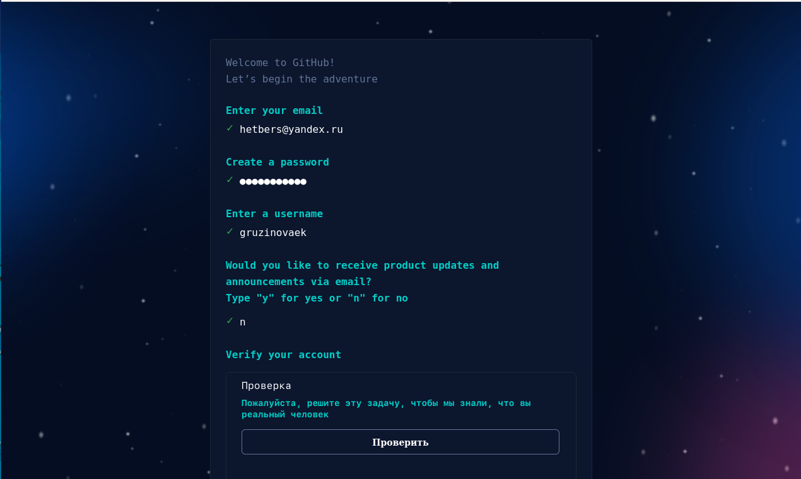{ #fig:001 width=70% }

2. Заполните основные данные на https://github.com. (рис. [-@fig:002])

{ #fig:002 width=70% }

3. Установка git-flow в Fedora Linux. (рис. [-@fig:003;-@fig:004])

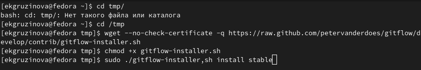{ #fig:003 width=70% }

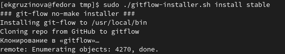{ #fig:004 width=70% }

4. Установка gh в Fedora Linux. (рис. [-@fig:005])

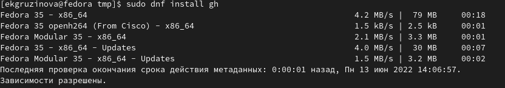{ #fig:005 width=70% }

5. Базовая настройка git. (рис. [-@fig:006;-@fig:007;-@fig:008;-@fig:009;-@fig:010])

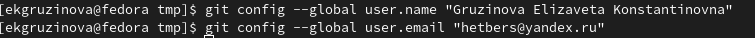{ #fig:006 width=70% }

{ #fig:007 width=70% }

{ #fig:008 width=70% }

{ #fig:009 width=70% }

{ #fig:010 width=70% }

6. Создайте ключи ssh. (рис. [-@fig:011;-@fig:012])

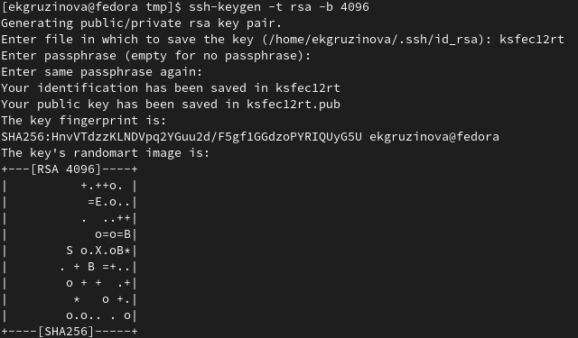{ #fig:011 width=70% }

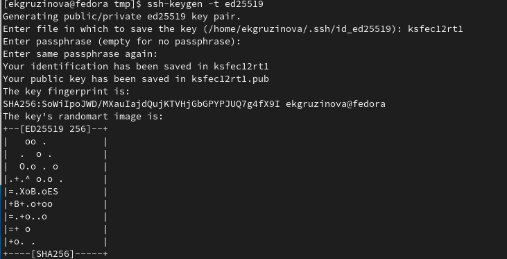{ #fig:012 width=70% }

7. Создайте ключи pgp. (рис. [-@fig:013;-@fig:014;-@fig:015;-@fig:016])

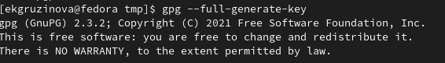{ #fig:013 width=70% }

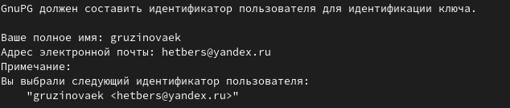{ #fig:014 width=70% }

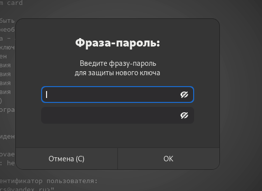{ #fig:015 width=70% }

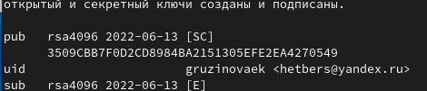{ #fig:016 width=70% }

8. Добавление PGP ключа в GitHub. (рис. [-@fig:017;-@fig:018;-@fig:019;-@fig:020])

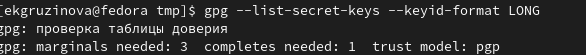{ #fig:017 width=70% }

{ #fig:018 width=70% }

{ #fig:019 width=70% }

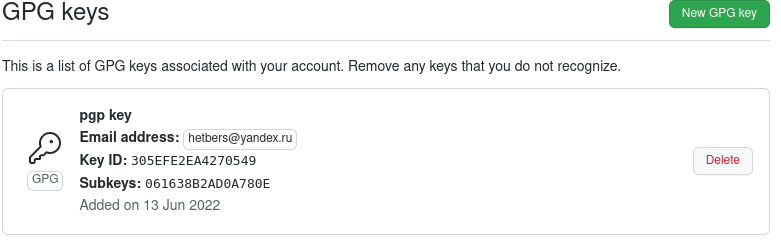{ #fig:020 width=70% }

9. Настройка автоматических подписей коммитов git. (рис. [-@fig:021])

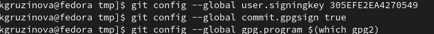{ #fig:021 width=70% }

10. Настройка gh. (рис. [-@fig:022;-@fig:023;-@fig:024])

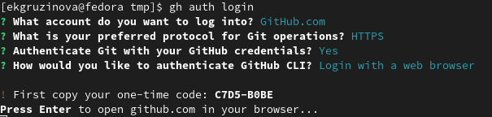{ #fig:022 width=70% }

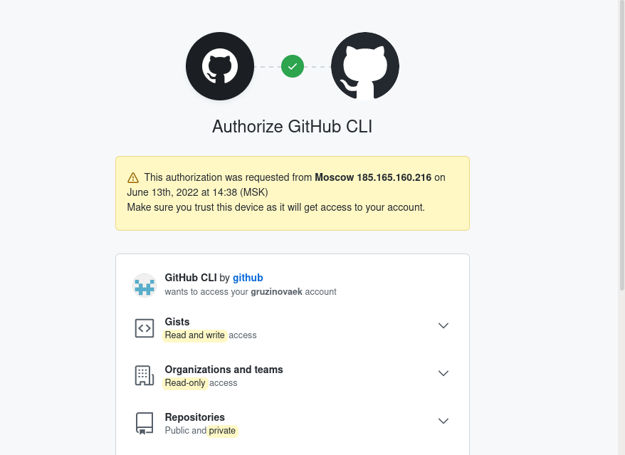{ #fig:023 width=70% }

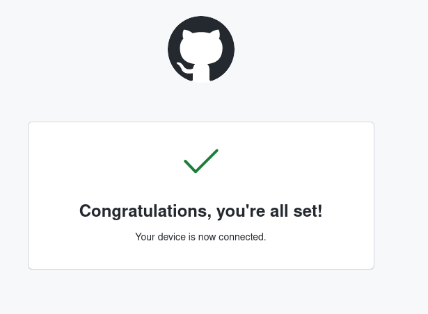{ #fig:024 width=70% }

11. Создание репозитория курса на основе шаблона. (рис. [-@fig:025;-@fig:026;-@fig:027])

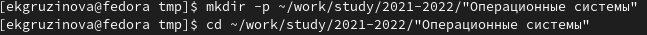{ #fig:025 width=70% }

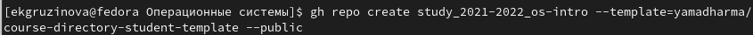{ #fig:026 width=70% }

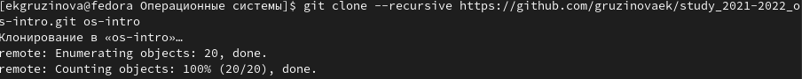{ #fig:027 width=70% }

12. Настройка каталога курса. (рис. [-@fig:028;-@fig:029;-@fig:030])

{ #fig:028 width=70% }

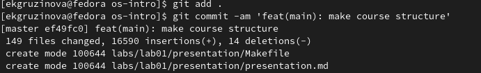{ #fig:029 width=70% }

{ #fig:030 width=70% }

# Выводы

В процессе выполенения лабораторной работы я изучила идеологию и применение средств контроля версий, а также освоила умения по работе с git.

# Контрольные вопросы

1. Что такое системы контроля версий (VCS) и для решения каких задач они предназначаются?
Система контроля версий — программное обеспечение, которое обеспечивает командную работу в рамках одного или нескольких проектов. Команда разработчиков взаимодействует с консольным или браузерным инструментом для выгрузки кода на сервер, скачивания его на рабочий компьютер и изменения структуры. Она хранит все версии проекта и обеспечивает к ним доступ. Любой член команды может взаимодействовать с основной «веткой» проекта или создавать новые.
2. Объясните следующие понятия VCS и их отношения: хранилище, commit, история, рабочая копия. 
    • Хранилище (repository, сокр. repo), или репозитарий, — место хранения всех версий и служебной информации.
    • Версия (revision), или ревизия, — состояние всех файлов на определенный момент времени, сохраненное в репозитарии, с дополнительной информацией.
    • Коммит (commit; редко переводится как «слепок») — 
    • 1) синоним версии;
    • 2) создание новой версии («сделать коммит», «закоммитить»).
    • Рабочая копия (working copy или working tree) — текущее состояние файлов проекта, основанное на версии из хранилища (обычно на последней).
3. Что представляют собой и чем отличаются централизованные и децентрализованные VCS? Приведите примеры VCS каждого вида. 
Централизованные системы контроля версий представляют собой приложения типа клиент-сервер, когда репозиторий проекта существует в единственном экземпляре и хранится на сервере. Доступ к нему осуществлялся через специальное клиентское приложение. В качестве примеров таких программных продуктов можно привести CVS, Subversion.
Децентрализованные системы контроля версий (Distributed Version Control System, DVCS) позволяют хранить репозиторий (его копию) у каждого разработчика, работающего с данной системой. При этом можно выделить центральный репозиторий (условно), в который будут отправляться изменения из локальных и, с ним же эти локальные репозитории будут синхронизироваться. При работе с такой системой, пользователи периодически синхронизируют свои локальные репозитории с центральным и работают непосредственно со своей локальной копией. После внесения достаточного количества изменений в локальную копию они (изменения) отправляются на сервер. При этом сервер, чаще всего, выбирается условно, т.к. в большинстве DVCS нет такого понятия как “выделенный сервер с центральным репозиторием”.
Большое преимущество такого подхода заключается в автономии разработчика при работе над проектом, гибкости общей системы и повышение надежности, благодаря тому, что каждый разработчик имеет локальную копию центрального репозитория. Две наиболее известные DVCS – это Git и Mercurial.
4. Опишите действия с VCS при единоличной работе с хранилищем. 
Сначала вам нужно создать и подключить удаленный репозиторий. Затем, поскольку никто, кроме вас, не изменяет проект, по мере изменения проекта отправляйте изменения на сервер, и нет необходимости загружать изменения.

5. Опишите порядок работы с общим хранилищем VCS. 
Участник проекта (пользователь) получает нужную ему версию файлов перед началом работы с помощью определенных команд. После внесения изменений пользователь помещает новую версию в репозиторий. В то же время предыдущие версии не удаляются из центрального хранилища, и вы можете вернуться к ним в любое время.
6. Каковы основные задачи, решаемые инструментальным средством git? 
У Git две основных задачи: первая — хранить информацию о всех изменениях в вашем коде, начиная с самой первой строчки, а вторая — обеспечение удобства командной работы над кодом.
7. Назовите и дайте краткую характеристику командам git. 
git init – создание основного дерева репозитория.
git pull – получение обновлений (изменений) текущего дерева из центрального репозитория.
git push – отправка всех произведённых изменений локального дерева в центральный репозиторий.
git status – просмотр списка изменённых файлов в текущей директории.
git diff – просмотр текущих изменения.
git add . – добавить все изменённые и/или созданные файлы и/или каталоги. 
git add  имена_файлов – добавить конкретные изменённые и/или созданные файлы и/или каталоги.
git rm имена_файлов – удалить файл и/или каталог из индекса репозитория (при этом файл и/или каталог остаётся в локальной директории).
git commit -am 'Описание коммита' – сохранить все добавленные изменения и все изменённые файлы.
И т.д.
8. Что такое и зачем могут быть нужны ветви (branches)? 
Ветви функций, также иногда называемые ветвями тем, используются для разработки новых функций, которые должны появиться в текущих или будущих выпусках.
9. Как и зачем можно игнорировать некоторые файлы при commit?
Существуют временные и системные файлы, которые загромождают проект и не нужны. путь к ним можно добавить в файл .gitignore, тогда они не будут добавлены в проект.

# Список литературы{.unnumbered}

::: {#refs}
:::
