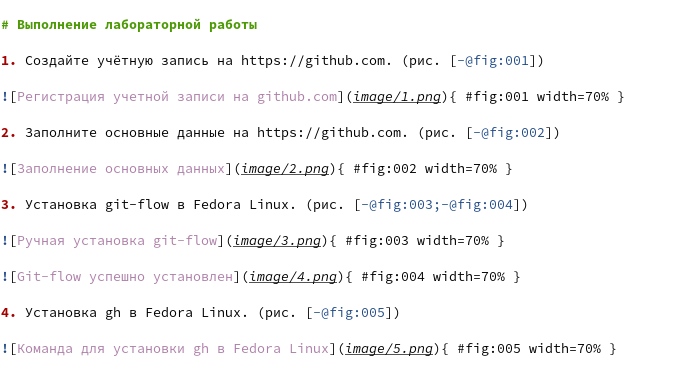

---
## Front matter
lang: ru-RU
title: Отчёт по лабораторной работе №3
author: Грузинова Елизавета Константиновна
## Formatting
toc: false
slide_level: 2
theme: metropolis
header-includes: 
 - \metroset{progressbar=frametitle,sectionpage=progressbar,numbering=fraction}
 - '\makeatletter'
 - '\beamer@ignorenonframefalse'
 - '\makeatother'
aspectratio: 43
section-titles: true
---

# Markdown

## Цель работы

Научиться оформлять отчёты с помощью легковесного языка разметки Markdown.

## Задание

1. Сделайте отчёт по предыдущей лабораторной работе в формате Markdown.

2. В качестве отчёта просьба предоставить отчёты в 3 форматах: pdf, docx и md (в архиве, поскольку он должен содержать скриншоты, Makefile и т.д.)

## Теоретическое введение

Markdown (маркда́ун) — это язык упрощённой разметки, который был создан в 2004 году специально для написания наиболее читаемого и удобного для правки текста. При этом markdown может быть перекомпилирован в HTML. Файлы использующие markdown обозначаются как формат .md.

# Выполнение лабораторной работы

1. Сделайте отчёт по предыдущей лабораторной работе в формате Markdown. (рис. [-@fig:001;-@fig:002;-@fig:003;-@fig:004;-@fig:005;-@fig:006])

{ #fig:001 width=70% }

## Выполнение лабораторной работы

{ #fig:002 width=70% }

## Выполнение лабораторной работы

{ #fig:003 width=50% }

## Выполнение лабораторной работы

{ #fig:004 width=70% }

## Выполнение лабораторной работы

{ #fig:005 width=70% }

## Выполнение лабораторной работы

{ #fig:006 width=70% }

## Выполнение лабораторной работы

2. В качестве отчёта просьба предоставить отчёты в 3 форматах: pdf, docx и md (в архиве, поскольку он должен содержать скриншоты, Makefile и т.д.) (рис. [-@fig:007])

## Выполнение лабораторной работы

{ #fig:007 width=70% }

# Выводы

При выполнении лабораторной работы научилась оформлять отчёты с помощью легковесного языка разметки Markdown.

## {.standout}

Спасибо за внимание!
