---
## Front matter
lang: ru-RU
title: Отчёт по лабораторной работе №4
author: Грузинова Елизавета Константиновна; НКНбд-02-21
## Formatting
toc: false
slide_level: 2
theme: metropolis
header-includes: 
 - \metroset{progressbar=frametitle,sectionpage=progressbar,numbering=fraction}
 - '\makeatletter'
 - '\beamer@ignorenonframefalse'
 - '\makeatother'
aspectratio: 43
section-titles: true
---

# Основы интерфейса взаимодействия пользователя с системой Unix на уровне командной строки

## Цель работы

Приобретение практических навыков взаимодействия пользователя с системой посредством командной строки.

## Задание

1. Определите полное имя вашего домашнего каталога. Далее относительно этого каталога будут выполняться последующие упражнения.

2. Выполните следующие действия:

2.1. Перейдите в каталог /tmp.

2.2. Выведите на экран содержимое каталога /tmp. Для этого используйте команду ls с различными опциями. Поясните разницу в выводимой на экран информации.

2.3. Определите, есть ли в каталоге /var/spool подкаталог с именем cron?

2.4. Перейдите в Ваш домашний каталог и выведите на экран его содержимое. Определите, кто является владельцем файлов и подкаталогов?

## Задание

3. Выполните следующие действия:

3.1. В домашнем каталоге создайте новый каталог с именем newdir.

3.2. В каталоге ~/newdir создайте новый каталог с именем morefun.

3.3. В домашнем каталоге создайте одной командой три новых каталога с именами letters, memos, misk. Затем удалите эти каталоги одной командой.

## Задание

3.4. Попробуйте удалить ранее созданный каталог ~/newdir командой rm. Проверьте, был ли каталог удалён.

3.5. Удалите каталог ~/newdir/morefun из домашнего каталога. Проверьте, был ли каталог удалён.

## Задание

4. С помощью команды man определите, какую опцию команды ls нужно использовать для просмотра содержимое не только указанного каталога, но и подкаталогов, входящих в него.

5. С помощью команды man определите набор опций команды ls, позволяющий отсортировать по времени последнего изменения выводимый список содержимого каталога с развёрнутым описанием файлов.

## Задание

6. Используйте команду man для просмотра описания следующих команд: cd, pwd, mkdir, rmdir, rm. Поясните основные опции этих команд.

7. Используя информацию, полученную при помощи команды history, выполните модификацию и исполнение нескольких команд из буфера команд.

## Теоретическое введение

В операционной системе типа Linux взаимодействие пользователя с системой обычно осуществляется с помощью командной строки посредством построчного ввода команд. При этом обычно используется командные интерпретаторы языка shell: /bin/sh; /bin/csh; /bin/ksh.

Командой в операционной системе называется записанный поспециальным правилам текст (возможно с аргументами), представляющий собой указание на выполнение какой-либо функций (или действий) в операционной системе. Обычно первым словом идёт имя команды, остальной текст — аргументы или опции, конкретизирующие действие.
Общий формат команд можно представить следующим образом: (имя_команды) (разделитель) (аргументы).

## Выполнение лабораторной работы

1. Определите полное имя вашего домашнего каталога. Далее относительно этого каталога будут выполняться последующие упражнения. (рис. [-@fig:001])

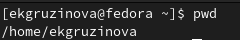{ #fig:001 width=70% }

## Выполнение лабораторной работы

2. Выполните следующие действия: 

2.1. Перейдите в каталог /tmp. (рис. [-@fig:002])

## Выполнение лабораторной работы

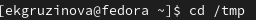{ #fig:002 width=70% }

## Выполнение лабораторной работы

2.2. Выведите на экран содержимое каталога /tmp. Для этого используйте команду ls с различными опциями. Поясните разницу в выводимой на экран информации. (рис. [-@fig:003;-@fig:004;-@fig:005;-@fig:006])

## Выполнение лабораторной работы

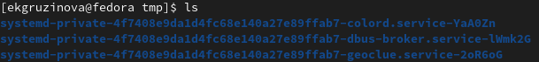{ #fig:003 width=70% }

## Выполнение лабораторной работы

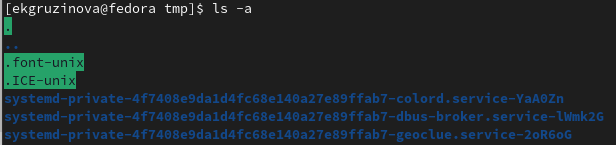{ #fig:004 width=70% }

## Выполнение лабораторной работы

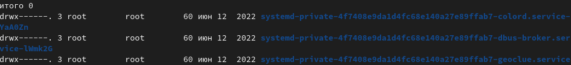{ #fig:005 width=70% }

## Выполнение лабораторной работы

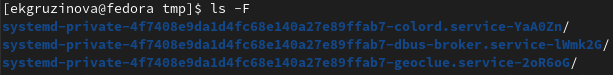{ #fig:006 width=70% }

## Выполнение лабораторной работы

2.3. Определите, есть ли в каталоге /var/spool подкаталог с именем cron? (рис. [-@fig:007])

## Выполнение лабораторной работы

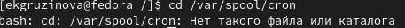{ #fig:007 width=70% }

## Выполнение лабораторной работы

2.4. Перейдите в Ваш домашний каталог и выведите на экран его содержимое. Определите, кто является владельцем файлов и подкаталогов? (рис. [-@fig:008])

## Выполнение лабораторной работы

{ #fig:008 width=70% }

## Выполнение лабораторной работы

3. Выполните следующие действия:

3.1. В домашнем каталоге создайте новый каталог с именем newdir. (рис. [-@fig:009])

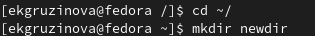{ #fig:009 width=70% }

## Выполнение лабораторной работы

3.2. В каталоге ~/newdir создайте новый каталог с именем morefun. (рис. [-@fig:010])

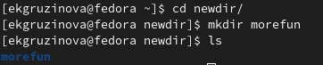{ #fig:010 width=70% }

## Выполнение лабораторной работы

3.3. В домашнем каталоге создайте одной командой три новых каталога с именами letters, memos, misk. Затем удалите эти каталоги одной командой.
(рис. [-@fig:012;-@fig:013;-@fig:014])

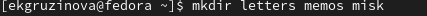{ #fig:012 width=70% }

## Выполнение лабораторной работы

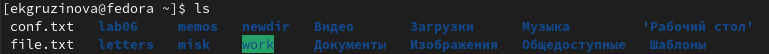{ #fig:013 width=70% }

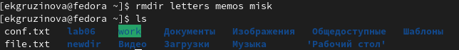{ #fig:014 width=70% }

## Выполнение лабораторной работы

3.4. Попробуйте удалить ранее созданный каталог ~/newdir командой rm. Проверьте, был ли каталог удалён. (рис. [-@fig:015])

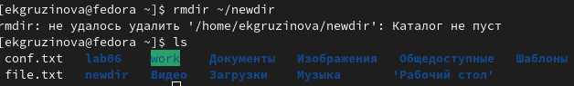{ #fig:015 width=70% }

## Выполнение лабораторной работы

3.5. Удалите каталог ~/newdir/morefun из домашнего каталога. Проверьте, был ли каталог удалён. (рис. [-@fig:016;-@fig:017])

{ #fig:016 width=70% }

## Выполнение лабораторной работы

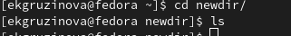{ #fig:017 width=70% }

## Выполнение лабораторной работы

4. С помощью команды man определите, какую опцию команды ls нужно использовать для просмотра содержимое не только указанного каталога, но и подкаталогов, входящих в него. (рис. [-@fig:018;-@fig:019;-@fig:020;-@fig:021])

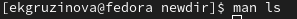{ #fig:018 width=70% }

## Выполнение лабораторной работы

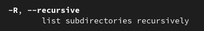{ #fig:019 width=70% }

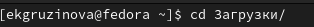{ #fig:020 width=70% }

## Выполнение лабораторной работы

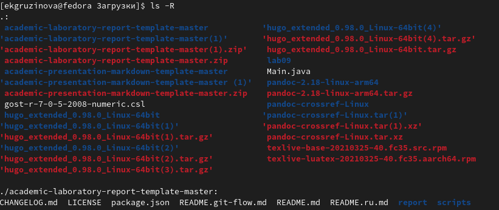{ #fig:021 width=70% }

## Выполнение лабораторной работы

5. С помощью команды man определите набор опций команды ls, позволяющий отсортировать по времени последнего изменения выводимый список содержимого каталога с развёрнутым описанием файлов. (рис. [-@fig:022])

## Выполнение лабораторной работы

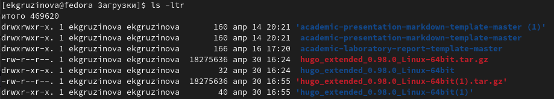{ #fig:022 width=70% }

## Выполнение лабораторной работы

6. Используйте команду man для просмотра описания следующих команд: cd, pwd, mkdir, rmdir, rm. Поясните основные опции этих команд. (рис. [-@fig:023;-@fig:024;-@fig:025;-@fig:026;-@fig:027;-@fig:028])

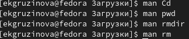{ #fig:023 width=70% }

## Выполнение лабораторной работы

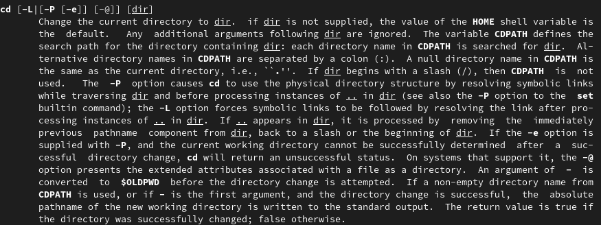{ #fig:024 width=70% }

## Выполнение лабораторной работы

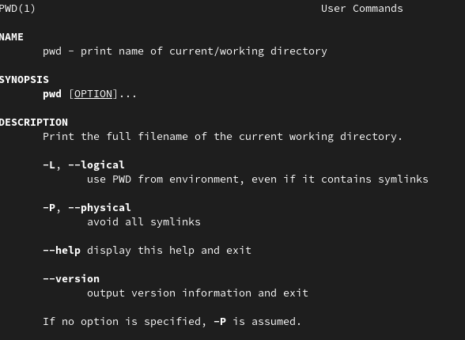{ #fig:025 width=70% }

## Выполнение лабораторной работы

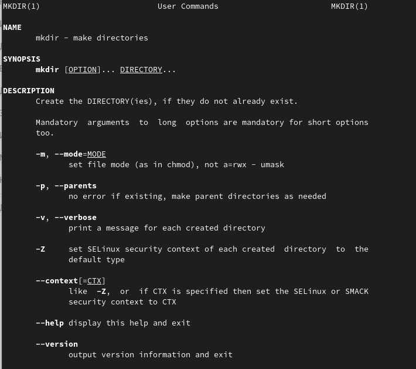{ #fig:026 width=70% }

## Выполнение лабораторной работы

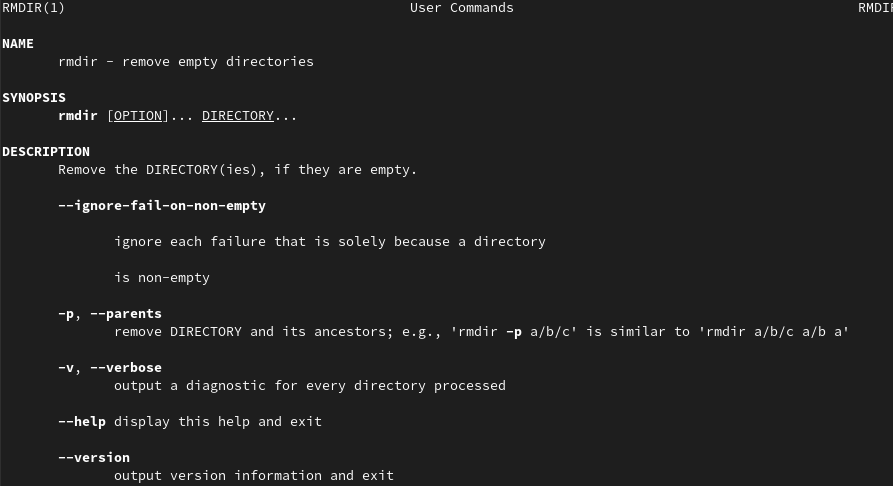{ #fig:027 width=70% }

## Выполнение лабораторной работы

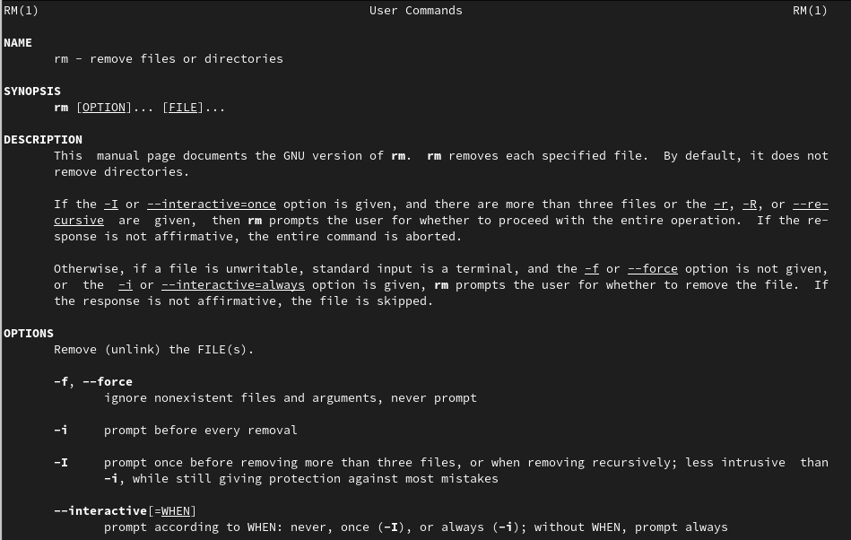{ #fig:028 width=70% }

## Выполнение лабораторной работы

7. Используя информацию, полученную при помощи команды history, выполните модификацию и исполнение нескольких команд из буфера команд.  (рис. [-@fig:029;-@fig:030])

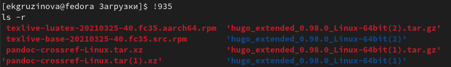{ #fig:029 width=70% }

## Выполнение лабораторной работы

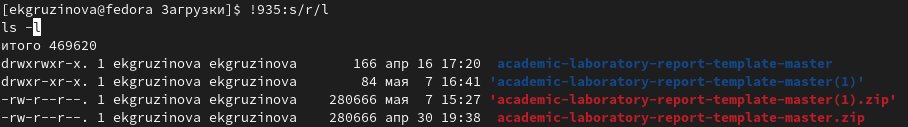{ #fig:030 width=70% }

## Выводы

При выполнении лабораторной работы приобрела навыки взаимодействия пользователя с системой посредством командной строки.

## {.standout}

Спасибо за внимание!
