---
## Front matter
lang: ru-RU
title: Отчёт по лабораторной работе №6
author: Грузинова Елизавета Константиновна

## Formatting
toc: false
slide_level: 2
theme: metropolis
header-includes: 
 - \metroset{progressbar=frametitle,sectionpage=progressbar,numbering=fraction}
 - '\makeatletter'
 - '\beamer@ignorenonframefalse'
 - '\makeatother'
aspectratio: 43
section-titles: true
---

# Поиск файлов. Перенаправление ввода-вывода. Просмотр запущенных процессов

## Цель работы

Ознакомление с инструментами поиска файлов и фильтрации текстовых данных. Приобретение практических навыков: по управлению процессами (и заданиями), по проверке использования диска и обслуживанию файловых систем.

## Задание

1. Запишите в файл file.txt названия файлов, содержащихся в каталоге /etc. Допишите в этот же файл названия файлов, содержащихся в вашем домашнем каталоге.

2. Выведите имена всех файлов из file.txt, имеющих расширение .conf, после чего запишите их в новый текстовой файл conf.txt.

3. Определите, какие файлы в вашем домашнем каталоге имеют имена, начинавшиеся с символа c? Предложите несколько вариантов, как это сделать.

4. Выведите на экран (по странично) имена файлов из каталога /etc, начинающиеся с символа h.

## Задание

5. Запустите в фоновом режиме процесс, который будет записывать в файл ~/logfile файлы, имена которых начинаются с log.

6. Удалите файл ~/logfile.

7. Запустите из консоли в фоновом режиме редактор gedit.

8. Определите идентификатор процесса gedit, используя команду ps, конвейер и фильтр grep. Как ещё можно определить идентификатор процесса?

## Задание

9. Прочтите справку (man) команды kill, после чего используйте её для завершения процесса gedit.

10. Выполните команды df и du, предварительно получив более подробную информацию об этих командах, с помощью команды man.

11. Воспользовавшись справкой команды find, выведите имена всех директорий, имеющихся в вашем домашнем каталоге.

## Теоретическое введение

Для того, чтобы записать данные в файл или прочитать их оттуда, процессу необходимо сначала открыть этот файл (при открытии на запись, возможно, придётся предварительно создать его). При этом процесс получает дескриптор (описатель) открытого файла — уникальное для этого процесса число, которое он и будет использовать во всех операциях записи. Первый открытый файл получит дескриптор 0, второй — 1 и так далее. Закончив работу с файлом, процесс закрывает его, при этом дескриптор освобождается и может быть использован повторно. Если процесс завершается, не закрыв файлы, за него это делает система. 

## Теоретическое введение

Строго говоря, только в операции открытия дескриптора указывается, какой именно файл будет использоваться. В качестве «файла» используются и обычные файлы, и файлы-дырки (чаще всего — терминалы), и каналы, описанные в разделе Конвейер. Дальнейшие операции — чтение, запись и закрытие, работают с дескриптором, как с потоком данных, а куда именно ведёт этот поток, неважно.

## Теоретическое введение

Каждый процесс Linux получает при старте три «файла», открытых для него системой. Первый из них (дескриптор 0) открыт на чтение, это стандартный ввод процесса. Именно со стандартным вводом работают все операции чтения, если в них не указан дескриптор файла. Второй (дескриптор 1) — открыт на запись, это стандартный вывод процесса. С ним работают все операции записи, если дескриптор файла не указан в них явно. 

## Теоретическое введение

Наконец, третий поток данных (дескриптор 2) предназначается для вывода диагностических сообщений, он называется стандартный вывод ошибок. Поскольку эти три дескриптора уже открыты к моменту запуска процесса, первый файл, открытый самим процессом, будет, скорее всего, иметь дескриптор 3.

## Выполнение лабораторной работы

1. Запишите в файл file.txt названия файлов, содержащихся в каталоге /etc. Допишите в этот же файл названия файлов, содержащихся в вашем домашнем каталоге. (рис. [-@fig:001;-@fig:002; -@fig:003])

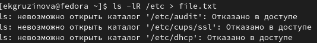{ #fig:001 width=70% }

## Выполнение лабораторной работы

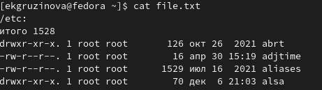{ #fig:002 width=70% }

## Выполнение лабораторной работы

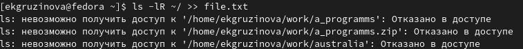{ #fig:003 width=70% }

## Выполнение лабораторной работы

2. Выведите имена всех файлов из file.txt, имеющих расширение .conf, после чего запишите их в новый текстовой файл conf.txt. (рис. [-@fig:004;-@fig:005])

## Выполнение лабораторной работы

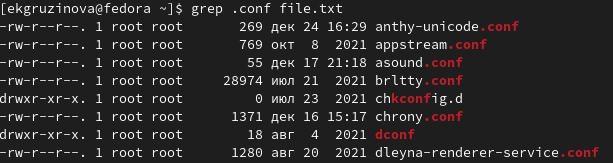{ #fig:004 width=70% }

## Выполнение лабораторной работы

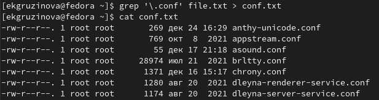{ #fig:005 width=70% }

## Выполнение лабораторной работы

3. Определите, какие файлы в вашем домашнем каталоге имеют имена, начинавшиеся с символа c? Предложите несколько вариантов, как это сделать. (рис. [-@fig:006;-@fig:007])

## Выполнение лабораторной работы

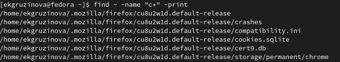{ #fig:006 width=70% }

## Выполнение лабораторной работы

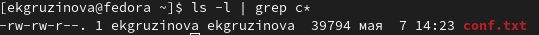{ #fig:007 width=70% }

## Выполнение лабораторной работы

4. Выведите на экран (по странично) имена файлов из каталога /etc, начинающиеся с символа h. (рис. [-@fig:008])

## Выполнение лабораторной работы

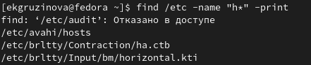{ #fig:008 width=70% }

## Выполнение лабораторной работы

5. Запустите в фоновом режиме процесс, который будет записывать в файл ~/logfile файлы, имена которых начинаются с log. (рис. [-@fig:009])

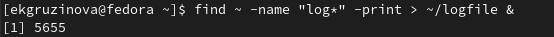{ #fig:009 width=70% }

## Выполнение лабораторной работы

6. Удалите файл ~/logfile. (рис. [-@fig:010])

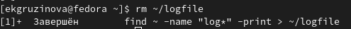{ #fig:010 width=70% }

## Выполнение лабораторной работы

7. Запустите из консоли в фоновом режиме редактор gedit. (рис. [-@fig:011])

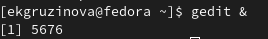{ #fig:011 width=70% }

## Выполнение лабораторной работы

8. Определите идентификатор процесса gedit, используя команду ps, конвейер и фильтр grep. Как ещё можно определить идентификатор процесса? (рис. [-@fig:012;-@fig:013])

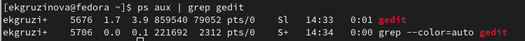{ #fig:012 width=70% }

## Выполнение лабораторной работы

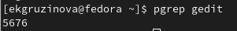{ #fig:013 width=70% }

## Выполнение лабораторной работы

9. Прочтите справку (man) команды kill, после чего используйте её для завершения процесса gedit. (рис. [-@fig:014;-@fig:015; -@fig:016])

{ #fig:014 width=70% }

## Выполнение лабораторной работы

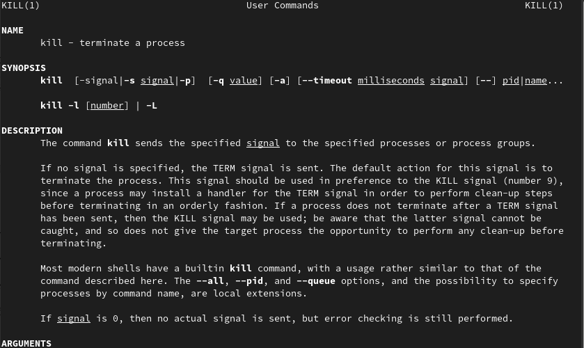{ #fig:015 width=70% }

## Выполнение лабораторной работы

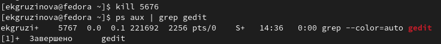{ #fig:016 width=70% }

## Выполнение лабораторной работы

10. Выполните команды df и du, предварительно получив более подробную информацию об этих командах, с помощью команды man. (рис. [-@fig:017;-@fig:018; -@fig:019; -@fig:020;-@fig:021])

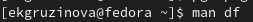{ #fig:017 width=70% }

## Выполнение лабораторной работы

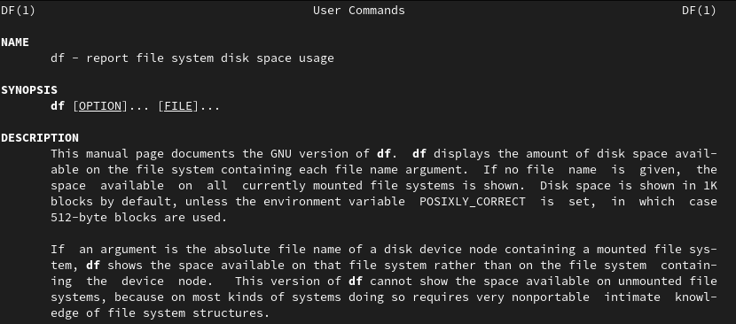{ #fig:018 width=70% }

## Выполнение лабораторной работы

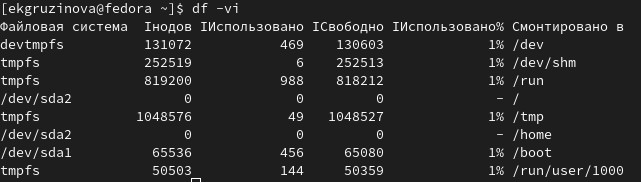{ #fig:019 width=70% }

## Выполнение лабораторной работы

{ #fig:020 width=70% }

## Выполнение лабораторной работы

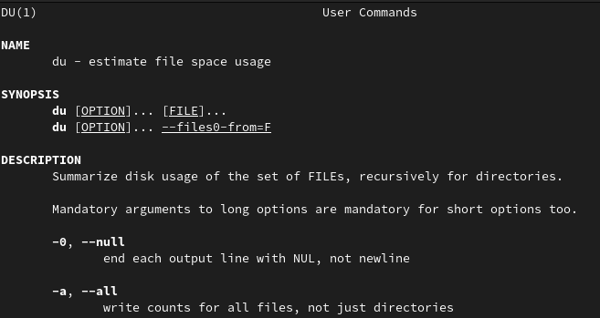{ #fig:021 width=70% }

## Выполнение лабораторной работы

11. Воспользовавшись справкой команды find, выведите имена всех директорий, имеющихся в вашем домашнем каталоге. (рис. [-@fig:022;-@fig:023])

## Выполнение лабораторной работы

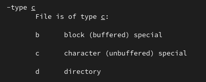{ #fig:022 width=70% }

## Выполнение лабораторной работы

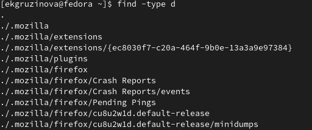{ #fig:023 width=70% }

## Выводы

При выполнении лабораторной работы я ознакомилась с инструментами поиска файлов и фильтрации текстовых данных, приобрела практические навыки: по управлению процессами (и заданиями), по проверке использования диска и обслуживанию файловых систем.

## {.standout}

Спасибо за внимание!
