---
## Front matter
title: "Отчёт по лабораторной работе №6"
subtitle: "Поиск файлов. Перенаправление ввода-вывода. Просмотр запущенных процессов"
author: "Грузинова Елизавета Кoнстантиновна; НКНбд-02-21"

## Generic otions
lang: ru-RU
toc-title: "Содержание"

## Bibliography
bibliography: bib/cite.bib
csl: pandoc/csl/gost-r-7-0-5-2008-numeric.csl

## Pdf output format
toc: true # Table of contents
toc-depth: 2
lof: true # List of figures
lot: false # List of tables
fontsize: 12pt
linestretch: 1.5
papersize: a4
documentclass: scrreprt
## I18n polyglossia
polyglossia-lang:
  name: russian
  options:
	- spelling=modern
	- babelshorthands=true
polyglossia-otherlangs:
  name: english
## I18n babel
babel-lang: russian
babel-otherlangs: english
## Fonts
mainfont: PT Serif
romanfont: PT Serif
sansfont: PT Sans
monofont: PT Mono
mainfontoptions: Ligatures=TeX
romanfontoptions: Ligatures=TeX
sansfontoptions: Ligatures=TeX,Scale=MatchLowercase
monofontoptions: Scale=MatchLowercase,Scale=0.9
## Biblatex
biblatex: true
biblio-style: "gost-numeric"
biblatexoptions:
  - parentracker=true
  - backend=biber
  - hyperref=auto
  - language=auto
  - autolang=other*
  - citestyle=gost-numeric
## Pandoc-crossref LaTeX customization
figureTitle: "Рис."
tableTitle: "Таблица"
listingTitle: "Листинг"
lofTitle: "Список иллюстраций"
lotTitle: "Список таблиц"
lolTitle: "Листинги"
## Misc options
indent: true
header-includes:
  - \usepackage{indentfirst}
  - \usepackage{float} # keep figures where there are in the text
  - \floatplacement{figure}{H} # keep figures where there are in the text
---

# Цель работы

Ознакомление с инструментами поиска файлов и фильтрации текстовых данных. Приобретение практических навыков: по управлению процессами (и заданиями), по проверке использования диска и обслуживанию файловых систем.

# Задание

1. Запишите в файл file.txt названия файлов, содержащихся в каталоге /etc. Допишите в этот же файл названия файлов, содержащихся в вашем домашнем каталоге.

2. Выведите имена всех файлов из file.txt, имеющих расширение .conf, после чего запишите их в новый текстовой файл conf.txt.

3. Определите, какие файлы в вашем домашнем каталоге имеют имена, начинавшиеся с символа c? Предложите несколько вариантов, как это сделать.

4. Выведите на экран (по странично) имена файлов из каталога /etc, начинающиеся с символа h.

5. Запустите в фоновом режиме процесс, который будет записывать в файл ~/logfile файлы, имена которых начинаются с log.

6. Удалите файл ~/logfile.

7. Запустите из консоли в фоновом режиме редактор gedit.

8. Определите идентификатор процесса gedit, используя команду ps, конвейер и фильтр grep. Как ещё можно определить идентификатор процесса?

9. Прочтите справку (man) команды kill, после чего используйте её для завершения процесса gedit.

10. Выполните команды df и du, предварительно получив более подробную информацию об этих командах, с помощью команды man.

11. Воспользовавшись справкой команды find, выведите имена всех директорий, имеющихся в вашем домашнем каталоге.

# Теоретическое введение

Для того, чтобы записать данные в файл или прочитать их оттуда, процессу необходимо сначала открыть этот файл (при открытии на запись, возможно, придётся предварительно создать его). При этом процесс получает дескриптор (описатель) открытого файла — уникальное для этого процесса число, которое он и будет использовать во всех операциях записи. Первый открытый файл получит дескриптор 0, второй — 1 и так далее. Закончив работу с файлом, процесс закрывает его, при этом дескриптор освобождается и может быть использован повторно. Если процесс завершается, не закрыв файлы, за него это делает система. Строго говоря, только в операции открытия дескриптора указывается, какой именно файл будет использоваться. В качестве «файла» используются и обычные файлы, и файлы-дырки (чаще всего — терминалы), и каналы, описанные в разделе Конвейер. Дальнейшие операции — чтение, запись и закрытие, работают с дескриптором, как с потоком данных, а куда именно ведёт этот поток, неважно.

Каждый процесс Linux получает при старте три «файла», открытых для него системой. Первый из них (дескриптор 0) открыт на чтение, это стандартный ввод процесса. Именно со стандартным вводом работают все операции чтения, если в них не указан дескриптор файла. Второй (дескриптор 1) — открыт на запись, это стандартный вывод процесса. С ним работают все операции записи, если дескриптор файла не указан в них явно. Наконец, третий поток данных (дескриптор 2) предназначается для вывода диагностических сообщений, он называется стандартный вывод ошибок. Поскольку эти три дескриптора уже открыты к моменту запуска процесса, первый файл, открытый самим процессом, будет, скорее всего, иметь дескриптор 3.[@info:bash]

# Выполнение лабораторной работы

1. Запишите в файл file.txt названия файлов, содержащихся в каталоге /etc. Допишите в этот же файл названия файлов, содержащихся в вашем домашнем каталоге. (рис. [-@fig:001;-@fig:002; -@fig:003])

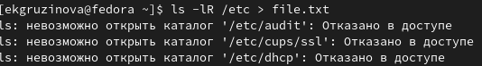{ #fig:001 width=70% }

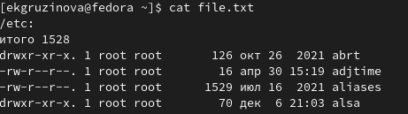{ #fig:002 width=70% }

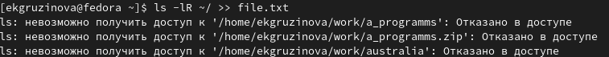{ #fig:003 width=70% }

2. Выведите имена всех файлов из file.txt, имеющих расширение .conf, после чего запишите их в новый текстовой файл conf.txt. (рис. [-@fig:004;-@fig:005])

{ #fig:004 width=70% }

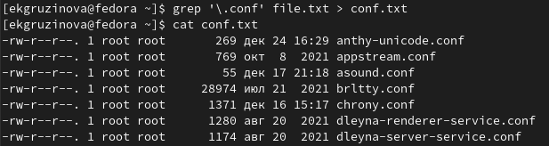{ #fig:005 width=70% }

3. Определите, какие файлы в вашем домашнем каталоге имеют имена, начинавшиеся с символа c? Предложите несколько вариантов, как это сделать. (рис. [-@fig:006;-@fig:007])

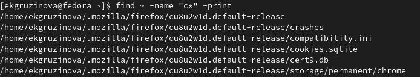{ #fig:006 width=70% }

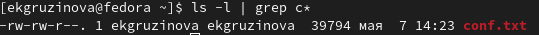{ #fig:007 width=70% }

4. Выведите на экран (по странично) имена файлов из каталога /etc, начинающиеся с символа h. (рис. [-@fig:008])

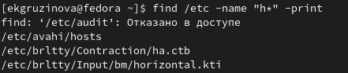{ #fig:008 width=70% }

5. Запустите в фоновом режиме процесс, который будет записывать в файл ~/logfile файлы, имена которых начинаются с log. (рис. [-@fig:009])

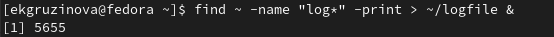{ #fig:009 width=70% }

6. Удалите файл ~/logfile. (рис. [-@fig:010])

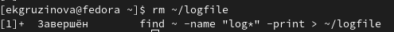{ #fig:010 width=70% }

7. Запустите из консоли в фоновом режиме редактор gedit. (рис. [-@fig:011])

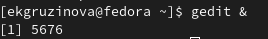{ #fig:011 width=70% }

8. Определите идентификатор процесса gedit, используя команду ps, конвейер и фильтр grep. Как ещё можно определить идентификатор процесса? (рис. [-@fig:012;-@fig:013])

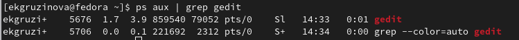{ #fig:012 width=70% }

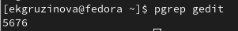{ #fig:013 width=70% }

9. Прочтите справку (man) команды kill, после чего используйте её для завершения процесса gedit. (рис. [-@fig:014;-@fig:015; -@fig:016])

{ #fig:014 width=70% }

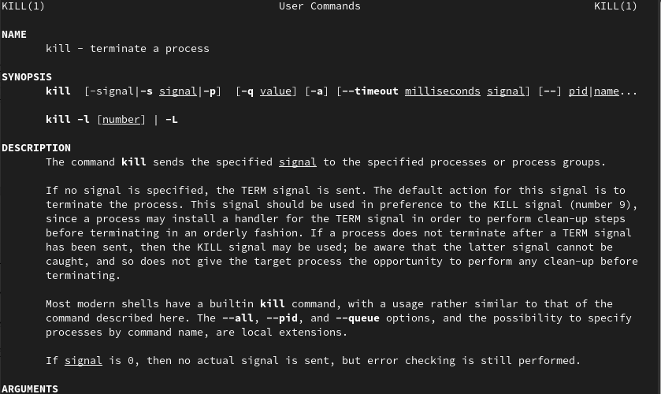{ #fig:015 width=70% }

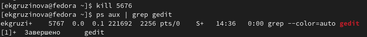{ #fig:016 width=70% }

10. Выполните команды df и du, предварительно получив более подробную информацию об этих командах, с помощью команды man. (рис. [-@fig:017;-@fig:018; -@fig:019; -@fig:020;-@fig:021])

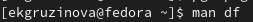{ #fig:017 width=70% }

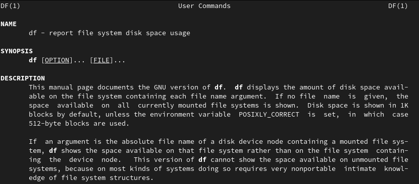{ #fig:018 width=70% }

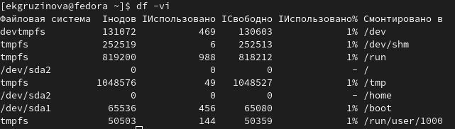{ #fig:019 width=70% }

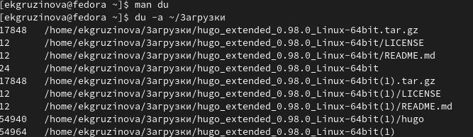{ #fig:020 width=70% }

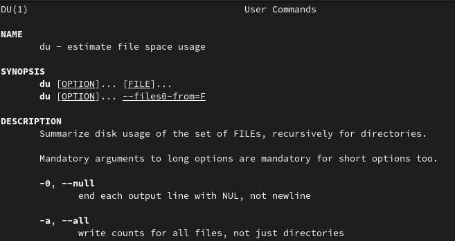{ #fig:021 width=70% }

11. Воспользовавшись справкой команды find, выведите имена всех директорий, имеющихся в вашем домашнем каталоге. (рис. [-@fig:022;-@fig:023])

{ #fig:022 width=70% }

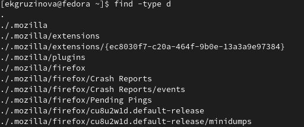{ #fig:023 width=70% }

# Выводы

При выполнении лабораторной работы я ознакомилась с инструментами поиска файлов и фильтрации текстовых данных, приобрела практические навыки: по управлению процессами (и заданиями), по проверке использования диска и обслуживанию файловых систем.

# Контрольные вопросы

1. stdin, stdout, stderr

2. При ">>" файл также открывается в режиме добавления, а при ">" - нет.

3. Объединение простых команд или утилит в цепочки, в которых результат работы предыщущей команды передаётся в следующую.

4. Компьютерная программа сама по себе — это только пассивная совокупность инструкций, в то время как процесс — это непосредственное выполнение этих инструкций.

5. gid - идентификатор группы UNIX, в котором работает программа.

При запуске процесса ему присваивается уникальный номер, называемый process ID (PID), который идентифицирует этот процесс для системы.

6. Запущенные из консоли с помощью амперсанда команды, работают в фоновом режиме, называются задачами. С помощью команды top можно управлять ими.

7. top - интерактивный просмотрщик процессов. Htop – основанный на ncurses просмотрщик процессов подобный top, htop, atop интерактивные просмотрщики процессов, но позволяющий прокручивать список процессов вертикально и горизонтально, чтобы видеть их полные параметры запуска. Управление процессами (остановка, изменение приоритета) может выполняться без ручного ввода их идентификаторов.

8. Команда find представляет собой универсальный инструмент поиска: она позволяет искать файлы и каталоги, просматривать все каталоги в системе или только текущий каталог.

Команда 

find ~ -name "t*" -print

выведет на экран имена всех файлов из домашнего каталога, начинающиеся с символа t.

9. Да, возможно. Для этого необходимо использовать команду

grep -rnw '/ПУТЬ/ДО/ПАПКИ/' -e 'ШАБЛОН'

10. C помощью команды

df -h (имя диска)

11. С помощью команды

du ~/

12. С помощью команды kill%номер процесса

# Список литературы{.unnumbered}

::: {#refs}
:::
