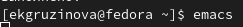

---
## Front matter
lang: ru-RU
title: Отчёт по лабораторной работе №9
author: Грузинова Елизавета Константиновна; НКНбд-02-21

## Formatting
toc: false
slide_level: 2
theme: metropolis
header-includes: 
 - \metroset{progressbar=frametitle,sectionpage=progressbar,numbering=fraction}
 - '\makeatletter'
 - '\beamer@ignorenonframefalse'
 - '\makeatother'
aspectratio: 43
section-titles: true
---

# Текстовый редактор emacs

## Цель работы

Познакомиться с операционной системой Linux и получить практические навыки работы с редактором Emacs.

## Задание

1. Ознакомиться с теоретическим материалом.

2. Ознакомиться с редактором emacs.

3. Выполнить упражнения.

## Задание

3.1. Открыть emacs.

3.2. Создать файл lab07.sh с помощью комбинации Ctrl-x Ctrl-f (C-x C-f).

3.3. Наберите заданный в лабораторной работе текст.

3.4. Сохранить файл с помощью комбинации Ctrl-x Ctrl-s (C-x C-s).

3.5. Проделать с текстом стандартные процедуры редактирования, каждое действие долж-
но осуществляться комбинацией клавиш.

## Задание

3.5.1. Вырезать одной командой целую строку (С-k).

3.5.2. Вставить эту строку в конец файла (C-y).

3.5.3. Выделить область текста (C-space).

3.5.4. Скопировать область в буфер обмена (M-w).

3.5.5. Вставить область в конец файла.

3.5.6. Вновь выделить эту область и на этот раз вырезать её (C-w).

3.5.7. Отмените последнее действие (C-/).

## Задание

3.6. Научитесь использовать команды по перемещению курсора.

3.6.1. Переместите курсор в начало строки (C-a).

3.6.2. Переместите курсор в конец строки (C-e).

3.6.3. Переместите курсор в начало буфера (M-<).

3.6.4. Переместите курсор в конец буфера (M->).

## Задание

3.7. Управление буферами.

3.7.1. Вывести список активных буферов на экран (C-x C-b).

3.7.2. Переместитесь во вновь открытое окно (C-x) o со списком открытых буферов
и переключитесь на другой буфер.

3.7.3. Закройте это окно (C-x 0).

3.7.4. Теперь вновь переключайтесь между буферами, но уже без вывода их списка на экран (C-x b).

## Задание

3.8. Управление окнами.

3.8.1. Поделите фрейм на 4 части: разделите фрейм на два окна по вертикали (C-x 3), а затем каждое из этих окон на две части по горизонтали (C-x 2).

3.8.2. В каждом из четырёх созданных окон откройте новый буфер (файл) и введите несколько строк текста.

## Задание

3.9. Режим поиска.

3.9.1. Переключитесь в режим поиска (C-s) и найдите несколько слов, присутствующих
в тексте.

3.9.2. Переключайтесь между результатами поиска, нажимая C-s.

3.9.3. Выйдите из режима поиска, нажав C-g.

## Задание

3.9.4. Перейдите в режим поиска и замены (M-%), введите текст, который следует найти и заменить, нажмите Enter , затем введите текст для замены. После того как будут подсвечены результаты поиска, нажмите ! для подтверждения замены.

3.9.5. Испробуйте другой режим поиска, нажав M-s o. Объясните, чем он отличается от
обычного режима?

4. Ответить на контрольные вопросы.

## Теоретическое введение

Emacs - один из двух наиболее широко используемых текстовых редакторов на платформах Unix и Linux. 

Emacs - это больше, чем просто текстовый редактор; он также может выдавать команды оболочки, выходить в Интернет, писать и тестировать программы, а также читать и отправлять электронные письма в среде Emacs.

## Теоретическое введение

Еще одна полезная функция, которая делает текст и код более читабельным, - это автоматическое отступление. Emacs идентифицирует блоки кода и группирует их соответственно. Он также обеспечивает поддержку символов Unicode практически для всех систем письма и языков, а также обеспечивает самодокументирование, которое автоматически генерирует и отображает документацию для каждой команды, переменной и внутренней функции, найденной в исходном коде программы.

## Выполнение лабораторной работы

Выполнить упражнения.

1. Открыть emacs.(рис. [-@fig:001])

{ #fig:001 width=70% }

## Выполнение лабораторной работы

2. Создать файл lab07.sh с помощью комбинации Ctrl-x Ctrl-f (C-x C-f).(рис. [-@fig:002])

{ #fig:002 width=40% }

## Выполнение лабораторной работы

3. Наберите заданный в лабораторной работе текст. 4. Сохранить файл с помощью комбинации Ctrl-x Ctrl-s (C-x C-s).(рис. [-@fig:003])

{ #fig:003 width=70% }

## Выполнение лабораторной работы

5. Проделать с текстом стандартные процедуры редактирования, каждое действие должно осуществляться комбинацией клавиш.

5.1. Вырезать одной командой целую строку (С-k).(рис. [-@fig:004])

{ #fig:004 width=40% }

## Выполнение лабораторной работы

5.2. Вставить эту строку в конец файла (C-y).(рис. [-@fig:005])

{ #fig:005 width=50% }

## Выполнение лабораторной работы

5.3. Выделить область текста (C-space).(рис. [-@fig:006])

{ #fig:006 width=20% }

## Выполнение лабораторной работы

5.4. Скопировать область в буфер обмена (M-w). 5.5. Вставить область в конец файла.(рис. [-@fig:007])

{ #fig:007 width=50% }

## Выполнение лабораторной работы

5.6. Вновь выделить эту область и на этот раз вырезать её (C-w).(рис. [-@fig:008])

{ #fig:008 width=50% }

## Выполнение лабораторной работы

5.7. Отмените последнее действие (C-/).(рис. [-@fig:009])

{ #fig:009 width=50% }

## Выполнение лабораторной работы

6. Научитесь использовать команды по перемещению курсора.

6.1. Переместите курсор в начало строки (C-a).(рис. [-@fig:010])

{ #fig:010 width=70% }

6.2. Переместите курсор в конец строки (C-e).(рис. [-@fig:011])

{ #fig:011 width=70% }

## Выполнение лабораторной работы

6.3. Переместите курсор в начало буфера (M-<).(рис. [-@fig:012])

{ #fig:012 width=70% }

6.4. Переместите курсор в конец буфера (M->).(рис. [-@fig:013])

{ #fig:013 width=70% }

## Выполнение лабораторной работы

7. Управление буферами.

7.1. Вывести список активных буферов на экран (C-x C-b). (рис. [-@fig:014])

{ #fig:014 width=70% }

## Выполнение лабораторной работы

7.2. Переместитесь во вновь открытое окно (C-x) o со списком открытых буферов и переключитесь на другой буфер. (рис. [-@fig:015])

{ #fig:015 width=40% }

## Выполнение лабораторной работы

7.3. Закройте это окно (C-x 0). 7.4. Теперь вновь переключайтесь между буферами, но уже без вывода их списка на экран (C-x b). (рис. [-@fig:016])

{ #fig:016 width=70% }

## Выполнение лабораторной работы

8. Управление окнами. 

8.1. Поделите фрейм на 4 части: разделите фрейм на два окна по вертикали (C-x 3), а затем каждое из этих окон на две части по горизонтали (C-x 2). (рис. [-@fig:017])

{ #fig:017 width=50% }

## Выполнение лабораторной работы

8.2. В каждом из четырёх созданных окон откройте новый буфер (файл) и введите несколько строк текста. (рис. [-@fig:018])

{ #fig:018 width=70% }

## Выполнение лабораторной работы

9. Режим поиска.

9.1. Переключитесь в режим поиска (C-s) и найдите несколько слов, присутствующих
в тексте. (рис. [-@fig:019])

{ #fig:019 width=70% }

## Выполнение лабораторной работы

9.2. Переключайтесь между результатами поиска, нажимая C-s. 9.3. Выйдите из режима поиска, нажав C-g. (рис. [-@fig:020])

{ #fig:020 width=70% }

## Выполнение лабораторной работы

9.4. Перейдите в режим поиска и замены (M-%), введите текст, который следует найти и заменить, нажмите Enter , затем введите текст для замены. После того как будут подсвечены результаты поиска, нажмите ! для подтверждения замены. (рис. [-@fig:021; -@fig:022; -@fig:023])

{ #fig:021 width=60% }

## Выполнение лабораторной работы

{ #fig:022 width=70% }

{ #fig:023 width=70% }

## Выполнение лабораторной работы

9.5. Испробуйте другой режим поиска, нажав M-s o. Объясните, чем он отличается от
обычного режима? (рис. [-@fig:024])

{ #fig:024 width=70% }

## Выводы

В течение лабораторной работы я познакомилась с операционной системой Linux и получила практические навыки работы с редактором Emacs.

## {.standout}

Спасибо за внимание.
