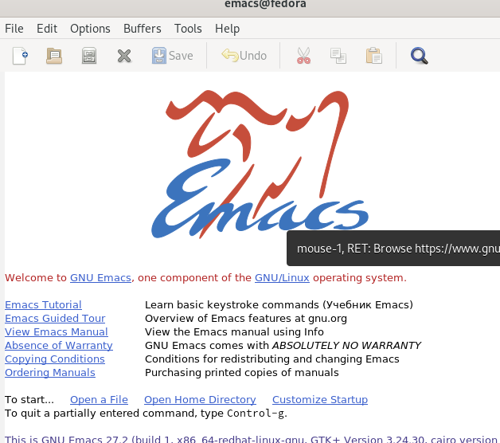
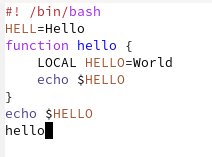
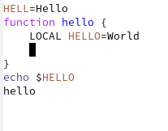
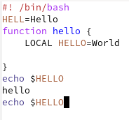
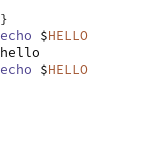
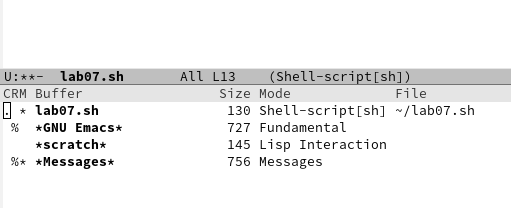
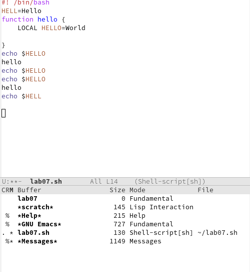
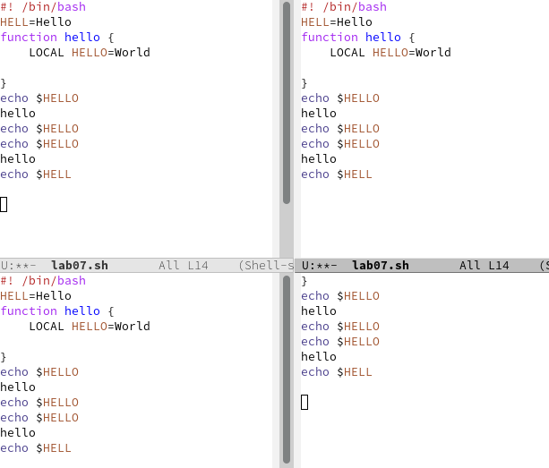
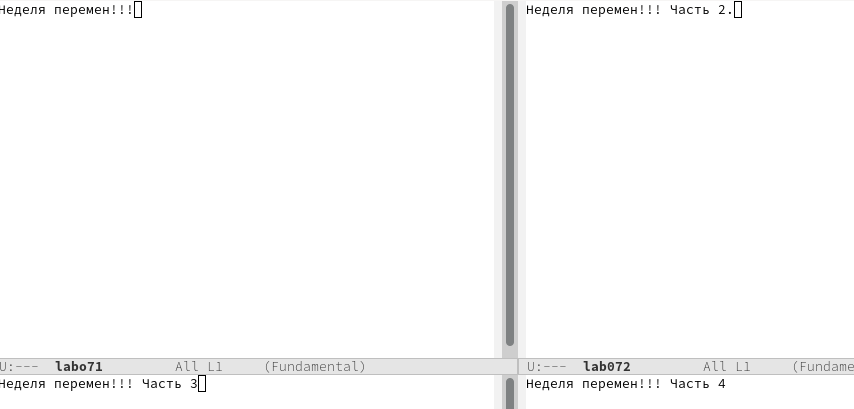
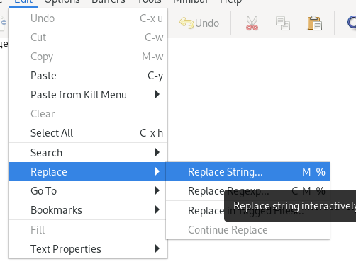

---
## Front matter
title: "Отчёт по лабораторной работе №9"
subtitle: "Текстовый редактор emacs"
author: "Грузинова Елизавета Константиновна"

## Generic otions
lang: ru-RU
toc-title: "Содержание"

## Bibliography
bibliography: bib/cite.bib
csl: pandoc/csl/gost-r-7-0-5-2008-numeric.csl

## Pdf output format
toc: true # Table of contents
toc-depth: 2
lof: true # List of figures
lot: false # List of tables
fontsize: 12pt
linestretch: 1.5
papersize: a4
documentclass: scrreprt
## I18n polyglossia
polyglossia-lang:
  name: russian
  options:
	- spelling=modern
	- babelshorthands=true
polyglossia-otherlangs:
  name: english
## I18n babel
babel-lang: russian
babel-otherlangs: english
## Fonts
mainfont: PT Serif
romanfont: PT Serif
sansfont: PT Sans
monofont: PT Mono
mainfontoptions: Ligatures=TeX
romanfontoptions: Ligatures=TeX
sansfontoptions: Ligatures=TeX,Scale=MatchLowercase
monofontoptions: Scale=MatchLowercase,Scale=0.9
## Biblatex
biblatex: true
biblio-style: "gost-numeric"
biblatexoptions:
  - parentracker=true
  - backend=biber
  - hyperref=auto
  - language=auto
  - autolang=other*
  - citestyle=gost-numeric
## Pandoc-crossref LaTeX customization
figureTitle: "Рис."
tableTitle: "Таблица"
listingTitle: "Листинг"
lofTitle: "Список иллюстраций"
lotTitle: "Список таблиц"
lolTitle: "Листинги"
## Misc options
indent: true
header-includes:
  - \usepackage{indentfirst}
  - \usepackage{float} # keep figures where there are in the text
  - \floatplacement{figure}{H} # keep figures where there are in the text
---

# Цель работы

Познакомиться с операционной системой Linux и получить практические навыки работы с редактором Emacs.

# Задание

1. Ознакомиться с теоретическим материалом.

2. Ознакомиться с редактором emacs.

3. Выполнить упражнения.

1. Открыть emacs.

2. Создать файл lab07.sh с помощью комбинации Ctrl-x Ctrl-f (C-x C-f).

3. Наберите заданный в лабораторной работе текст.

4. Сохранить файл с помощью комбинации Ctrl-x Ctrl-s (C-x C-s).

5. Проделать с текстом стандартные процедуры редактирования, каждое действие долж-
но осуществляться комбинацией клавиш.

5.1. Вырезать одной командой целую строку (С-k).

5.2. Вставить эту строку в конец файла (C-y).

5.3. Выделить область текста (C-space).

5.4. Скопировать область в буфер обмена (M-w).

5.5. Вставить область в конец файла.

5.6. Вновь выделить эту область и на этот раз вырезать её (C-w).

5.7. Отмените последнее действие (C-/).

6. Научитесь использовать команды по перемещению курсора.

6.1. Переместите курсор в начало строки (C-a).

6.2. Переместите курсор в конец строки (C-e).

6.3. Переместите курсор в начало буфера (M-<).

6.4. Переместите курсор в конец буфера (M->).

7. Управление буферами.

7.1. Вывести список активных буферов на экран (C-x C-b).

7.2. Переместитесь во вновь открытое окно (C-x) o со списком открытых буферов
и переключитесь на другой буфер.

7.3. Закройте это окно (C-x 0).

7.4. Теперь вновь переключайтесь между буферами, но уже без вывода их списка на экран (C-x b).

8. Управление окнами.

8.1. Поделите фрейм на 4 части: разделите фрейм на два окна по вертикали (C-x 3), а затем каждое из этих окон на две части по горизонтали (C-x 2).

8.2. В каждом из четырёх созданных окон откройте новый буфер (файл) и введите несколько строк текста.

9. Режим поиска.

9.1. Переключитесь в режим поиска (C-s) и найдите несколько слов, присутствующих
в тексте.

9.2. Переключайтесь между результатами поиска, нажимая C-s.

9.3. Выйдите из режима поиска, нажав C-g.

9.4. Перейдите в режим поиска и замены (M-%), введите текст, который следует найти и заменить, нажмите Enter , затем введите текст для замены. После того как будут подсвечены результаты поиска, нажмите ! для подтверждения замены.

9.5. Испробуйте другой режим поиска, нажав M-s o. Объясните, чем он отличается от
обычного режима?

4. Ответить на контрольные вопросы.

# Теоретическое введение

Emacs - один из двух наиболее широко используемых текстовых редакторов на платформах Unix и Linux. 

Emacs - это больше, чем просто текстовый редактор; он также может выдавать команды оболочки, выходить в Интернет, писать и тестировать программы, а также читать и отправлять электронные письма в среде Emacs.

Еще одна полезная функция, которая делает текст и код более читабельным, - это автоматическое отступление. Emacs идентифицирует блоки кода и группирует их соответственно. Он также обеспечивает поддержку символов Unicode практически для всех систем письма и языков, а также обеспечивает самодокументирование, которое автоматически генерирует и отображает документацию для каждой команды, переменной и внутренней функции, найденной в исходном коде программы. [@emacs:bash]

# Выполнение лабораторной работы

Выполнить упражнения.

1. Открыть emacs.(рис. [-@fig:001])

{ #fig:001 width=70% }

2. Создать файл lab07.sh с помощью комбинации Ctrl-x Ctrl-f (C-x C-f).(рис. [-@fig:002])

{ #fig:002 width=70% }

3. Наберите заданный в лабораторной работе текст. 4. Сохранить файл с помощью комбинации Ctrl-x Ctrl-s (C-x C-s).(рис. [-@fig:003])

{ #fig:003 width=70% }

5. Проделать с текстом стандартные процедуры редактирования, каждое действие должно осуществляться комбинацией клавиш.

5.1. Вырезать одной командой целую строку (С-k).(рис. [-@fig:004])

{ #fig:004 width=70% }

5.2. Вставить эту строку в конец файла (C-y).(рис. [-@fig:005])

{ #fig:005 width=70% }

5.3. Выделить область текста (C-space).(рис. [-@fig:006])

{ #fig:006 width=70% }

5.4. Скопировать область в буфер обмена (M-w). 5.5. Вставить область в конец файла.(рис. [-@fig:007])

{ #fig:007 width=70% }

5.6. Вновь выделить эту область и на этот раз вырезать её (C-w).(рис. [-@fig:008])

{ #fig:008 width=70% }

5.7. Отмените последнее действие (C-/).(рис. [-@fig:009])

{ #fig:009 width=70% }

6. Научитесь использовать команды по перемещению курсора.

6.1. Переместите курсор в начало строки (C-a).(рис. [-@fig:010])

{ #fig:010 width=70% }

6.2. Переместите курсор в конец строки (C-e).(рис. [-@fig:011])

{ #fig:011 width=70% }

6.3. Переместите курсор в начало буфера (M-<).(рис. [-@fig:012])

{ #fig:012 width=70% }

6.4. Переместите курсор в конец буфера (M->).(рис. [-@fig:013])

{ #fig:013 width=70% }

7. Управление буферами.

7.1. Вывести список активных буферов на экран (C-x C-b). (рис. [-@fig:014])

{ #fig:014 width=70% }

7.2. Переместитесь во вновь открытое окно (C-x) o со списком открытых буферов и переключитесь на другой буфер. (рис. [-@fig:015])

{ #fig:015 width=70% }

7.3. Закройте это окно (C-x 0). 7.4. Теперь вновь переключайтесь между буферами, но уже без вывода их списка на экран (C-x b). (рис. [-@fig:016])

{ #fig:016 width=70% }

8. Управление окнами. 

8.1. Поделите фрейм на 4 части: разделите фрейм на два окна по вертикали (C-x 3), а затем каждое из этих окон на две части по горизонтали (C-x 2). (рис. [-@fig:017])

{ #fig:017 width=70% }

8.2. В каждом из четырёх созданных окон откройте новый буфер (файл) и введите несколько строк текста. (рис. [-@fig:018])

{ #fig:018 width=70% }

9. Режим поиска.

9.1. Переключитесь в режим поиска (C-s) и найдите несколько слов, присутствующих
в тексте. (рис. [-@fig:019])

{ #fig:019 width=70% }

9.2. Переключайтесь между результатами поиска, нажимая C-s. 9.3. Выйдите из режима поиска, нажав C-g. (рис. [-@fig:020])

{ #fig:020 width=70% }

9.4. Перейдите в режим поиска и замены (M-%), введите текст, который следует найти и заменить, нажмите Enter , затем введите текст для замены. После того как будут подсвечены результаты поиска, нажмите ! для подтверждения замены. (рис. [-@fig:021; -@fig:022; -@fig:023])

{ #fig:021 width=70% }

{ #fig:022 width=70% }

{ #fig:023 width=70% }

9.5. Испробуйте другой режим поиска, нажав M-s o. Объясните, чем он отличается от
обычного режима? (рис. [-@fig:024])

{ #fig:024 width=70% }

# Контрольные вопросы

1. Кратко охарактеризуйте редактор emacs.

Emacs — это расширяемый текстовый редактор, который можно кастомизировать под свои нужды при помощи языка Emacs Lisp (Elisp).

2. Какие особенности данного редактора могут сделать его сложным для освоения новичком?

Количество комбинаций клавиш и далеко не простой интерфейс могут показаться сложной часть для освоения новичком.

3. Своими словами опишите, что такое буфер и окно в терминологии emacs’а.

Буфер - это объект, содержащищй записанный текст.

Окно - область прямоугольной формы, отображаюшая один из буферов.

4. Можно ли открыть больше 10 буферов в одном окне?

Да, это возможно.

5. Какие буферы создаются по умолчанию при запуске emacs?

Messages, GNU Emacs, scratch.

6. Какие клавиши вы нажмёте, чтобы ввести следующую комбинацию C-c | и C-c C-|?

Ctrl+C, а потом | и Ctrl+C, Ctrl + |.

7. Как поделить текущее окно на две части?
 
С помощью комбинаций клавиш Сtrl + x, 2 (по горизонтали) или Ctrl + x, 3 (по вертикали).

8. В каком файле хранятся настройки редактора emacs?

Настройки реадктор emacs хранятся в файле .emacs, расположенным в директории пользователя.

9. Какую функцию выполняет клавиша DEL и можно ли её переназначить?

Она выполняется функцию "стереть".

10. Какой редактор вам показался удобнее в работе vi или emacs? Поясните почему.

Однозначно emacs, поскольку в vi неудобное переключение режимов и не имеем простого интерфейса.

# Выводы

В течение лабораторной работы я познакомилась с операционной системой Linux и получила практические навыки работы с редактором Emacs.

# Список литературы{.unnumbered}

::: {#refs}
:::
