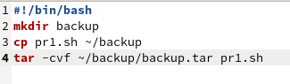
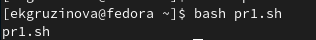
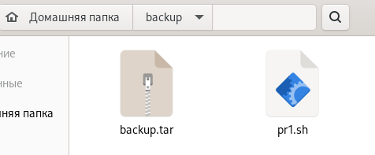
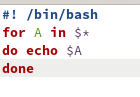
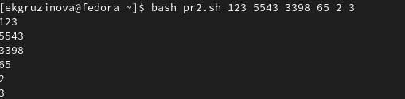
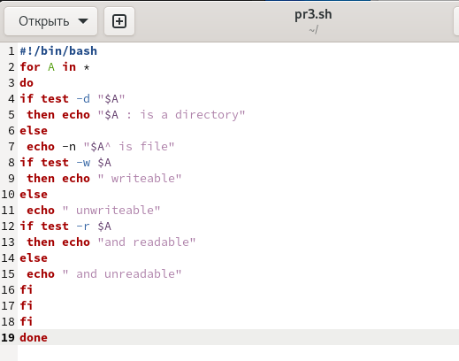
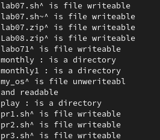
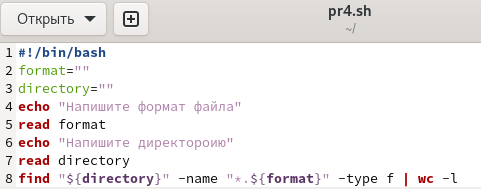
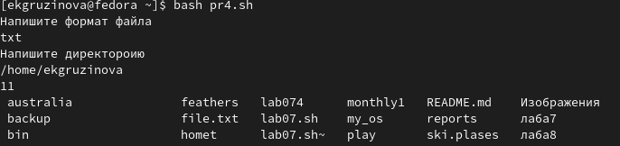

---
## Front matter
title: "Отчёт по лабораторной работе №10"
subtitle: "Программирование в командном процессоре ОС UNIX. Командные файлы."
author: "Грузинова Елизавета Константиновна; НКНбд-02-21"

## Generic otions
lang: ru-RU
toc-title: "Содержание"

## Bibliography
bibliography: bib/cite.bib
csl: pandoc/csl/gost-r-7-0-5-2008-numeric.csl

## Pdf output format
toc: true # Table of contents
toc-depth: 2
lof: true # List of figures
lot: false # List of tables
fontsize: 12pt
linestretch: 1.5
papersize: a4
documentclass: scrreprt
## I18n polyglossia
polyglossia-lang:
  name: russian
  options:
	- spelling=modern
	- babelshorthands=true
polyglossia-otherlangs:
  name: english
## I18n babel
babel-lang: russian
babel-otherlangs: english
## Fonts
mainfont: PT Serif
romanfont: PT Serif
sansfont: PT Sans
monofont: PT Mono
mainfontoptions: Ligatures=TeX
romanfontoptions: Ligatures=TeX
sansfontoptions: Ligatures=TeX,Scale=MatchLowercase
monofontoptions: Scale=MatchLowercase,Scale=0.9
## Biblatex
biblatex: true
biblio-style: "gost-numeric"
biblatexoptions:
  - parentracker=true
  - backend=biber
  - hyperref=auto
  - language=auto
  - autolang=other*
  - citestyle=gost-numeric
## Pandoc-crossref LaTeX customization
figureTitle: "Рис."
tableTitle: "Таблица"
listingTitle: "Листинг"
lofTitle: "Список иллюстраций"
lotTitle: "Список таблиц"
lolTitle: "Листинги"
## Misc options
indent: true
header-includes:
  - \usepackage{indentfirst}
  - \usepackage{float} # keep figures where there are in the text
  - \floatplacement{figure}{H} # keep figures where there are in the text
---

# Цель работы

Изучить основы программирования в оболочке ОС UNIX/Linux и научиться писать небольшие командные файлы.

# Задание

1. Написать скрипт, который при запуске будет делать резервную копию самого себя (то есть файла, в котором содержится его исходный код) в другую директорию backup в вашем домашнем каталоге. При этом файл должен архивироваться одним из архиваторов на выбор zip, bzip2 или tar. Способ использования команд архивации необходимо узнать, изучив справку.

2. Написать пример командного файла, обрабатывающего любое произвольное число аргументов командной строки, в том числе превышающее десять. Например, скрипт может последовательно распечатывать значения всех переданных аргументов.

3. Написать командный файл — аналог команды ls (без использования самой этой команды и команды dir). Требуется, чтобы он выдавал информацию о нужном каталоге и выводил информацию о возможностях доступа к файлам этого каталога.

4. Написать командный файл, который получает в качестве аргумента командной строки формат файла (.txt, .doc, .jpg, .pdf и т.д.) и вычисляет количество таких файлов в указанной директории. Путь к директории также передаётся в виде аргумента командной строки.

# Теоретическое введение

Командный процессор (командная оболочка, интерпретатор команд shell) — это программа, позволяющая пользователю взаимодействовать с операционной системой компьютера. В операционных системах типа UNIX/Linux наиболее часто используются следующие реализации командных оболочек:

– оболочка Борна (Bourne shell или sh) — стандартная командная оболочка UNIX/Linux, содержащая базовый, но при этом полный набор функций;

– С-оболочка (или csh) — надстройка на оболочкой Борна, использующая С-подобный синтаксис команд с возможностью сохранения истории выполнения команд;

– оболочка Корна (или ksh) — напоминает оболочку С, но операторы управления программой совместимы с операторами оболочки Борна;

– BASH — сокращение от Bourne Again Shell (опять оболочка Борна), в основе своей совмещает свойства оболочек С и Корна (разработка компании Free Software Foundation). POSIX (Portable Operating System Interface for Computer Environments) — набор стандартов описания интерфейсов взаимодействия операционной системы и прикладных программ. [@lab10:bash]

# Выполнение лабораторной работы

1. Написать скрипт, который при запуске будет делать резервную копию самого себя (то есть файла, в котором содержится его исходный код) в другую директорию backup в вашем домашнем каталоге. При этом файл должен архивироваться одним из архиваторов на выбор zip, bzip2 или tar. Способ использования команд архивации необходимо узнать, изучив справку. (рис. [-@fig:001; -@fig:002; -@fig:003; -@fig:004])

{ #fig:001 width=70% }

{ #fig:002 width=70% }

{ #fig:003 width=70% }

{ #fig:004 width=70% }

2. Написать пример командного файла, обрабатывающего любое произвольное число аргументов командной строки, в том числе превышающее десять. Например, скрипт может последовательно распечатывать значения всех переданных аргументов. (рис. [-@fig:005; -@fig:006])

{ #fig:005 width=70% }

{ #fig:006 width=70% }

3. Написать командный файл — аналог команды ls (без использования самой этой команды и команды dir). Требуется, чтобы он выдавал информацию о нужном каталоге и выводил информацию о возможностях доступа к файлам этого каталога. (рис. [-@fig:007; -@fig:008])

{ #fig:007 width=70% }

{ #fig:008 width=70% }

4. Написать командный файл, который получает в качестве аргумента командной строки формат файла (.txt, .doc, .jpg, .pdf и т.д.) и вычисляет количество таких файлов в указанной директории. Путь к директории также передаётся в виде аргумента командной строки. (рис. [-@fig:009; -@fig:010])

{ #fig:009 width=70% }

{ #fig:010 width=70% }

# Контрольные вопросы

1. Объясните понятие командной оболочки. Приведите примеры командных оболочек. Чем они отличаются?

Командная оболочка - это программа, позволяющая пользователю взаимодействовать с операционной системой компьютера.

Примеры: MC, BASH, VI и т.д.

Они отличаются своей реализацией командных оболочек, т.е. некоторые из них построенные на оболочке bash, Борнаб Корна и т.д.

2. Что такое POSIX?

POSIX (Portable Operating System Interface for Computer Environments) — набор стандартов описания интерфейсов взаимодействия операционной системы и прикладных программ.  Разработан для обеспечения совместимости различных UNIX/Linux-подобных операционных систем и переносимости прикладных программ на уровне исходного кода.

3. Как определяются переменные и массивы в языке программирования bash?

Для определения переменной используют имя переменной. присваемое значени и знак "=" между ними.

Для создания массива используется команда set с флагом -A. За флагом следует имя переменной, а затем список значений, разделённых пробелами.

4. Каково назначение операторов let и read?

Команда let берет два операнда и присваивает их переменной.

Команда read присваивает значение, введеное пользователем, той переменной, указанной после команды.

5. Какие арифметические операции можно применять в языке программирования bash?

Сложение (+), вычитание (-), умножение (*), целочисленное деление (/) и целочисленный остаток от деления (%) и т.д.

6. Что означает операция (( ))?

Вычисление арифметических выражений.

7. Какие стандартные имена переменных Вам известны?

X, Y, Z, trash.

8. Что такое метасимволы?

Метасимволы - это символы вида  < > * ? | \ " &, имеющие определенный смысл для командного процессора.

9. Как экранировать метасимволы?

Для этого необходимо снять специальный символ с матесимвола, то есть заключить в одинарые ковычки. Это не работает с символами $, ' , \, ".

10. Как создавать и запускать командные файлы?

Для создания файла используем touch имя файла. Для запуска пишем bash командный_файл [аргументы].

11. Как определяются функции в языке программирования bash?

Функция - это группа команд.

12. Каким образом можно выяснить, является файл каталогом или обычным файлом?

С помощью команды test -f имя _файла.

13. Каково назначение команд set, typeset и unset?

Команда typeset задаёт и/или накладывает ограничения на переменные.

Команда set изменяет значения внутренних переменных сценария.

Команда unset удаляет переменную, фактически -- устанавливает ее значение в null.

14. Как передаются параметры в командные файлы?

Часто сценарий написан так, что аргументы могут быть переданы в любом порядке с использованием флагов. 

15. Назовите специальные переменные языка bash и их назначение

Переменные - ? # $ !. Они позволяют с помощью команды echo получить следующую информацию:

- – текущие флаги интерпретатора (установка флагов может быть изменена командой set);

2 # – число аргументов, которое было сохранено интерпретатором при выполнении какой-либо команды;

? – код возврата последней выполняемой команды;

# Выводы

В процессе выполнения лабораторной работы изучила основы программирования в оболочке ОС UNIX/Linux и научилась писать небольшие командные файлы.

# Список литературы{.unnumbered}

::: {#refs}
:::
