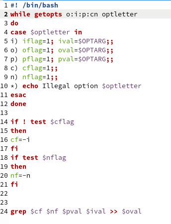
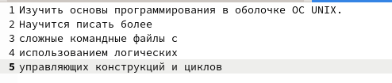
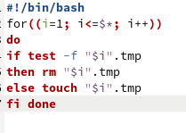
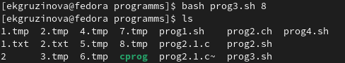
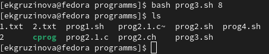
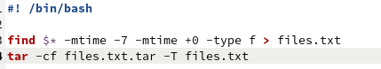
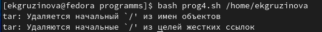
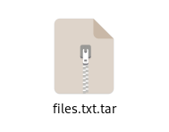
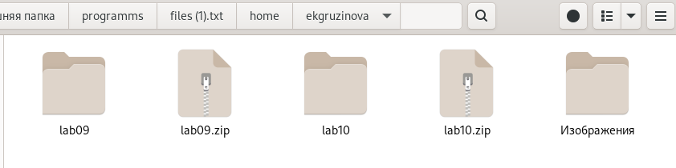

---
## Front matter
lang: ru-RU
title: Отчет по лабораторной работе №11
author: Грузинова Елизавета Константиновна. НКНбд-02-21

## Formatting
toc: false
slide_level: 2
theme: metropolis
header-includes: 
 - \metroset{progressbar=frametitle,sectionpage=progressbar,numbering=fraction}
 - '\makeatletter'
 - '\beamer@ignorenonframefalse'
 - '\makeatother'
aspectratio: 43
section-titles: true
---

# Программирование в командном процессоре ОС UNIX. Ветвления и циклы.

## Цель работы

Изучить основы программирования в оболочке ОС UNIX. Научится писать более сложные командные файлы с использованием логических управляющих конструкций и циклов.

## Задание

1. Используя команды getopts grep, написать командный файл, который анализирует командную строку с ключами:
– -iinputfile — прочитать данные из указанного файла;
– -ooutputfile — вывести данные в указанный файл;
– -pшаблон — указать шаблон для поиска;
– -C — различать большие и малые буквы;
– -n — выдавать номера строк.
а затем ищет в указанном файле нужные строки, определяемые ключом -p.

## Задание

2. Написать на языке Си программу, которая вводит число и определяет, является ли оно больше нуля, меньше нуля или равно нулю. Затем программа завершается с помощью функции exit(n), передавая информацию в о коде завершения в оболочку. Командный файл должен вызывать эту программу и, проанализировав с помощью команды $?, выдать сообщение о том, какое число было введено.

## Задание

3. Написать командный файл, создающий указанное число файлов, пронумерованных последовательно от 1 до N (например 1.tmp, 2.tmp, 3.tmp,4.tmp и т.д.). Число файлов, которые необходимо создать, передаётся в аргументы командной строки. Этот же командный файл должен уметь удалять все созданные им файлы (если они существуют).

## Задание

4. Написать командный файл, который с помощью команды tar запаковывает в архив все файлы в указанной директории. Модифицировать его так, чтобы запаковывались только те файлы, которые были изменены менее недели тому назад (использовать команду find).

## Теоретическое введение

Циклы Bash - это циклические конструкции, используемые для итерационного выполнения (перебора) любого заданного количества задач до тех пор, пока не будут выполнены все пункты в указанном списке или же предопределенные условия. Циклы в Bash имеют три основных типа.

## Теоретическое введение

Цикл for используется для повторения любого заданного кода для любого количества элементов в заданном списке.
Следующий вид циклов в нашем списке - цикл while. Конкретно этот цикл действует по заданному условию. То есть он будет выполнять код, заключенный в рамки DO и DONE пока заданное условие истинно. Как только заданное условие станет ложным, выполнение цикла прекратится.

## Теоретическое введение

Последний цикл, который мы рассмотрим в этой статье по написанию скриптов - это цикл until. Цикл until действует прямо противоположно циклу while. Цикл until также действует по заданному условию. Однако код, заключенный между DO и DONE, будет выполняться только до тех пор, пока это условие не изменится с ложного на истинное.

## Выполнение лабораторной работы

1. Используя команды getopts grep, написать командный файл, который анализирует командную строку с ключами:
– -iinputfile — прочитать данные из указанного файла;
– -ooutputfile — вывести данные в указанный файл;
– -pшаблон — указать шаблон для поиска;
– -C — различать большие и малые буквы;
– -n — выдавать номера строк.
а затем ищет в указанном файле нужные строки, определяемые ключом -p. (рис. [-@fig:001; -@fig:002; -@fig:003])

## Выполнение лабораторной работы

{ #fig:001 width=50% }

## Выполнение лабораторной работы

{ #fig:002 width=70% }

## Выполнение лабораторной работы

{ #fig:003 width=70% }

## Выполнение лабораторной работы

3. Написать командный файл, создающий указанное число файлов, пронумерованных последовательно от 1 до N (например 1.tmp, 2.tmp, 3.tmp,4.tmp и т.д.). Число файлов, которые необходимо создать, передаётся в аргументы командной строки. Этот же командный файл должен уметь удалять все созданные им файлы (если они существуют). (рис. [-@fig:004; -@fig:005; -@fig:006])

## Выполнение лабораторной работы

{ #fig:004 width=70% }

## Выполнение лабораторной работы

{ #fig:005 width=70% }

{ #fig:006 width=70% }

## Выполнение лабораторной работы

4. Написать командный файл, который с помощью команды tar запаковывает в архив все файлы в указанной директории. Модифицировать его так, чтобы запаковывались только те файлы, которые были изменены менее недели тому назад (использовать команду find). рис. [-@fig:007; -@fig:008; -@fig:009; -@fig:010])

## Выполнение лабораторной работы

{ #fig:007 width=70% }

{ #fig:008 width=70% }

## Выполнение лабораторной работы

{ #fig:009 width=50% }

## Выполнение лабораторной работы

{ #fig:010 width=70% }

## Выводы

В процессе выполнения лабораторной работы изучила основы программмирования в оболочке OC UNIX и научилась писать более сложные командные файлы с использованием логических управляющих конструкций.

## {.standout}

Спасибо за внимание!
