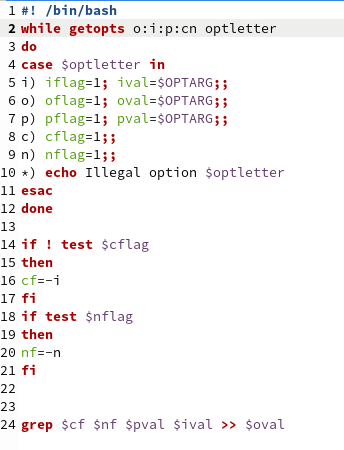
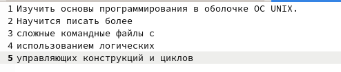
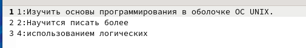
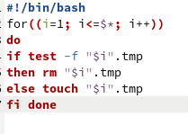
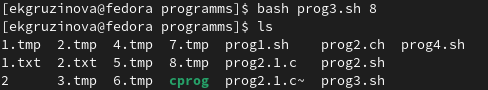
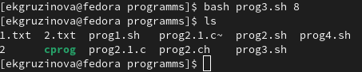
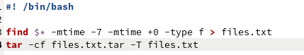
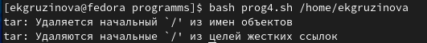
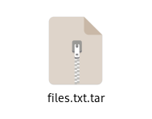
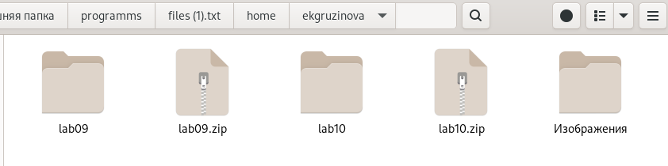

---
## Front matter
title: "Отчёт по лабораторной работе №11"
subtitle: "Программирование в командном процессоре ОС UNIX. Ветвления и циклы"
author: "Грузинова Елизавета Константиновна. НКНбд-02-21"

## Generic otions
lang: ru-RU
toc-title: "Содержание"

## Bibliography
bibliography: bib/cite.bib
csl: pandoc/csl/gost-r-7-0-5-2008-numeric.csl

## Pdf output format
toc: true # Table of contents
toc-depth: 2
lof: true # List of figures
lot: false # List of tables
fontsize: 12pt
linestretch: 1.5
papersize: a4
documentclass: scrreprt
## I18n polyglossia
polyglossia-lang:
  name: russian
  options:
	- spelling=modern
	- babelshorthands=true
polyglossia-otherlangs:
  name: english
## I18n babel
babel-lang: russian
babel-otherlangs: english
## Fonts
mainfont: PT Serif
romanfont: PT Serif
sansfont: PT Sans
monofont: PT Mono
mainfontoptions: Ligatures=TeX
romanfontoptions: Ligatures=TeX
sansfontoptions: Ligatures=TeX,Scale=MatchLowercase
monofontoptions: Scale=MatchLowercase,Scale=0.9
## Biblatex
biblatex: true
biblio-style: "gost-numeric"
biblatexoptions:
  - parentracker=true
  - backend=biber
  - hyperref=auto
  - language=auto
  - autolang=other*
  - citestyle=gost-numeric
## Pandoc-crossref LaTeX customization
figureTitle: "Рис."
tableTitle: "Таблица"
listingTitle: "Листинг"
lofTitle: "Список иллюстраций"
lotTitle: "Список таблиц"
lolTitle: "Листинги"
## Misc options
indent: true
header-includes:
  - \usepackage{indentfirst}
  - \usepackage{float} # keep figures where there are in the text
  - \floatplacement{figure}{H} # keep figures where there are in the text
---

# Цель работы

Изучить основы программирования в оболочке ОС UNIX. Научится писать более сложные командные файлы с использованием логических управляющих конструкций и циклов.

# Задание

1. Используя команды getopts grep, написать командный файл, который анализирует командную строку с ключами:
– -iinputfile — прочитать данные из указанного файла;
– -ooutputfile — вывести данные в указанный файл;
– -pшаблон — указать шаблон для поиска;
– -C — различать большие и малые буквы;
– -n — выдавать номера строк.
а затем ищет в указанном файле нужные строки, определяемые ключом -p.

2. Написать на языке Си программу, которая вводит число и определяет, является ли оно больше нуля, меньше нуля или равно нулю. Затем программа завершается с помощью функции exit(n), передавая информацию в о коде завершения в оболочку. Командный файл должен вызывать эту программу и, проанализировав с помощью команды $?, выдать сообщение о том, какое число было введено.

3. Написать командный файл, создающий указанное число файлов, пронумерованных последовательно от 1 до N (например 1.tmp, 2.tmp, 3.tmp,4.tmp и т.д.). Число файлов, которые необходимо создать, передаётся в аргументы командной строки. Этот же командный файл должен уметь удалять все созданные им файлы (если они существуют).

4. Написать командный файл, который с помощью команды tar запаковывает в архив все файлы в указанной директории. Модифицировать его так, чтобы запаковывались только те файлы, которые были изменены менее недели тому назад (использовать команду find).

# Теоретическое введение

Циклы Bash - это циклические конструкции, используемые для итерационного выполнения (перебора) любого заданного количества задач до тех пор, пока не будут выполнены все пункты в указанном списке или же предопределенные условия. Циклы в Bash имеют три основных типа.
Цикл for используется для повторения любого заданного кода для любого количества элементов в заданном списке.
Следующий вид циклов в нашем списке - цикл while. Конкретно этот цикл действует по заданному условию. То есть он будет выполнять код, заключенный в рамки DO и DONE пока заданное условие истинно. Как только заданное условие станет ложным, выполнение цикла прекратится.
Последний цикл, который мы рассмотрим в этой статье по написанию скриптов - это цикл until. Цикл until действует прямо противоположно циклу while. Цикл until также действует по заданному условию. Однако код, заключенный между DO и DONE, будет выполняться только до тех пор, пока это условие не изменится с ложного на истинное.
[@info_ru:bash]

# Выполнение лабораторной работы

1. Используя команды getopts grep, написать командный файл, который анализирует командную строку с ключами:
– -iinputfile — прочитать данные из указанного файла;
– -ooutputfile — вывести данные в указанный файл;
– -pшаблон — указать шаблон для поиска;
– -C — различать большие и малые буквы;
– -n — выдавать номера строк.
а затем ищет в указанном файле нужные строки, определяемые ключом -p. (рис. [-@fig:001; -@fig:002; -@fig:003])

{ #fig:001 width=70% }

{ #fig:002 width=70% }

{ #fig:003 width=70% }

3. Написать командный файл, создающий указанное число файлов, пронумерованных последовательно от 1 до N (например 1.tmp, 2.tmp, 3.tmp,4.tmp и т.д.). Число файлов, которые необходимо создать, передаётся в аргументы командной строки. Этот же командный файл должен уметь удалять все созданные им файлы (если они существуют). (рис. [-@fig:004; -@fig:005; -@fig:006])

{ #fig:004 width=70% }

{ #fig:005 width=70% }

{ #fig:006 width=70% }

4. Написать командный файл, который с помощью команды tar запаковывает в архив все файлы в указанной директории. Модифицировать его так, чтобы запаковывались только те файлы, которые были изменены менее недели тому назад (использовать команду find). рис. [-@fig:007; -@fig:008; -@fig:009; -@fig:010])

{ #fig:007 width=70% }

{ #fig:008 width=70% }

{ #fig:009 width=70% }

{ #fig:010 width=70% }

# Контрольные вопросы.

1. Каково предназначение команды getopts?

Getopts – это POSIX-совместимая встроенная функция bash, которая принимает короткие аргументы, такие как -h, -v, -b и т.д.

2. Какое отношение метасимволы имеют к генерации имён файлов?

После всех подстановок в каждом слове команды ищутся символы *,?, и [. Если находится хотя бы один из них, то это слово рассматривается как шаблон имен файлов и заменяется именами файлов, удовлетворяющих данному шаблону (в алфавитном порядке). Если ни одно имя файла не удовлетворяет шаблону, то он остается неизменным. Значения указанных символов:

*	любая строка, включая и пустую
?	один любой символ
[...]	любой из указанных между ними символов. Пара символов, разделенных знаком -, означает любой символ, который находится между ними, включая и их самих. Если первым символом после "[" идет "!", то указанные символы не должны входить в имя файла

3. Какие операторы управления действиями вы знаете?

Точка с запятой (;), амперсанд (&), символ доллара со знаком вопроса ($?), двойной амперсанд (&&) и Знак фунта (#).

4. Какие операторы используются для прерывания цикла?

Break, return.

5. Для чего нужны команды false и true?

Если мы выполняем команды, они действительно “ничего не делают”, за исключением того, что команда true возвращает 0, а команда false возвращает 1. Команда false необходима для возращения кода сбоя, а true позволяет создавать бесконечные циклы.

6. Что означает строка if test -f man$s/$i.$s, встреченная в командном файле?

Если man$s/$i.$s существует и является обычным файлом, то...

7. Объясните различия между конструкциями while и until

While действует до тех пор, пока истинное в условии не станет ложным. Until же, наоборот, действует до тех пор, пока ложное в условии не станет истинным.

# Выводы

В процессе выполнения лабораторной работы изучила основы программмирования в оболочке OC UNIX и научилась писать более сложные командные файлы с использованием логических управляющих конструкций.

# Список литературы{.unnumbered}

::: {#refs}
:::
