---
## Front matter
lang: ru-RU
title: Отчёт по лабораторной работе
author: Грузинова Елизавета Константиновна
## Formatting
toc: false
slide_level: 2
theme: metropolis
header-includes: 
 - \metroset{progressbar=frametitle,sectionpage=progressbar,numbering=fraction}
 - '\makeatletter'
 - '\beamer@ignorenonframefalse'
 - '\makeatother'
aspectratio: 43
section-titles: true
---

# Средства, применяемые при разработке программного обеспечения в ОС типа UNIX/Linux

## Цель работы

Приобрести простейшие навыки разработки, анализа, тестирования и отладки приложений в ОС типа UNIX/Linux на примере создания на языке программирования С калькулятора с простейшими функциями.

## Задание

1. В домашнем каталоге создайте подкаталог ~/work/os/lab_prog.

2. Создайте в нём файлы: calculate.h, calculate.c, main.c.

Это будет примитивнейший калькулятор, способный складывать, вычитать, умножать и делить, возводить число в степень, брать квадратный корень, вычислять sin, cos, tan. При запуске он будет запрашивать первое число, операцию, второе число. После этого программа выведет результат и остановится.

## Задание

Тексты реализаций функций калькулятора в файле calculate.h, интерфейсного файла calculate.h, описывающий формат вызова функции-калькулятора и основного файла main.c, реализующий интерфейс пользователя к калькулятору приведены при выполнении лабораторной работы.

## Задание

3. Выполните компиляцию программы посредством gcc:

1 gcc -c calculate.c
2 gcc -c main.c
3 gcc calculate.o main.o -o calcul -lm

4. При необходимости исправьте синтаксические ошибки.

5. Создайте Makefile со следующим содержанием (текст также приведен при выполнении лабораторной работы).
Поясните в отчёте его содержание.

## Задание

6. С помощью gdb выполните отладку программы calcul (перед использованием gdb
исправьте Makefile):

– Запустите отладчик GDB, загрузив в него программу для отладки:

1 gdb ./calcul

– Для запуска программы внутри отладчика введите команду run:

1 run

## Задание

– Для постраничного (по 9 строк) просмотра исходного код используйте команду list:

1 list

– Для просмотра строк с 12 по 15 основного файла используйте list с параметрами:

1 list 12,15

## Задание

– Для просмотра определённых строк не основного файла используйте list с параметрами:

1 list calculate.c:20,29

– Установите точку останова в файле calculate.c на строке номер 21:

1 list calculate.c:20,27

2 break 21

## Задание

– Выведите информацию об имеющихся в проекте точка останова:

1 info breakpoints

## Задание

– Запустите программу внутри отладчика и убедитесь, что программа остановится в момент прохождения точки останова:

1 run

2 5

3 -

4 backtrace

## Задание

– Отладчик выдаст следующую информацию:

1 #0 Calculate (Numeral=5, Operation=0x7fffffffd280 "-")
2 at calculate.c:21
3 #1 0x0000000000400b2b in main () at main.c:17

а команда backtrace покажет весь стек вызываемых функций от начала программы до текущего места.

## Задание

– Посмотрите, чему равно на этом этапе значение переменной Numeral, введя

1 print Numeral

На экран должно быть выведено число 5.

## Задание

– Сравните с результатом вывода на экран после использования команды:

1 display Numeral

## Задание

– Уберите точки останова:

1 info breakpoints
2 delete 1

7. С помощью утилиты splint попробуйте проанализировать коды файлов calculate.c
и main.c.

## Теоретическое введение

Этапы разработки приложений.

Процесс разработки программного обеспечения обычно разделяется на следующие этапы:

– планирование, включающее сбор и анализ требований к функционалу и другим характеристикам разрабатываемого приложения;

– проектирование, включающее в себя разработку базовых алгоритмов и спецификаций, определение языка программирования;

– непосредственная разработка приложения:

– кодирование — по сути создание исходного текста программы (возможно в нескольких вариантах);

– анализ разработанного кода;

## Теоретическое введение

– сборка, компиляция и разработка исполняемого модуля;

– тестирование и отладка, сохранение произведённых изменений;

– документирование.

Для создания исходного текста программы разработчик может воспользоваться любым удобным для него редактором текста: vi, vim, mceditor, emacs, geany и др. После завершения написания исходного кода программы (возможно состоящей из нескольких файлов), необходимо её скомпилировать и получить исполняемый модуль.

## Выполнение лабораторной работы

1. В домашнем каталоге создание подкаталога ~/work/os/lab_prog. (рис. [-@fig:001])

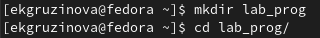{ #fig:001 width=70% }

2. Создание в нём файлов: calculate.h, calculate.c, main.c. (рис. [-@fig:002])

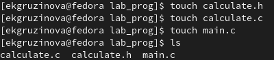{ #fig:002 width=70% }

## Выполнение лабораторной работы

Это будет примитивнейший калькулятор, способный складывать, вычитать, умножать и делить, возводить число в степень, брать квадратный корень, вычислять sin, cos, tan. При запуске он будет запрашивать первое число, операцию, второе число. После этого программа выведет результат и остановится.
Тексты реализаций функций калькулятора в файле calculate.h, интерфейсного файла calculate.h, описывающий формат вызова функции-калькулятора и основного файла main.c, реализующий интерфейс пользователя к калькулятору приведены при выполнении лабораторной работы. (рис. [-@fig:003; -@fig:004; -@fig:005; -@fig:006; -@fig:007])

## Выполнение лабораторной работы

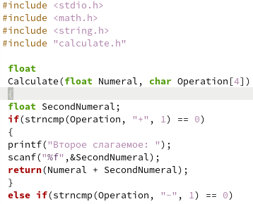{ #fig:003 width=70% }

## Выполнение лабораторной работы

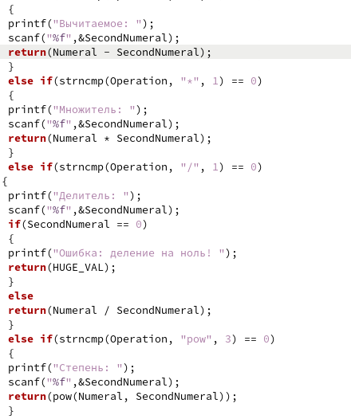{ #fig:004 width=40% }

## Выполнение лабораторной работы

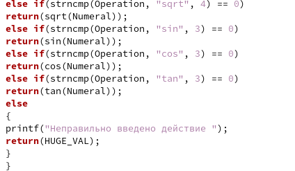{ #fig:005 width=70% }

## Выполнение лабораторной работы

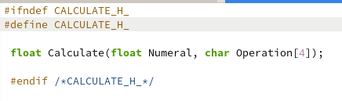{ #fig:006 width=70% }

## Выполнение лабораторной работы

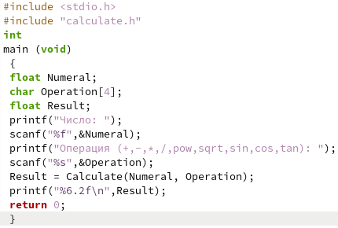{ #fig:007 width=70% }

## Выполнение лабораторной работы

3. Выполнение компиляции программы посредством gcc (рис. [-@fig:008]):

1 gcc -c calculate.c
2 gcc -c main.c
3 gcc calculate.o main.o -o calcul -lm 

## Выполнение лабораторной работы

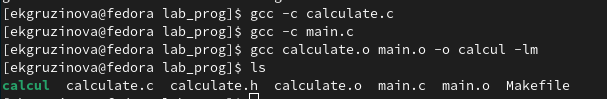{ #fig:008 width=70% }

## Выполнение лабораторной работы

4. При необходимости исправьте синтаксические ошибки (их не было обнаружено).

5. Создание Makefile со следующим содержанием (текст также приведен при выполнении лабораторной работы).
Поясните в отчёте его содержание. (рис. [-@fig:009])

## Выполнение лабораторной работы

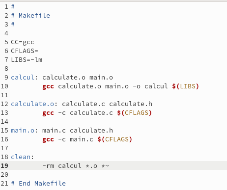{ #fig:009 width=70% }

## Выполнение лабораторной работы

6. С помощью gdb выполнение отладки программы calcul (перед использованием gdb
исправьте Makefile) (рис. [-@fig:010;-@fig:011]): 

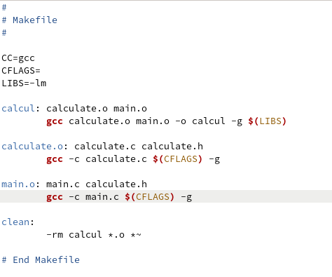{ #fig:010 width=70% }

## Выполнение лабораторной работы

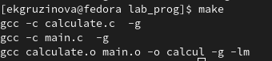{ #fig:011 width=70% }

## Выполнение лабораторной работы

– Запуcтите отладчик GDB, загрузив в него программу для отладки (рис. [-@fig:012]):

1 gdb ./calcul

## Выполнение лабораторной работы

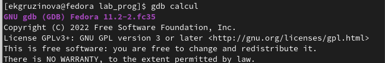{ #fig:012 width=70% }

## Выполнение лабораторной работы

– Для запуска программы внутри отладчика введите команду run (рис. [-@fig:013]):

1 run

## Выполнение лабораторной работы

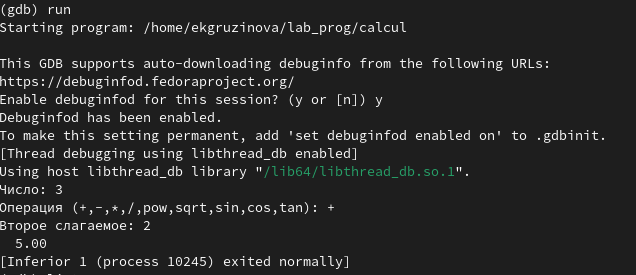{ #fig:013 width=70% }

## Выполнение лабораторной работы

– Для постраничного (по 9 строк) просмотра исходного код используйте команду list (рис. [-@fig:014]):

1 list

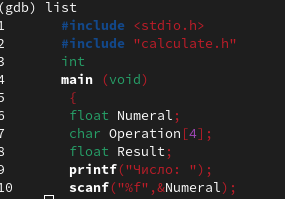{ #fig:014 width=70% }

## Выполнение лабораторной работы

– Для просмотра строк с 12 по 15 основного файла используйте list с параметрами (рис. [-@fig:015]):

1 list 12,15

{ #fig:015 width=70% }

## Выполнение лабораторной работы

– Для просмотра определённых строк не основного файла используйте list с параметрами (рис. [-@fig:016]):

1 list calculate.c:20,29

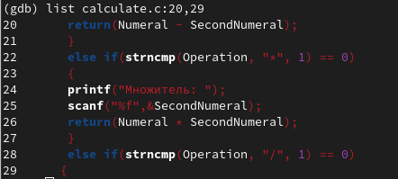{ #fig:016 width=70% }

## Выполнение лабораторной работы

– Установите точку останова в файле calculate.c на строке номер 21 (рис. [-@fig:017; -@fig:018]):

1 list calculate.c:20,27

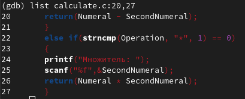{ #fig:017 width=70% }

## Выполнение лабораторной работы

2 break 21

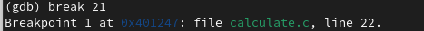{ #fig:018 width=70% }

## Выполнение лабораторной работы

– Выведите информацию об имеющихся в проекте точка останова (рис. [-@fig:019]):

1 info breakpoints

{ #fig:019 width=70% }

## Выполнение лабораторной работы

– Запустите программу внутри отладчика и убедитесь, что программа остановится в момент прохождения точки останова (рис. [-@fig:020]):

1 run

2 5

3 -

4 backtrace

## Выполнение лабораторной работы

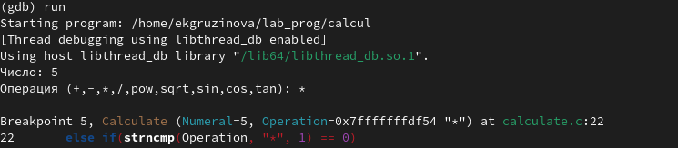{ #fig:020 width=70% }

а команда backtrace покажет весь стек вызываемых функций от начала программы до текущего места (рис. [-@fig:021]).

## Выполнение лабораторной работы

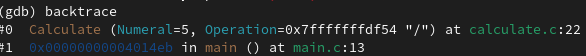{ #fig:021 width=70% }

## Выполнение лабораторной работы

– Посмотрите, чему равно на этом этапе значение переменной Numeral, введя

1 print Numeral

На экран должно быть выведено число 5 (рис. [-@fig:022]).

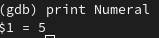{ #fig:022 width=70% }

## Выполнение лабораторной работы

– Сравните с результатом вывода на экран после использования команды (рис. [-@fig:023]):

1 display Numeral

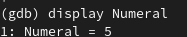{ #fig:023 width=70% }

## Выполнение лабораторной работы

– Уберите точки останова (рис. [-@fig:024]):

1 info breakpoints
2 delete 1

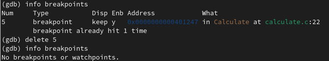{ #fig:024 width=70% }

## Выполнение лабораторной работы

7. С помощью утилиты splint попробуйте проанализировать коды файлов calculate.c
и main.c. (рис. [-@fig:025; -@fig:026])

## Выполнение лабораторной работы

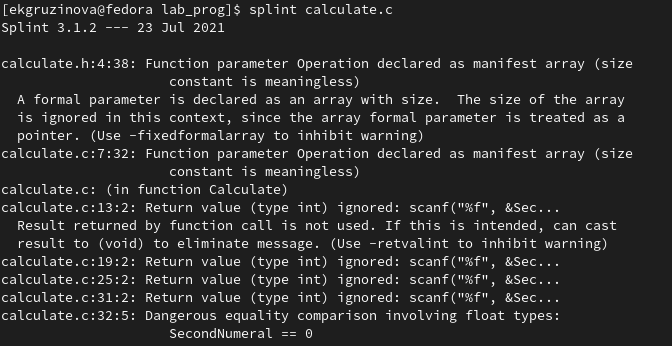{ #fig:025 width=70% }

## Выполнение лабораторной работы

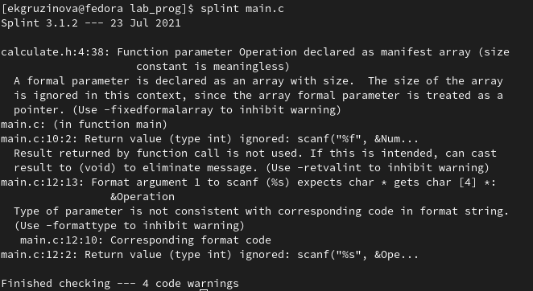{ #fig:026 width=70% }

# Выводы

При выполнении лабораторной работы приобрела навыки разработки, анализа, тестирования и откладки приложений в ОС типа UNIX/Linux на примере создания на языке программирования С калькулятора с простейшими функциями.

## {.standout}

Спасибо за внимание!
