---
## Front matter
title: "Отчёт по лабораторной работе №13"
subtitle: "Средства, применяемые при разработке программного обеспечения в ОС типа UNIX/Linux"
author: "Грузинова Елизавета Константиновна, НКНбд-02-21"

## Generic otions
lang: ru-RU
toc-title: "Содержание"

## Bibliography
bibliography: bib/cite.bib
csl: pandoc/csl/gost-r-7-0-5-2008-numeric.csl

## Pdf output format
toc: true # Table of contents
toc-depth: 2
lof: true # List of figures
lot: false # List of tables
fontsize: 12pt
linestretch: 1.5
papersize: a4
documentclass: scrreprt
## I18n polyglossia
polyglossia-lang:
  name: russian
  options:
	- spelling=modern
	- babelshorthands=true
polyglossia-otherlangs:
  name: english
## I18n babel
babel-lang: russian
babel-otherlangs: english
## Fonts
mainfont: PT Serif
romanfont: PT Serif
sansfont: PT Sans
monofont: PT Mono
mainfontoptions: Ligatures=TeX
romanfontoptions: Ligatures=TeX
sansfontoptions: Ligatures=TeX,Scale=MatchLowercase
monofontoptions: Scale=MatchLowercase,Scale=0.9
## Biblatex
biblatex: true
biblio-style: "gost-numeric"
biblatexoptions:
  - parentracker=true
  - backend=biber
  - hyperref=auto
  - language=auto
  - autolang=other*
  - citestyle=gost-numeric
## Pandoc-crossref LaTeX customization
figureTitle: "Рис."
tableTitle: "Таблица"
listingTitle: "Листинг"
lofTitle: "Список иллюстраций"
lotTitle: "Список таблиц"
lolTitle: "Листинги"
## Misc options
indent: true
header-includes:
  - \usepackage{indentfirst}
  - \usepackage{float} # keep figures where there are in the text
  - \floatplacement{figure}{H} # keep figures where there are in the text
---

# Цель работы

Приобрести простейшие навыки разработки, анализа, тестирования и отладки приложений в ОС типа UNIX/Linux на примере создания на языке программирования С калькулятора с простейшими функциями.

# Задание

1. В домашнем каталоге создайте подкаталог ~/work/os/lab_prog.

2. Создайте в нём файлы: calculate.h, calculate.c, main.c.

Это будет примитивнейший калькулятор, способный складывать, вычитать, умножать и делить, возводить число в степень, брать квадратный корень, вычислять sin, cos, tan. При запуске он будет запрашивать первое число, операцию, второе число. После этого программа выведет результат и остановится.
Тексты реализаций функций калькулятора в файле calculate.h, интерфейсного файла calculate.h, описывающий формат вызова функции-калькулятора и основного файла main.c, реализующий интерфейс пользователя к калькулятору приведены при выполнении лабораторной работы.

3. Выполните компиляцию программы посредством gcc:

1 gcc -c calculate.c
2 gcc -c main.c
3 gcc calculate.o main.o -o calcul -lm

4. При необходимости исправьте синтаксические ошибки.

5. Создайте Makefile со следующим содержанием (текст также приведен при выполнении лабораторной работы).
Поясните в отчёте его содержание.

6. С помощью gdb выполните отладку программы calcul (перед использованием gdb
исправьте Makefile):

– Запустите отладчик GDB, загрузив в него программу для отладки:

1 gdb ./calcul

– Для запуска программы внутри отладчика введите команду run:

1 run

– Для постраничного (по 9 строк) просмотра исходного код используйте команду list:

1 list

– Для просмотра строк с 12 по 15 основного файла используйте list с параметрами:

1 list 12,15

– Для просмотра определённых строк не основного файла используйте list с параметрами:

1 list calculate.c:20,29

– Установите точку останова в файле calculate.c на строке номер 21:

1 list calculate.c:20,27

2 break 21

– Выведите информацию об имеющихся в проекте точка останова:

1 info breakpoints

– Запустите программу внутри отладчика и убедитесь, что программа остановится в момент прохождения точки останова:

1 run
2 5
3 -
4 backtrace

– Отладчик выдаст следующую информацию:

1 #0 Calculate (Numeral=5, Operation=0x7fffffffd280 "-")
2 at calculate.c:21
3 #1 0x0000000000400b2b in main () at main.c:17

а команда backtrace покажет весь стек вызываемых функций от начала программы до текущего места.

– Посмотрите, чему равно на этом этапе значение переменной Numeral, введя

1 print Numeral

На экран должно быть выведено число 5.

– Сравните с результатом вывода на экран после использования команды:

1 display Numeral

– Уберите точки останова:

1 info breakpoints
2 delete 1

7. С помощью утилиты splint попробуйте проанализировать коды файлов calculate.c
и main.c.

# Теоретическое введение

Этапы разработки приложений.

Процесс разработки программного обеспечения обычно разделяется на следующие этапы:

– планирование, включающее сбор и анализ требований к функционалу и другим характеристикам разрабатываемого приложения;

– проектирование, включающее в себя разработку базовых алгоритмов и спецификаций, определение языка программирования;

– непосредственная разработка приложения:

– кодирование — по сути создание исходного текста программы (возможно в нескольких вариантах);

– анализ разработанного кода;

– сборка, компиляция и разработка исполняемого модуля;

– тестирование и отладка, сохранение произведённых изменений;

– документирование.

Для создания исходного текста программы разработчик может воспользоваться любым удобным для него редактором текста: vi, vim, mceditor, emacs, geany и др. После завершения написания исходного кода программы (возможно состоящей из нескольких файлов), необходимо её скомпилировать и получить исполняемый модуль. [@lab13:bash]

# Выполнение лабораторной работы

1. В домашнем каталоге создание подкаталога ~/work/os/lab_prog. (рис. [-@fig:001])

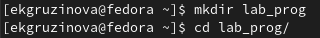{ #fig:001 width=70% }

2. Создание в нём файлов: calculate.h, calculate.c, main.c. (рис. [-@fig:002])

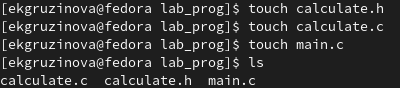{ #fig:002 width=70% }

Это будет примитивнейший калькулятор, способный складывать, вычитать, умножать и делить, возводить число в степень, брать квадратный корень, вычислять sin, cos, tan. При запуске он будет запрашивать первое число, операцию, второе число. После этого программа выведет результат и остановится.
Тексты реализаций функций калькулятора в файле calculate.h, интерфейсного файла calculate.h, описывающий формат вызова функции-калькулятора и основного файла main.c, реализующий интерфейс пользователя к калькулятору приведены при выполнении лабораторной работы. (рис. [-@fig:003; -@fig:004; -@fig:005; -@fig:006; -@fig:007])

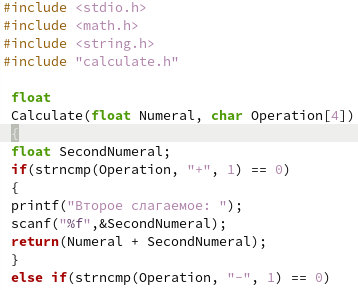{ #fig:003 width=70% }

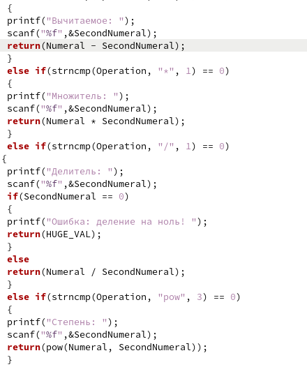{ #fig:004 width=70% }

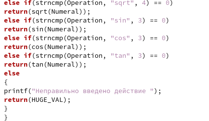{ #fig:005 width=70% }

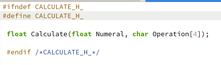{ #fig:006 width=70% }

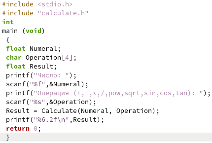{ #fig:007 width=70% }

3. Выполнение компиляции программы посредством gcc (рис. [-@fig:008]):

1 gcc -c calculate.c
2 gcc -c main.c
3 gcc calculate.o main.o -o calcul -lm 

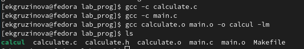{ #fig:008 width=70% }

4. При необходимости исправьте синтаксические ошибки (их не было обнаружено).

5. Создание Makefile со следующим содержанием (текст также приведен при выполнении лабораторной работы).
Поясните в отчёте его содержание. (рис. [-@fig:009])

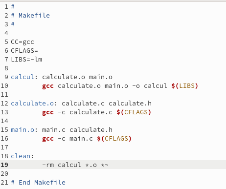{ #fig:009 width=70% }

6. С помощью gdb выполнение отладки программы calcul (перед использованием gdb
исправьте Makefile) (рис. [-@fig:010;-@fig:011]): 

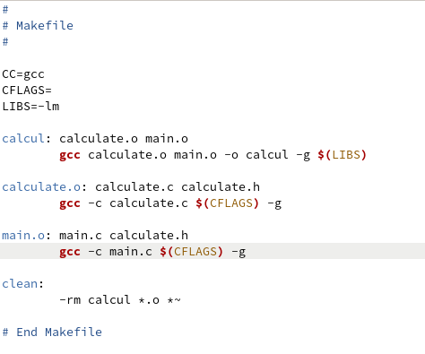{ #fig:010 width=70% }

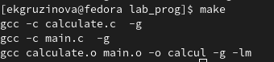{ #fig:011 width=70% }

– Запуcтите отладчик GDB, загрузив в него программу для отладки (рис. [-@fig:012]):

1 gdb ./calcul

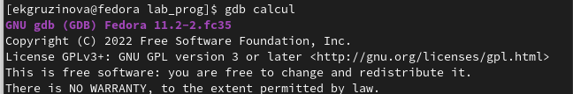{ #fig:012 width=70% }

– Для запуска программы внутри отладчика введите команду run (рис. [-@fig:013]):

1 run

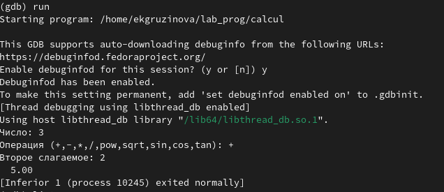{ #fig:013 width=70% }

– Для постраничного (по 9 строк) просмотра исходного код используйте команду list (рис. [-@fig:014]):

1 list

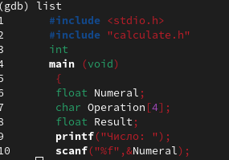{ #fig:014 width=70% }

– Для просмотра строк с 12 по 15 основного файла используйте list с параметрами (рис. [-@fig:015]):

1 list 12,15

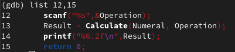{ #fig:015 width=70% }

– Для просмотра определённых строк не основного файла используйте list с параметрами (рис. [-@fig:016]):

1 list calculate.c:20,29

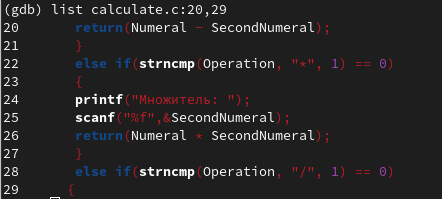{ #fig:016 width=70% }

– Установите точку останова в файле calculate.c на строке номер 21 (рис. [-@fig:017; -@fig:018]):

1 list calculate.c:20,27

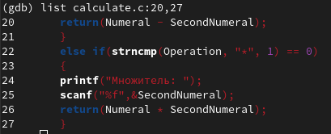{ #fig:017 width=70% }

2 break 21

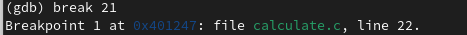{ #fig:018 width=70% }

– Выведите информацию об имеющихся в проекте точка останова (рис. [-@fig:019]):

1 info breakpoints

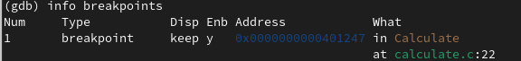{ #fig:019 width=70% }

– Запустите программу внутри отладчика и убедитесь, что программа остановится в момент прохождения точки останова (рис. [-@fig:020]):

1 run
2 5
3 -
4 backtrace

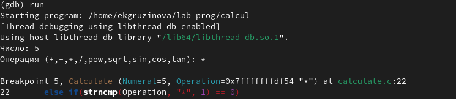{ #fig:020 width=70% }

а команда backtrace покажет весь стек вызываемых функций от начала программы до текущего места (рис. [-@fig:021]).

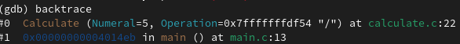{ #fig:021 width=70% }

– Посмотрите, чему равно на этом этапе значение переменной Numeral, введя

1 print Numeral

На экран должно быть выведено число 5 (рис. [-@fig:022]).

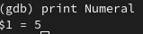{ #fig:022 width=70% }

– Сравните с результатом вывода на экран после использования команды (рис. [-@fig:023]):

1 display Numeral

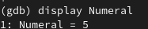{ #fig:023 width=70% }

– Уберите точки останова (рис. [-@fig:024]):

1 info breakpoints
2 delete 1

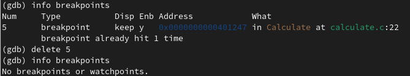{ #fig:024 width=70% }

7. С помощью утилиты splint попробуйте проанализировать коды файлов calculate.c
и main.c. (рис. [-@fig:025; -@fig:026])

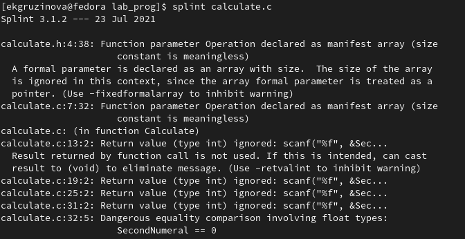{ #fig:025 width=70% }

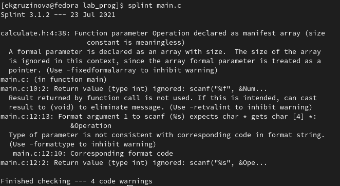{ #fig:026 width=70% }

# Выводы

При выполнении лабораторной работы приобрела навыки разработки, анализа, тестирования и откладки приложений в ОС типа UNIX/Linux на примере создания на языке программирования С калькулятора с простейшими функциями.

# Контрольные вопросы

1. Как получить информацию о возможностях программ gcc, make, gdb и др.?

С помощью команды man (имя_программы).

2. Назовите и дайте краткую характеристику основным этапам разработки приложений в UNIX.

– планирование, включающее сбор и анализ требований к функционалу и другим характеристикам разрабатываемого приложения;
– проектирование, включающее в себя разработку базовых алгоритмов и спецификаций, определение языка программирования;
– непосредственная разработка приложения:
– кодирование — по сути создание исходного текста программы (возможно в нескольких вариантах);
– анализ разработанного кода;
– сборка, компиляция и разработка исполняемого модуля;
– тестирование и отладка, сохранение произведённых изменений;
– документирование.

3. Что такое суффикс в контексте языка программирования? Приведите примеры использования.

Использование суффикса ".с" для имени файла с программой на языке Си отражает удобное и полезное соглашение, принятое в ОС UNIX. Для любого имени входного файла суффикс определяет какая компиляция требуется. Суффиксы и префиксы указывают тип объекта. Одно из полезных свойств компилятора Си — его способность по суффиксам определять типы файлов. По суффиксу .c компилятор распознает, что файл abcd.c должен компилироваться, а по суффиксу .o, что файл abcd.о является объектным модулем и для получения исполняемой программы необходимо выполнить редактирование связей. Простейший пример командной строки для компиляции программы abcd.c и построения исполняемого модуля abcd имеет вид: gcc -o abcd abcd.c.

4. Каково основное назначение компилятора языка С в UNIX?

Основное назначение компилятора с языка Си заключается в компиляции всей программы в целом и получении исполняемого модуля.

5. Для чего предназначена утилита make?

Утилита make автоматически определяет какие части большой программы должны быть перекомпилированы, и выполняет необходимые для этого действия.

6. Приведите пример структуры Makefile. Дайте характеристику основным элементам этого файла.

Текст, следующий за точкой с запятой, и все последующие строки, начинающиеся с литеры табуляции, являются командами OC UNIX, которые необходимо выполнить для обновления целевого файла. Таким образом, спецификация взаимосвязей имеет формат:

target1 [ target2...]: [:] [dependment1...]

[(tab)commands]

[#commentary]

[(tab)commands]

[#commentary],

где # — специфицирует начало комментария, так как содержимое строки, начиная с # и до конца строки, не будет обрабатываться командой make; : — последовательность команд ОС UNIX должна содержаться в одной строке make-файла (файла описаний), есть возможность переноса команд (\), но она считается как одна строка; :: — последовательность команд ОС UNIX может содержаться в нескольких последовательных строках файла описаний.

7. Назовите основное свойство, присущее всем программам отладки. Что необходимо сделать, чтобы его можно было использовать?

Запуск программы внутри отладки. В gdb используют команду run.

8. Назовите и дайте основную характеристику основным командам отладчика gdb.

– backtrace – выводит весь путь к текущей точке останова, то есть

названия всех функций, начиная от main(); иными словами, выводит

весь стек функций;

– break – устанавливает точку останова; параметром может быть

номер строки или название функции;

– clear – удаляет все точки останова на текущем уровне стека (то есть

в текущей функции);

– continue – продолжает выполнение программы от текущей точки

до конца;

– delete – удаляет точку останова или контрольное выражение;

– display – добавляет выражение в список выражений, значения кото-

рых отображаются каждый раз при остановке программы;

– finish – выполняет программу до выхода из текущей функции; отоб-

ражает возвращаемое значение,если такое имеется;

– info breakpoints – выводит список всех имеющихся точек останова;

– info watchpoints – выводит список всех имеющихся контрольных

выражений;

– list – выводит исходный код; в качестве параметра передаются

название файла исходного кода, затем, через двоеточие, номер

начальной и конечной строки;

– next – пошаговое выполнение программы, но, в отличие от команды

step, не выполняет пошагово вызываемые функции;

– print – выводит значение какого-либо выражения (выражение пере-

даётся в качестве параметра);

– run – запускает программу на выполнение;

– set – устанавливает новое значение переменной

– step – пошаговое выполнение программы;

– watch – устанавливает контрольное выражение, программа остановится, как только значение контрольного выражения изменится;

9. Опишите по шагам схему отладки программы, которую Вы использовали при выполнении лабораторной работы.

Добавляла после цели программы -g, чтобы выолнялась отладка программы.

10. Прокомментируйте реакцию компилятора на синтаксические ошибки в программе при его первом запуске.

11. Назовите основные средства, повышающие понимание исходного кода программы.

Если вы работаете с исходным кодом, который не вами разрабатывался, то назначение различных конструкций может быть не совсем понятным. Система разработки приложений UNIX предоставляет различные средства, повышающие понимание исходного кода. К ним относятся:

– cscope - исследование функций, содержащихся в программе;

– lint — критическая проверка программ, написанных на языке Си.

12. Каковы основные задачи, решаемые программой splint?

Эта утилита анализирует программный код, проверяет корректность задания аргументов использованных в программе функций и типов возвращаемых значений, обнаруживает синтаксические и семантические ошибки.

# Список литературы{.unnumbered}

::: {#refs}
:::
