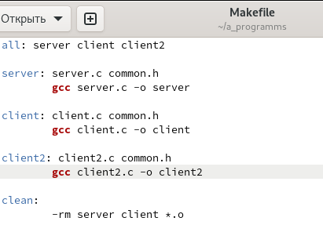
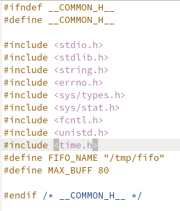
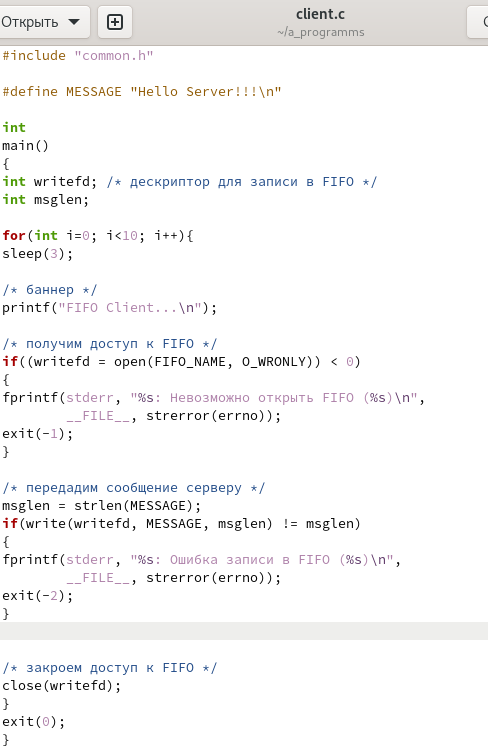
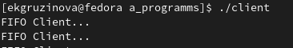
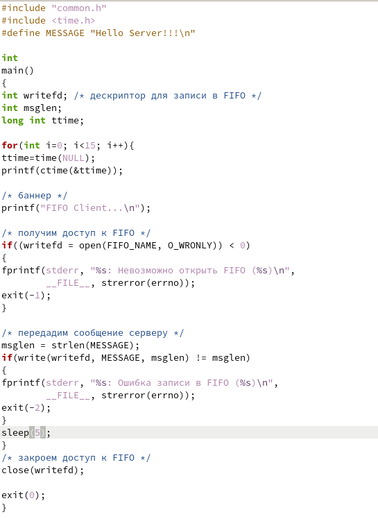
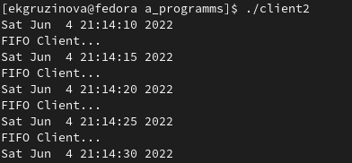
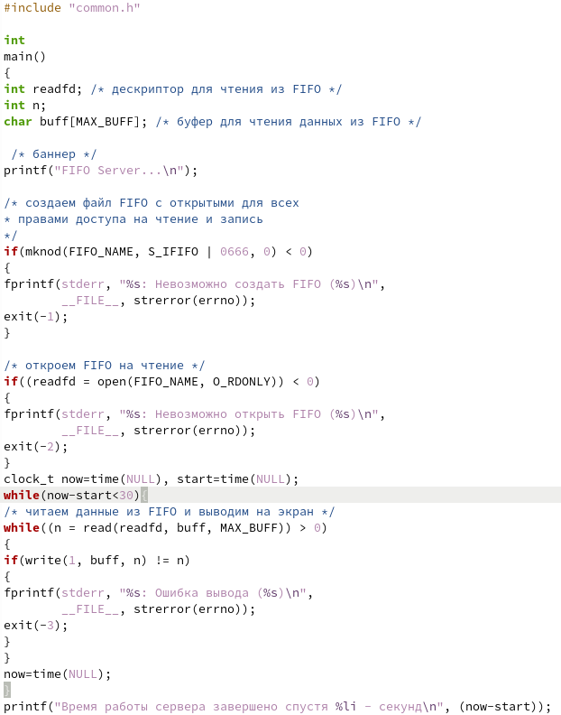
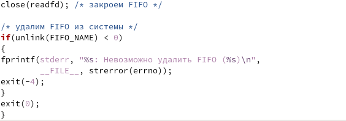
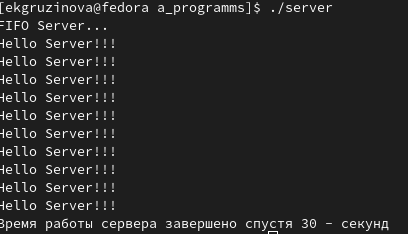

---
## Front matter
lang: ru-RU
title: Отчёт по лабораторной работе №14
author: Грузинова Елизавета Константиновна

## Formatting
toc: false
slide_level: 2
theme: metropolis
header-includes: 
 - \metroset{progressbar=frametitle,sectionpage=progressbar,numbering=fraction}
 - '\makeatletter'
 - '\beamer@ignorenonframefalse'
 - '\makeatother'
aspectratio: 43
section-titles: true
---

# Именованные каналы

## Цель работы

Приобретение практических навыков работы с именованными каналами.

## Задание

Изучите приведённые в тексте программы server.c и client.c. Взяв данные примеры за образец, напишите аналогичные программы, внеся следующие изменения:

1. Работает не 1 клиент, а несколько (например, два).

2. Клиенты передают текущее время с некоторой периодичностью (например, раз в пять секунд). Используйте функцию sleep() для приостановки работы клиента.

## Задание

3. Сервер работает не бесконечно, а прекращает работу через некоторое время (например, 30 сек). Используйте функцию clock() для определения времени работы сервера. Что будет в случае, если сервер завершит работу, не закрыв канал?

## Теоретическое введение

Для передачи данных между неродственными процессами можно использовать механизм именованных каналов (named pipes). Данные передаются по принципу FIFO (First In First Out) (первым записан — первым прочитан), поэтому они называются также FIFO pipes или просто FIFO. Именованные каналы отличаются от неименованных наличием идентификатора канала, который представлен как специальный файл (соответственно имя именованного канала — это имя файла). Поскольку файл находится на локальной файловой системе, данное IPC используется внутри одной системы.

## Выполнение лабораторной работы

Изучите приведённые в тексте программы server.c и client.c. Взяв данные примеры за образец, напишите аналогичные программы, внеся следующие изменения:

1. Работает не 1 клиент, а несколько (например, два). Также привести необходимые для работы тексты будущих командных файлов. (рис. [-@fig:001;-@fig:002;-@fig:003;-@fig:004])

## Выполнение лабораторной работы

{ #fig:001 width=70% }

## Выполнение лабораторной работы

{ #fig:002 width=40% }

## Выполнение лабораторной работы

{ #fig:003 width=40% }

## Выполнение лабораторной работы

{ #fig:004 width=70% }

## Выполнение лабораторной работы

2. Клиенты передают текущее время с некоторой периодичностью (например, раз в пять секунд). Используйте функцию sleep() для приостановки работы клиента. (рис. [-@fig:005;-@fig:006])

## Выполнение лабораторной работы

{ #fig:005 width=40% }

## Выполнение лабораторной работы

{ #fig:006 width=70% }

## Выполнение лабораторной работы

3. Сервер работает не бесконечно, а прекращает работу через некоторое время (например, 30 сек). Используйте функцию clock() для определения времени работы сервера. (рис. [-@fig:007;-@fig:008;-@fig:009])

## Выполнение лабораторной работы

{ #fig:007 width=40% }

## Выполнение лабораторной работы

{ #fig:008 width=70% }

## Выполнение лабораторной работы

{ #fig:009 width=70% }

Если сервер завершит работу, не закрыв канал, то файл FIFO не исчезнет, вследствие чего его нельзя будет запустить во второй раз, что приведет к недееспособности сервера.

# Выводы

В процессе выполнения лабораторной работы я приобрела практические навыки работы с именованными каналами.

## {.standout}

Спасибо за внимание!
