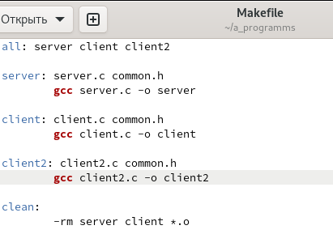
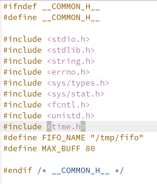
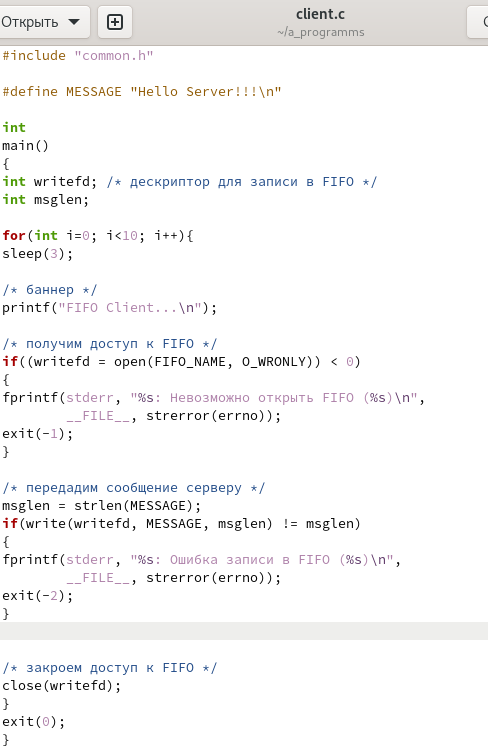
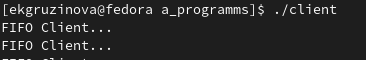
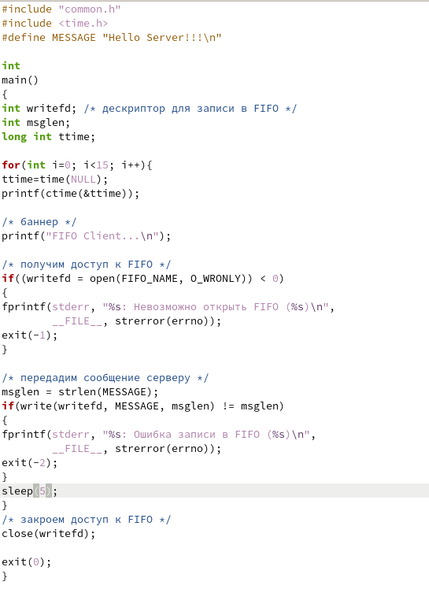
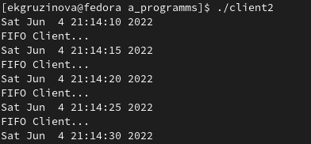
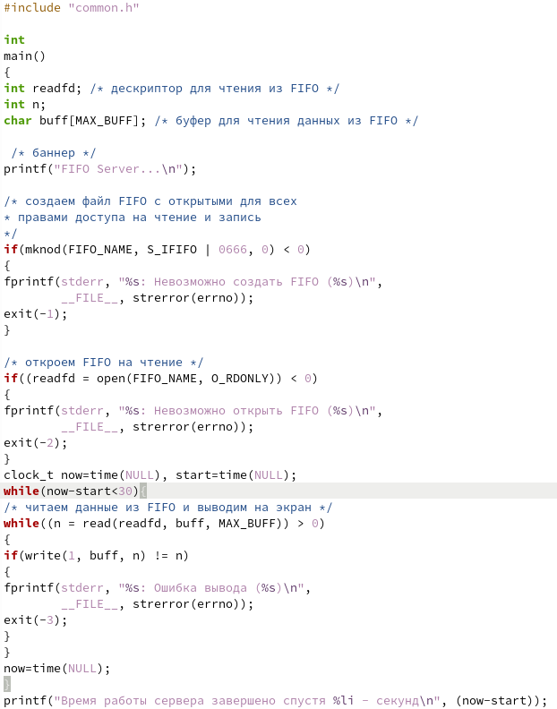
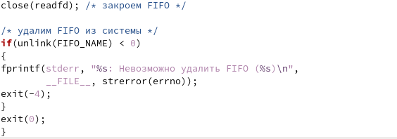
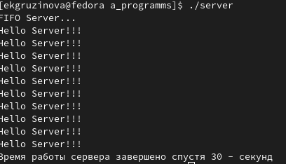

---
## Front matter
title: "Отчёт по лабораторной работе №14"
subtitle: "Именованные каналы"
author: "Грузинова Елизавета Константиновна"

## Generic otions
lang: ru-RU
toc-title: "Содержание"

## Bibliography
bibliography: bib/cite.bib
csl: pandoc/csl/gost-r-7-0-5-2008-numeric.csl

## Pdf output format
toc: true # Table of contents
toc-depth: 2
lof: true # List of figures
lot: false # List of tables
fontsize: 12pt
linestretch: 1.5
papersize: a4
documentclass: scrreprt
## I18n polyglossia
polyglossia-lang:
  name: russian
  options:
	- spelling=modern
	- babelshorthands=true
polyglossia-otherlangs:
  name: english
## I18n babel
babel-lang: russian
babel-otherlangs: english
## Fonts
mainfont: PT Serif
romanfont: PT Serif
sansfont: PT Sans
monofont: PT Mono
mainfontoptions: Ligatures=TeX
romanfontoptions: Ligatures=TeX
sansfontoptions: Ligatures=TeX,Scale=MatchLowercase
monofontoptions: Scale=MatchLowercase,Scale=0.9
## Biblatex
biblatex: true
biblio-style: "gost-numeric"
biblatexoptions:
  - parentracker=true
  - backend=biber
  - hyperref=auto
  - language=auto
  - autolang=other*
  - citestyle=gost-numeric
## Pandoc-crossref LaTeX customization
figureTitle: "Рис."
tableTitle: "Таблица"
listingTitle: "Листинг"
lofTitle: "Список иллюстраций"
lotTitle: "Список таблиц"
lolTitle: "Листинги"
## Misc options
indent: true
header-includes:
  - \usepackage{indentfirst}
  - \usepackage{float} # keep figures where there are in the text
  - \floatplacement{figure}{H} # keep figures where there are in the text
---

# Цель работы

Приобретение практических навыков работы с именованными каналами.

# Задание

Изучите приведённые в тексте программы server.c и client.c. Взяв данные примеры за образец, напишите аналогичные программы, внеся следующие изменения:

1. Работает не 1 клиент, а несколько (например, два).

2. Клиенты передают текущее время с некоторой периодичностью (например, раз в пять секунд). Используйте функцию sleep() для приостановки работы клиента.
3. Сервер работает не бесконечно, а прекращает работу через некоторое время (например, 30 сек). Используйте функцию clock() для определения времени работы сервера. Что будет в случае, если сервер завершит работу, не закрыв канал?

# Теоретическое введение

Для передачи данных между неродственными процессами можно использовать механизм именованных каналов (named pipes). Данные передаются по принципу FIFO (First In First Out) (первым записан — первым прочитан), поэтому они называются также FIFO pipes или просто FIFO. Именованные каналы отличаются от неименованных наличием идентификатора канала, который представлен как специальный файл (соответственно имя именованного канала — это имя файла). Поскольку файл находится на локальной файловой системе, данное IPC используется внутри одной системы. [@info:bash]

# Выполнение лабораторной работы

Изучите приведённые в тексте программы server.c и client.c. Взяв данные примеры за образец, напишите аналогичные программы, внеся следующие изменения:

1. Работает не 1 клиент, а несколько (например, два). Также привести необходимые для работы тексты будущих командных файлов. (рис. [-@fig:001;-@fig:002;-@fig:003;-@fig:004])

{ #fig:001 width=70% }

{ #fig:002 width=70% }

{ #fig:003 width=70% }

{ #fig:004 width=70% }

2. Клиенты передают текущее время с некоторой периодичностью (например, раз в пять секунд). Используйте функцию sleep() для приостановки работы клиента. (рис. [-@fig:005;-@fig:006])

{ #fig:005 width=70% }

{ #fig:006 width=70% }

3. Сервер работает не бесконечно, а прекращает работу через некоторое время (например, 30 сек). Используйте функцию clock() для определения времени работы сервера. (рис. [-@fig:007;-@fig:008;-@fig:009])

{ #fig:007 width=70% }

{ #fig:008 width=70% }

{ #fig:009 width=70% }

Если сервер завершит работу, не закрыв канал, то файл FIFO не исчезнет, вследствие чего его нельзя будет запустить во второй раз, что приведет к недееспособности сервера.

# Выводы

В процессе выполнения лабораторной работы я приобрела практические навыки работы с именованными каналами.

# Контрольные вопросы

1. В чем ключевое отличие именованных каналов от неименованных?

Именованные каналы отличаются от неименованных наличием идентификатора канала, который представлен как специальный файл (соответственно имя именованного канала — это имя файла).

2. Возможно ли создание неименованного канала из командной строки?

Для создания неименованного канала используется системный вызов pipe. Массив из двух целых чисел является выходным параметром этого системного вызова

3. Возможно ли создание именованного канала из командной строки?

Для создания файла FIFO можно использовать более общую функцию mknod(2), пред-
назначенную для создания специальных файлов различных типов (FIFO, сокеты, файлы
устройств и обычные файлы для хранения данных).
1 #include <sys/types.h>
2 #include <sys/stat.h>
3 #include <fcntl.h>
4 #include <unistd.h>
5
6 int mknod(const char *pathname, mode_t mode, dev_t dev);

4. Опишите функцию языка С, создающую неименованный канал.

int read(int pipe_fd, void *area, int cnt);
Int write(int pipe_fd, void *area, int cnt);

Первый аргумент этих вызовов - дескриптор канала, второй - указатель на область памяти, с которой происходит обмен, третий - количество байт. Оба вызова возвращают число переданных байт (или -1 - при ошибке).

5. Опишите функцию языка С, создающую именованный канал.

int mkfifo (const char *pathname, mode_t mode);

Первый параметр — имя файла, идентифицирующего канал, второй параметр маска прав доступа к файлу. Вызов функции mkfifo() создаёт файл канала (с именем, заданным макросом FIFO_NAME): 

mkfifo(FIFO_NAME, 0600);

6. Что будет в случае прочтения из fifo меньшего числа байтов, чем находится в канале? Большего числа байтов?

При чтении меньшего числа байтов, чем находится в канале, возвращается требуемое число байтов, остаток сохраняется для последующих чтений. При чтении большего числа байтов, чем находится в канале или FIFO возвращается доступное число байтов.

7. Аналогично, что будет в случае записи в fifo меньшего числа байтов, чем позволяет буфер? Большего числа байтов?

При записи большего числа байтов, чем это позволяет канал или FIFO, вызов write(2) блокируется до освобождения требуемого места. При этом атомарность операции не гарантируется. Если процесс пытается записать данные в канал, не открытый ни одним процессом на чтение, процессу генерируется сигнал. Запись числа байтов, меньшего емкости канала или FIFO, гарантированно атомарно. Это означает, что в случае, когда несколько процессов одновременно записывают в канал, порции данных от этих процессов не перемешиваются

8. Могут ли два и более процессов читать или записывать в канал?

В общем случае возможна многонаправленная работа процессов с каналом, т.е. возможна ситуация, когда с одним и тем же каналом взаимодействуют два и более процесса, и каждый из взаимодействующих каналов пишет и читает информацию в канал. Но традиционной схемой организации работы с каналом является однонаправленная организация, когда канал связывает два, в большинстве случаев, или несколько взаимодействующих процесса, каждый из которых может либо читать, либо писать в канал.

9. Опишите функцию write (тип возвращаемого значения, аргументы и логику работы).
Что означает 1 (единица) в вызове этой функции в программе server.c (строка 42)?

Write - Функция записывает length байтов из буфера buffer в файл, определенный дескриптором файла fd. Эта операция чисто 'двоичная' и без буферизации. Реализуется как непосредственный вызов DOS. С помощью функции write мы посылаем сообщение клиенту или серверу.

10. Опишите функцию strerror

Строковая функция strerror - функция языков C/C++, транслирующая код ошибки, который обычно хранится в глобальной переменной errno, в сообщение об ошибке, понятном человеку. Ошибки эти возникают при вызове функций стандартных Си-библиотек.

# Список литературы{.unnumbered}

::: {#refs}
:::
