---
## Front matter
lang: ru-RU
title: Отчёт по лабораторной работе №5.
author: Грузинова Елизавета Константиновна

## Formatting
toc: false
slide_level: 2
theme: metropolis
header-includes: 
 - \metroset{progressbar=frametitle,sectionpage=progressbar,numbering=fraction}
 - '\makeatletter'
 - '\beamer@ignorenonframefalse'
 - '\makeatother'
aspectratio: 43
section-titles: true
---

# Анализ файловой системы Linux. Команды для работы с файлами и каталогами

## Цель работы

Ознакомление с файловой системой Linux, её структурой, именами и содержанием каталогов. Приобретение практических навыков по применению команд для работы с файлами и каталогами, по управлению процессами (и работами), по проверке использования диска и обслуживанию файловой системы

## Задание.

1. Выполните все примеры, приведённые в первой части описания лабораторной работы.

2. Выполните следующие действия, зафиксировав в отчёте по лабораторной работе
используемые при этом команды и результаты их выполнения:

2.1. Скопируйте файл /usr/include/sys/io.h в домашний каталог и назовите его
equipment. Если файла io.h нет, то используйте любой другой файл в каталоге
/usr/include/sys/ вместо него.

2.2. В домашнем каталоге создайте директорию ~/ski.plases.

2.3. Переместите файл equipment в каталог ~/ski.plases.

2.4. Переименуйте файл ~/ski.plases/equipment в ~/ski.plases/equiplist.

## Задание.

2.5. Создайте в домашнем каталоге файл abc1 и скопируйте его в каталог ~/ski.plases, назовите его equiplist2.

2.6. Создайте каталог с именем equipment в каталоге ~/ski.plases.

2.7. Переместите файлы ~/ski.plases/equiplist и equiplist2 в каталог ~/ski.plases/equipment.

2.8. Создайте и переместите каталог ~/newdir в каталог ~/ski.plases и назовите его plans.

## Задание.

3. Определите опции команды chmod, необходимые для того, чтобы присвоить перечис-
ленным ниже файлам выделенные права доступа, считая, что в начале таких прав
нет:
3.1. drwxr--r-- ... australia
3.2. drwx--x--x ... play
3.3. -r-xr--r-- ... my_os
3.4. -rw-rw-r-- ... feathers
При необходимости создайте нужные файлы.

## Задание.

4. Проделайте приведённые ниже упражнения, записывая в отчёт по лабораторной
работе используемые при этом команды:

4.1. Просмотрите содержимое файла /etc/password.

4.2. Скопируйте файл ~/feathers в файл ~/file.old.

4.3. Переместите файл ~/file.old в каталог ~/play.

4.4. Скопируйте каталог ~/play в каталог ~/fun.

## Задание.

4.5. Переместите каталог ~/fun в каталог ~/play и назовите его games.

4.6. Лишите владельца файла ~/feathers права на чтение.

4.7. Что произойдёт, если вы попытаетесь просмотреть файл ~/feathers командой
cat?

4.8. Что произойдёт, если вы попытаетесь скопировать файл ~/feathers?

## Задание.

4.9. Дайте владельцу файла ~/feathers право на чтение.

4.10. Лишите владельца каталога ~/play права на выполнение.

4.11. Перейдите в каталог ~/play. Что произошло?

4.12. Дайте владельцу каталога ~/play право на выполнение.

5. Прочитайте man по командам mount, fsck, mkfs, kill и кратко их охарактеризуйте,
приведя примеры

## Теоретическое введние.

Одной из компонент ОС является файловая система – основное хранилище системной и пользовательской информации. Все современные ОС работают с одной или несколькими файловыми системами, например, FAT (File Allocation Table), NTFS (NT File System), HPFS (High Performance File System), NFS (Network File System), AFS (Andrew File System), Internet File System.

Файловая система – это часть операционной системы, назначение которой состоит в том, чтобы обеспечить пользователю удобный интерфейс при работе с данными, хранящимися во внешней памяти, и обеспечить совместное использование файлов несколькими пользователями и процессами.

## Теоретическое введние.

В широком смысле понятие "файловая система" включает:

- совокупность всех файлов на диске;

- наборы структур данных, используемых для управления файлами, такие, например, как каталоги файлов, дескрипторы файлов, таблицы распределения свободного и занятого пространства на диске;

- комплекс системных программных средств, реализующих управление файлами, в частности: создание, уничтожение, чтение, запись, именование, поиск и другие операции над файлами.

## Выполнение лабораторной работы.

1. Выполнение всех примеров, приведённых в первой части описания лабораторной работы. (рис. [-@fig:001; -@fig:002; -@fig:003; -@fig:004; -@fig:005; -@fig:006; -@fig:007])
 
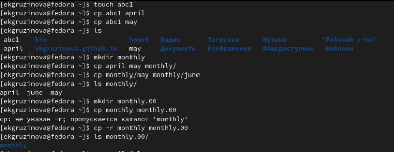{ #fig:001 width=70% } 

## Выполнение лабораторной работы.

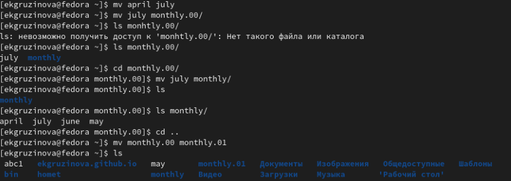{ #fig:002 width=70% }  

## Выполнение лабораторной работы.

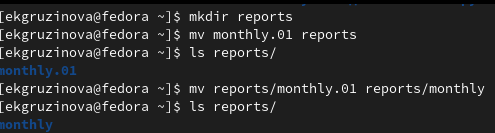{ #fig:003 width=70% }  

## Выполнение лабораторной работы.

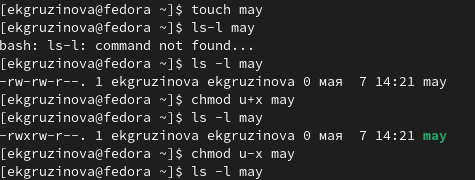{ #fig:004 width=70% }  

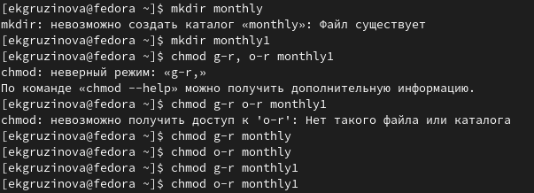{ #fig:005 width=70% }  

## Выполнение лабораторной работы.

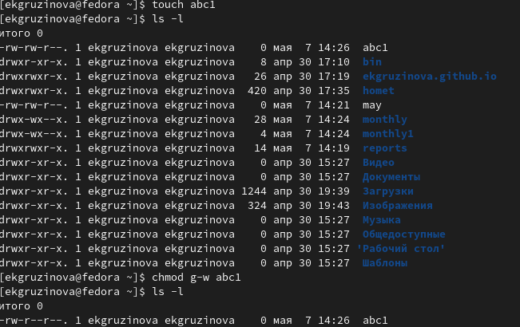{ #fig:006 width=70% }  

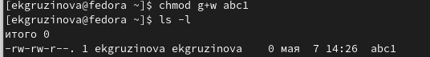{ #fig:007 width=70% }

## Выполнение лабораторной работы.

2. Выполнение следующих действий, зафиксировав в отчёте по лабораторной работе
используемые при этом команды и результаты их выполнения:

2.1. Скопирую файл /usr/include/sys/io.h в домашний каталог и назовите его
equipment. Если файла io.h нет, то используйте любой другой файл в каталоге
/usr/include/sys/ вместо него.  (рис. [-@fig:008])

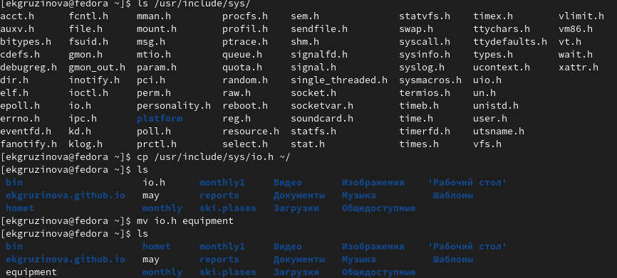{ #fig:008 width=70% }

## Выполнение лабораторной работы.

2.2. В домашнем каталоге создаю директорию ~/ski.plases. 2.3. Перемещаю файл equipment в каталог ~/ski.plases. (рис.[-@fig:009])

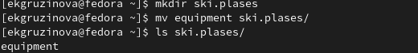{ #fig:009 width=70% }

## Выполнение лабораторной работы.

2.4. Переименую ~/ski.plases/equipment в ~/ski.plases/equiplist. 2.5. Создаю в домашнем каталоге файл abc1 и копирую его в каталог
~/ski.plases, назовите его equiplist2.(рис.[-@fig:010])

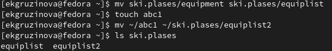{ #fig:010 width=70% }

2.6. Создаю каталог с именем equipment в каталоге ~/ski.plases. (рис.[-@fig:011])

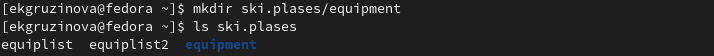{ #fig:011 width=70% }

## Выполнение лабораторной работы.

2.7. Перемещаю файлы ~/ski.plases/equiplist и equiplist2 в каталог ~/ski.plases/equipment.(рис.[-@fig:012])

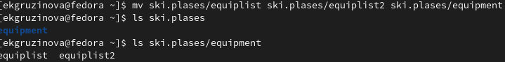{ #fig:012 width=70% }

## Выполнение лабораторной работы.

2.8. Создаю и перемещаю каталог ~/newdir в каталог ~/ski.plases и переименовываю его plans. (рис.[-@fig:013])

{ #fig:013 width=70% }

## Выполнение лабораторной работы.

3. Определите опции команды chmod, необходимые для того, чтобы присвоить перечис-
ленным ниже файлам выделенные права доступа, считая, что в начале таких прав нет:
3.1. drwxr--r-- ... australia
3.2. drwx--x--x ... play
3.3. -r-xr--r-- ... my_os
3.4. -rw-rw-r-- ... feathers

3.1. Для каталога (директория) australia: (рис.[-@fig:014; -@fig:015; -@fig:016])

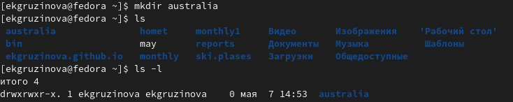{ #fig:014 width=70% }

## Выполнение лабораторной работы.

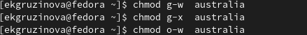{ #fig:015 width=70% }

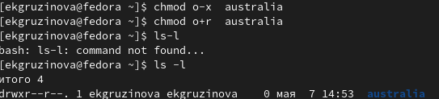{ #fig:016 width=70% }

## Выполнение лабораторной работы.

3.2 Для каталога (директория) play: (рис. [-@fig:017;-@fig:018])

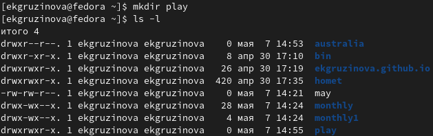{ #fig:017 width=70% }

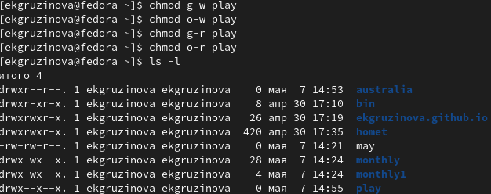{ #fig:018 width=70% }

## Выполнение лабораторной работы.

3.3 Для файла my_os: (рис. [-@fig:019;-@fig:020])

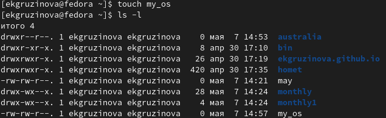{ #fig:019 width=70% }

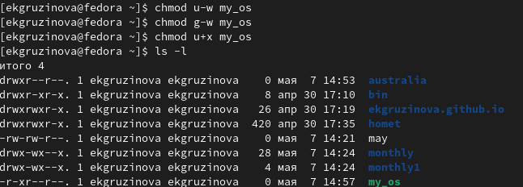{ #fig:020 width=70% }

## Выполнение лабораторной работы.

3.4. Для файла feathers: (рис.[-@fig:021; -@fig:022; -@fig:023])

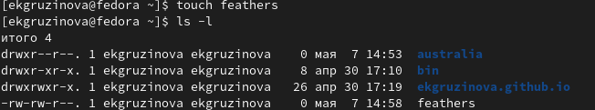{ #fig:021 width=70% }

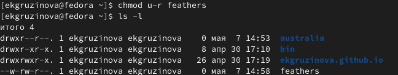{ #fig:022 width=70% }

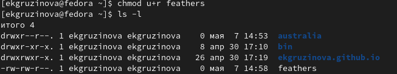{ #fig:023 width=70% }

## Выполнение лабораторной работы. 

4. Проделайте приведённые ниже упражнения, записывая в отчёт по лабораторной
работе используемые при этом команды:

4.1. Просматриваю содержимое файла /etc/password. (рис.[-@fig:024])

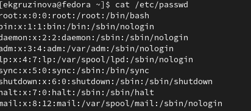{ #fig:024 width=70% }

## Выполнение лабораторной работы. 

4.2. Копирую файл ~/feathers в файл ~/file.old. (рис.[-@fig:025])

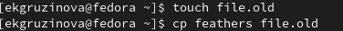{ #fig:025 width=70% }

4.3. Перемещаю файл ~/file.old в каталог ~/play. (рис.[-@fig:026])

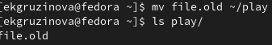{ #fig:026 width=70% }

## Выполнение лабораторной работы.

4.4. Копирую каталог ~/play в каталог ~/fun. 4.5. Перемещаю каталог ~/fun в каталог ~/play и называю его games. (рис. [-@fig:027;-@fig:028])

{ #fig:027 width=70% }

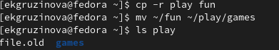{ #fig:028 width=70% }

## Выполнение лабораторной работы.
4.6. Лишаю владельца файла ~/feathers права на чтение. (рис.[-@fig:029])

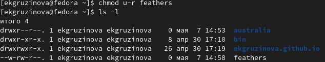{ #fig:029 width=70% }

4.7. Что произойдёт, если вы попытаетесь просмотреть файл ~/feathers командой cat? (рис.[-@fig:030])

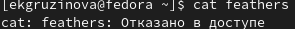{ #fig:030 width=70% }

## Выполнение лабораторной работы.

4.8. Что произойдёт, если вы попытаетесь скопировать файл ~/feathers? (рис.[-@fig:031])

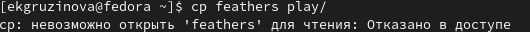{ #fig:031 width=70% }

4.9. Даю владельцу файла ~/feathers право на чтение. (рис.[-@fig:032])

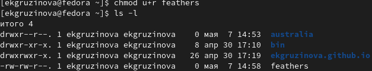{ #fig:032 width=70% }

## Выполнение лабораторной работы.

4.10. Лишаю владельца каталога ~/play права на выполнение. 4.11. Перейдите в каталог ~/play. Что произошло? (рис.[-@fig:033])

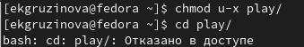{ #fig:033 width=70% }

4.12. Даю владельцу каталога ~/play право на выполнение. (рис.[-@fig:034])

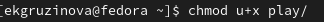{ #fig:034 width=70% }

## Выполнение лабораторной работы.

5. Прочитайте man по командам mount, fsck, mkfs, kill и кратко их охарактеризуйте, приведя примеры. (рис. [-@fig:035; -@fig:036; -@fig:037; -@fig:038; -@fig:039])

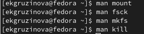{ #fig:035 width=70% }

## Выполнение лабораторной работы.

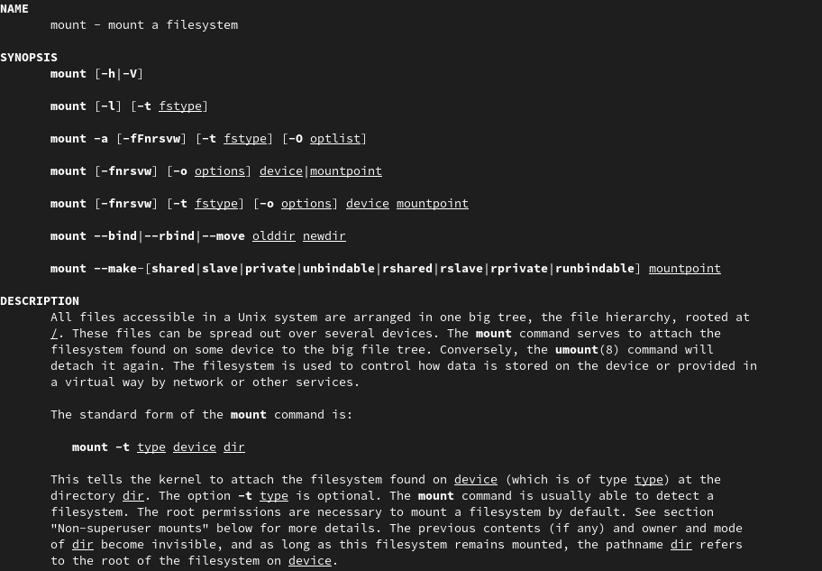{ #fig:036 width=70% }

## Выполнение лабораторной работы.

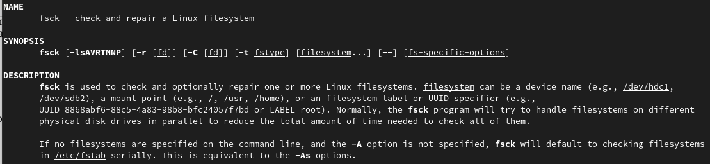{ #fig:037 width=70% }

## Выполнение лабораторной работы.

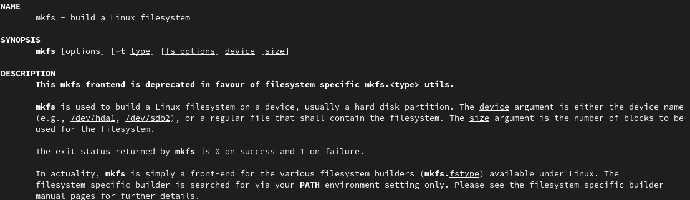{ #fig:038 width=70% }

## Выполнение лабораторной работы.

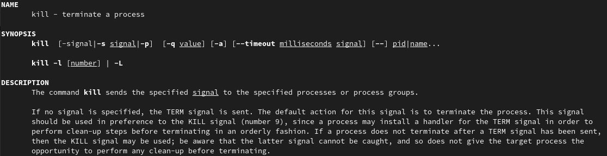{ #fig:039 width=70% }

## Выводы
Ознакомилась с файловой системой Linux, её структурой, именами и содержанием файлов и каталогов, а так же приобрела навыки по применению команд для работы с файлами и каталогами, по управлению процессами, по проверке использования диска и облуживанию файловой системы.

## Список литературы.

1.Права доступа к файлам в Linux.

URL: https://pingvinus.ru/note/file-permissions

2.Причины нарушения целостности файловых систем.

URL: https://studopedia.ru/7_133158_prichini-narusheniya-tselostnosti-faylovih-sistem.html

# Спасибо за внимание!

