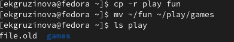

---
## Front matter
title: "Лабораторная работа №5"
subtitle: "Анализ файловой системы Linux. Команды для работы с файлами и каталогами"
author: "Грузинова Елизавета Константиновна"

## Generic otions
lang: ru-RU
toc-title: "Содержание"

## Bibliography
bibliography: bib/cite.bib
csl: pandoc/csl/gost-r-7-0-5-2008-numeric.csl

## Pdf output format
toc: true # Table of contents
toc-depth: 2
lof: true # List of figures
lot: false # List of tables
fontsize: 12pt
linestretch: 1.5
papersize: a4
documentclass: scrreprt
## I18n polyglossia
polyglossia-lang:
  name: russian
  options:
	- spelling=modern
	- babelshorthands=true
polyglossia-otherlangs:
  name: english
## I18n babel
babel-lang: russian
babel-otherlangs: english
## Fonts
mainfont: PT Serif
romanfont: PT Serif
sansfont: PT Sans
monofont: PT Mono
mainfontoptions: Ligatures=TeX
romanfontoptions: Ligatures=TeX
sansfontoptions: Ligatures=TeX,Scale=MatchLowercase
monofontoptions: Scale=MatchLowercase,Scale=0.9
## Biblatex
biblatex: true
biblio-style: "gost-numeric"
biblatexoptions:
  - parentracker=true
  - backend=biber
  - hyperref=auto
  - language=auto
  - autolang=other*
  - citestyle=gost-numeric
## Pandoc-crossref LaTeX customization
figureTitle: "Рис."
tableTitle: "Таблица"
listingTitle: "Листинг"
lofTitle: "Список иллюстраций"
lotTitle: "Список таблиц"
lolTitle: "Листинги"
## Misc options
indent: true
header-includes:
  - \usepackage{indentfirst}
  - \usepackage{float} # keep figures where there are in the text
  - \floatplacement{figure}{H} # keep figures where there are in the text
---

# Цель работы
Ознакомление с файловой системой Linux, её структурой, именами и содержанием
каталогов. Приобретение практических навыков по применению команд для работы
с файлами и каталогами, по управлению процессами (и работами), по проверке исполь-
зования диска и обслуживанию файловой системы

# Задание
1. Выполните все примеры, приведённые в первой части описания лабораторной работы.
2. Выполните следующие действия, зафиксировав в отчёте по лабораторной работе
используемые при этом команды и результаты их выполнения:
2.1. Скопируйте файл /usr/include/sys/io.h в домашний каталог и назовите его
equipment. Если файла io.h нет, то используйте любой другой файл в каталоге
/usr/include/sys/ вместо него.
2.2. В домашнем каталоге создайте директорию ~/ski.plases.
2.3. Переместите файл equipment в каталог ~/ski.plases.
2.4. Переименуйте файл ~/ski.plases/equipment в ~/ski.plases/equiplist.
2.5. Создайте в домашнем каталоге файл abc1 и скопируйте его в каталог ~/ski.plases, назовите его equiplist2.
2.6. Создайте каталог с именем equipment в каталоге ~/ski.plases.
2.7. Переместите файлы ~/ski.plases/equiplist и equiplist2 в каталог ~/ski.plases/equipment.
2.8. Создайте и переместите каталог ~/newdir в каталог ~/ski.plases и назовите его plans.
3. Определите опции команды chmod, необходимые для того, чтобы присвоить перечис-
ленным ниже файлам выделенные права доступа, считая, что в начале таких прав
нет:
3.1. drwxr--r-- ... australia
3.2. drwx--x--x ... play
3.3. -r-xr--r-- ... my_os
3.4. -rw-rw-r-- ... feathers
При необходимости создайте нужные файлы.
4. Проделайте приведённые ниже упражнения, записывая в отчёт по лабораторной
работе используемые при этом команды:
4.1. Просмотрите содержимое файла /etc/password.
4.2. Скопируйте файл ~/feathers в файл ~/file.old.
4.3. Переместите файл ~/file.old в каталог ~/play.
4.4. Скопируйте каталог ~/play в каталог ~/fun.
4.5. Переместите каталог ~/fun в каталог ~/play и назовите его games.
4.6. Лишите владельца файла ~/feathers права на чтение.
4.7. Что произойдёт, если вы попытаетесь просмотреть файл ~/feathers командой
cat?
4.8. Что произойдёт, если вы попытаетесь скопировать файл ~/feathers?
4.9. Дайте владельцу файла ~/feathers право на чтение.
4.10. Лишите владельца каталога ~/play права на выполнение.
4.11. Перейдите в каталог ~/play. Что произошло?
4.12. Дайте владельцу каталога ~/play право на выполнение.
5. Прочитайте man по командам mount, fsck, mkfs, kill и кратко их охарактеризуйте,
приведя примеры

# Теоретическое введение
Одной из компонент ОС является файловая система – основное хранилище системной и пользовательской информации. Все современные ОС работают с одной или несколькими файловыми системами, например, FAT (File Allocation Table), NTFS (NT File System), HPFS (High Performance File System), NFS (Network File System), AFS (Andrew File System), Internet File System.

Файловая система – это часть операционной системы, назначение которой состоит в том, чтобы обеспечить пользователю удобный интерфейс при работе с данными, хранящимися во внешней памяти, и обеспечить совместное использование файлов несколькими пользователями и процессами.

В широком смысле понятие "файловая система" включает:

- совокупность всех файлов на диске;

- наборы структур данных, используемых для управления файлами, такие, например, как каталоги файлов, дескрипторы файлов, таблицы распределения свободного и занятого пространства на диске;

- комплекс системных программных средств, реализующих управление файлами, в частности: создание, уничтожение, чтение, запись, именование, поиск и другие операции над файлами.

Файловая система используется обычно как при загрузке ОС после включения компьютера, так и в процессе работы. Файловая система выполняет следующие основные функции:

- определяет возможные способы организации файлов и файловой структуры на носителе;

- реализует методы доступа к содержимому файлов и предоставляет средства работы с файлами и файловой структурой. При этом доступ к данным может быть организован файловой системой как по именам, так и по адресам (номер сектора, поверхности и дорожки носителя);

- отслеживает свободное пространство на носителе.

# Выполнение лабораторной работы
1. Выполнение всех примеров, приведённых в первой части описания лабораторной работы. (рис. [-@fig:001; -@fig:002; -@fig:003; -@fig:004; -@fig:005; -@fig:006; -@fig:007])
 
{ #fig:001 width=70% } 

{ #fig:002 width=70% }  

{ #fig:003 width=70% }  

{ #fig:004 width=70% }  

{ #fig:005 width=70% }  

{ #fig:006 width=70% }  

{ #fig:007 width=70% }

2. Выполнение следующих действий, зафиксировав в отчёте по лабораторной работе
используемые при этом команды и результаты их выполнения:
2.1. Скопирую файл /usr/include/sys/io.h в домашний каталог и назовите его
equipment. Если файла io.h нет, то используйте любой другой файл в каталоге
/usr/include/sys/ вместо него.  (рис. [-@fig:008])

{ #fig:008 width=70% }

2.2. В домашнем каталоге создаю директорию ~/ski.plases. 2.3. Перемещаю файл equipment в каталог ~/ski.plases. (рис.[-@fig:009])

{ #fig:009 width=70% }

2.4. Переименую ~/ski.plases/equipment в ~/ski.plases/equiplist. 2.5. Создаю в домашнем каталоге файл abc1 и копирую его в каталог
~/ski.plases, назовите его equiplist2.(рис.[-@fig:010])

{ #fig:010 width=70% }

2.6. Создаю каталог с именем equipment в каталоге ~/ski.plases. (рис.[-@fig:011])

{ #fig:011 width=70% }

2.7. Перемещаю файлы ~/ski.plases/equiplist и equiplist2 в каталог ~/ski.plases/equipment.(рис.[-@fig:012])

{ #fig:012 width=70% }

2.8. Создаю и перемещаю каталог ~/newdir в каталог ~/ski.plases и переименовываю его plans. (рис.[-@fig:013])

{ #fig:013 width=70% }

3. Определите опции команды chmod, необходимые для того, чтобы присвоить перечис-
ленным ниже файлам выделенные права доступа, считая, что в начале таких прав нет:
3.1. drwxr--r-- ... australia
3.2. drwx--x--x ... play
3.3. -r-xr--r-- ... my_os
3.4. -rw-rw-r-- ... feathers

3.1. Для каталога (директория) australia: (рис.[-@fig:014; -@fig:015; -@fig:016])

{ #fig:014 width=70% }

{ #fig:015 width=70% }

{ #fig:016 width=70% }

3.2 Для каталога (директория) play: (рис. [-@fig:017;-@fig:018])

{ #fig:017 width=70% }

{ #fig:018 width=70% }

3.3 Для файла my_os: (рис. [-@fig:019;-@fig:020])

{ #fig:019 width=70% }

{ #fig:020 width=70% }

3.4. Для файла feathers: (рис.[-@fig:021; -@fig:022; -@fig:023])

{ #fig:021 width=70% }

{ #fig:022 width=70% }

{ #fig:023 width=70% }

4. Проделайте приведённые ниже упражнения, записывая в отчёт по лабораторной
работе используемые при этом команды:

4.1. Просматриваю содержимое файла /etc/password. (рис.[-@fig:024])

{ #fig:024 width=70% }

4.2. Копирую файл ~/feathers в файл ~/file.old. (рис.[-@fig:025])

{ #fig:025 width=70% }

4.3. Перемещаю файл ~/file.old в каталог ~/play. (рис.[-@fig:026])

{ #fig:026 width=70% }

4.4. Копирую каталог ~/play в каталог ~/fun. 4.5. Перемещаю каталог ~/fun в каталог ~/play и называю его games. (рис. [-@fig:027;-@fig:028])

{ #fig:027 width=70% }

{ #fig:028 width=70% }

4.6. Лишаю владельца файла ~/feathers права на чтение. (рис.[-@fig:029])

{ #fig:029 width=70% }

4.7. Что произойдёт, если вы попытаетесь просмотреть файл ~/feathers командой cat? (рис.[-@fig:030])

{ #fig:030 width=70% }

4.8. Что произойдёт, если вы попытаетесь скопировать файл ~/feathers? (рис.[-@fig:031])

{ #fig:031 width=70% }

4.9. Даю владельцу файла ~/feathers право на чтение. (рис.[-@fig:032])

{ #fig:032 width=70% }

4.10. Лишаю владельца каталога ~/play права на выполнение. 4.11. Перейдите в каталог ~/play. Что произошло? (рис.[-@fig:033])

{ #fig:033 width=70% }

4.12. Даю владельцу каталога ~/play право на выполнение. (рис.[-@fig:034])

{ #fig:034 width=70% }

5. Прочитайте man по командам mount, fsck, mkfs, kill и кратко их охарактеризуйте, приведя примеры. (рис. [-@fig:035; -@fig:036; -@fig:037; -@fig:038; -@fig:039])

{ #fig:035 width=70% }

{ #fig:036 width=70% }

{ #fig:037 width=70% }

{ #fig:038 width=70% }

{ #fig:039 width=70% }

5.5. Контрольные вопросы.

1. Дайте характеристику каждой файловой системе, существующей на жёстком диске
компьютера, на котором вы выполняли лабораторную работу.
UUID=37f38d9d-6184-4afd-814b-bfef9acbe4e8 /                       btrfs   subvol=root,compress=zstd:1 0 0
UUID=92ce4861-3de2-4fff-a2d2-ec29f8537544 /boot                   ext4    defaults        1 2
UUID=37f38d9d-6184-4afd-814b-bfef9acbe4e8 /home                   btrfs   subvol=home,compress=zstd:1 0 0
В каждой строке этого файла указано:
– имя устройство;
– точка монтирования;
– тип файловой системы;
– опции монтирования;
– специальные флаги для утилиты dump;
– порядок проверки целостности файловой системы с помощью утилиты fsck.
2. Приведите общую структуру файловой системы и дайте характеристику каждой ди-
ректории первого уровня этой структуры.
/ — root каталог. Содержит в себе всю иерархию системы;

/bin — здесь находятся двоичные исполняемые файлы. Основные общие команды, хранящиеся отдельно от других программ в системе (прим.: pwd, ls, cat, ps);

/boot — тут расположены файлы, используемые для загрузки системы (образ initrd, ядро vmlinuz);

/dev — в данной директории располагаются файлы устройств (драйверов). С помощью этих файлов можно взаимодействовать с устройствами. К примеру, если это жесткий диск, можно подключить его к файловой системе. В файл принтера же можно написать напрямую и отправить задание на печать;

/etc — в этой директории находятся файлы конфигураций программ. Эти файлы позволяют настраивать системы, сервисы, скрипты системных демонов;

/home — каталог, аналогичный каталогу Users в Windows. Содержит домашние каталоги учетных записей пользователей (кроме root). При создании нового пользователя здесь создается одноименный каталог с аналогичным именем и хранит личные файлы этого пользователя;

/lib — содержит системные библиотеки, с которыми работают программы и модули ядра;

/lost+found — содержит файлы, восстановленные после сбоя работы системы. Система проведет проверку после сбоя и найденные файлы можно будет посмотреть в данном каталоге;

/media — точка монтирования внешних носителей. Например, когда вы вставляете диск в дисковод, он будет автоматически смонтирован в директорию /media/cdrom;

/mnt — точка временного монтирования. Файловые системы подключаемых устройств обычно монтируются в этот каталог для временного использования;

/opt — тут расположены дополнительные (необязательные) приложения. Такие программы обычно не подчиняются принятой иерархии и хранят свои файлы в одном подкаталоге (бинарные, библиотеки, конфигурации);

/proc — содержит файлы, хранящие информацию о запущенных процессах и о состоянии ядра ОС;

/root — директория, которая содержит файлы и личные настройки суперпользователя;

/run — содержит файлы состояния приложений. Например, PID-файлы или UNIX-сокеты;

/sbin — аналогично /bin содержит бинарные файлы. Утилиты нужны для настройки и администрирования системы суперпользователем;

/srv — содержит файлы сервисов, предоставляемых сервером (прим. FTP или Apache HTTP);

/sys — содержит данные непосредственно о системе. Тут можно узнать информацию о ядре, драйверах и устройствах;

/tmp — содержит временные файлы. Данные файлы доступны всем пользователям на чтение и запись. Стоит отметить, что данный каталог очищается при перезагрузке;

/usr — содержит пользовательские приложения и утилиты второго уровня, используемые пользователями, а не системой. Содержимое доступно только для чтения (кроме root). Каталог имеет вторичную иерархию и похож на корневой;

/var — содержит переменные файлы. Имеет подкаталоги, отвечающие за отдельные переменные. Например, логи будут храниться в /var/log, кэш в /var/cache, очереди заданий в /var/spool/ и так далее.

3. Какая операция должна быть выполнена, чтобы содержимое некоторой файловой
системы было доступно операционной системе?
Только монтирование тома.

4. Назовите основные причины нарушения целостности файловой системы. Как устра-
нить повреждения файловой системы?
Не исправленная запись в каталоге содержит адрес кластера, который уже объявлен свободным и может быть назначен другому файлу; это может привести к разного рода коллизиям.
Некорректность файловой системы может возникать не только в результате насильственного прерывания операций ввода-вывода, выполняемых непосредственно с диском, но и в результате нарушения работы дискового кэша. Кэширование данных с диска предполагает, что в течение некоторого времени результаты операций ввода-вывода никак не сказываются на содержимом диска — все изменения происходят с копиями блоков диска, временно хранящихся в буферах оперативной памяти. В этих буферах оседают данные из пользовательских файлов и служебная информация файловой системы, такая как каталоги, индексные дескрипторы, списки свободных, занятых и поврежденных блоков и т. п.

5. Как создаётся файловая система?
Команда mkfs создаёт файловую систему Linux.

6. Дайте характеристику командам для просмотра текстовых файлов.
Cat - выводит небольшое содержимое файла на стандартное устройство вывода.
Less - выводит содержимое файла на стандартное устройство вывода постранично.

7. Приведите основные возможности команды cp в Linux.
Cp – команда копирования и перемещения файлов и каталогов.

8. Приведите основные возможности команды mv в Linux.
Mv - команда переименовования и перемещения файлов и каталогов.
9. Что такое права доступа? Как они могут быть изменены?
Для каждого файла или директории в Linux задаются права доступа. Они задаются тремя атрибутами: набором разрешений, именем владельца, именем группы.
Набор разрешений — это три блока прав доступа: права доступа для владельца файла, права доступа для группы, права доступа для всех остальных. Разрешения записываются символами r, w, x. Набор разрешений состоит из трех блоков и записывается в виде трех rwx, записанных друг за другом в виде одного «слова». Если какая-либо возможность отключена (запрещена), то вместо соответствующего символа в наборе разрешений ставится прочерк (символ минус). Права доступа к файлу или каталогу можно изменить, воспользовавшись командой chmod.

# Выводы
Ознакомилась с файловой системой Linux, её структурой, именами и содержанием файлов и каталогов, а так же приобрела навыки по применению команд для работы с файлами и каталогами, по управлению процессами, по проверке использования диска и облуживанию файловой системы.

# Список литературы{.unnumbered}

1.Права доступа к файлам в Linux.
URL: https://pingvinus.ru/note/file-permissions

2.Причины нарушения целостности файловых систем.
URL: https://studopedia.ru/7_133158_prichini-narusheniya-tselostnosti-faylovih-sistem.html

