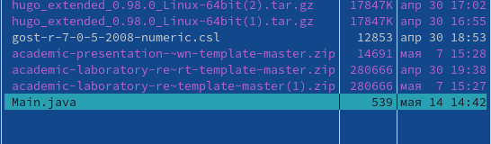

---
## Front matter
lang: ru-RU
title: Отчёт по лабораторной работе №7
author: Грузинова Елизавета Константиновна

## Formatting
toc: false
slide_level: 2
theme: metropolis
header-includes: 
 - \metroset{progressbar=frametitle,sectionpage=progressbar,numbering=fraction}
 - '\makeatletter'
 - '\beamer@ignorenonframefalse'
 - '\makeatother'
aspectratio: 43
section-titles: true
---

# Командная оболочка Midnight Commander

## Цель работы

Освоение основных возможностей командной оболочки Midnight Commander и приобретение навыков практической работы по просмотру каталогов и файлов и манипуляций с ними.

## Задание по mc

1. Изучите информацию о mc, вызвав в командной строке man mc.

2. Запустите из командной строки mc, изучите его структуру и меню. 

3. Выполните несколько операций в mc, используя управляющие клавиши (операции с панелями; выделение/отмена выделения файлов, копирование/перемещение файлов, получение информации о размере и правах доступа на файлы и/или каталоги и т.п.)

4. Выполните основные команды меню левой (или правой) панели. Оцените степень подробности вывода информации о файлах.

## Задание по mc

5. Используя возможности подменю Файл , выполните:

– просмотр содержимого текстового файла;

– редактирование содержимого текстового файла (без сохранения результатов редактирования);

– создание каталога;

– копирование в файлов в созданный каталог.

## Задание по mc

6. С помощью соответствующих средств подменю Команда осуществите:

– поиск в файловой системе файла с заданными условиями (например, файла с расширением .c или .cpp, содержащего строку main);

– выбор и повторение одной из предыдущих команд;

– переход в домашний каталог;

– анализ файла меню и файла расширений.

7. Вызовите подменю Настройки . Освойте операции, определяющие структуру экрана mc (Full screen, Double Width, Show Hidden Files и т.д.)

## Задание по встроенному редактору mc

1. Создайте текстовой файл text.txt.

2. Откройте этот файл с помощью встроенного в mc редактора.

3. Вставьте в открытый файл небольшой фрагмент текста, скопированный из любого другого файла или Интернета.

4. Проделайте с текстом следующие манипуляции, используя горячие клавиши:

4.1. Удалите строку текста.

4.2. Выделите фрагмент текста и скопируйте его на новую строку

4.3. Выделите фрагмент текста и перенесите его на новую строку.

## Задание по встроенному редактору mc

4.4. Сохраните файл.

4.5. Отмените последнее действие.

4.6. Перейдите в конец файла (нажав комбинацию клавиш) и напишите некоторый текст.

4.7. Перейдите в начало файла (нажав комбинацию клавиш) и напишите некоторый текст.

4.8. Сохраните и закройте файл.

5. Откройте файл с исходным текстом на некотором языке программирования (например C или Java)

6. Используя меню редактора, включите подсветку синтаксиса, если она не включена, или выключите, если она включена.

## Теоретическое введение
GNU Midnight Commander - это визуальный файловый менеджер, распространяемый под лицензией GPL, и поэтому он квалифицируется как Free Software. Это мощная текстовая полнофункциональная программа, которая позволяет вам копировать, перемещать и удалять файлы и директории, производить поиск файлов и запускать на выполнение команды оболочки. Также включены встроенные редактор и программа для просмотра файлов.

## Выполнение лабораторной работы

1. Изучите информацию о mc, вызвав в командной строке man mc (рис. [-@fig:001])

{ #fig:001 width=70% }

## Выполнение лабораторной работы

2. Запустите из командной строки mc, изучите его структуру и меню. рис. [-@fig:002])

{ #fig:002 width=70% }

## Выполнение лабораторной работы

3. Выполните несколько операций в mc, используя управляющие клавиши (операции с панелями; выделение/отмена выделения файлов, копирование/перемещение файлов, получение информации о размере и правах доступа на файлы и/или каталоги и т.п.) 4. Выполните основные команды меню левой (или правой) панели. Оцените степень подробности вывода информации о файлах. (рис. [-@fig:003])

{ #fig:003 width=50% }

## Выполнение лабораторной работы

5. Используя возможности подменю Файл , выполните:

– просмотр содержимого текстового файла;

– редактирование содержимого текстового файла (без сохранения результатов редактирования); (рис. [-@fig:004])

{ #fig:004 width=70% }

– создание каталога;

– копирование в файлов в созданный каталог.

## Выполнение лабораторной работы

6. С помощью соответствующих средств подменю Команда осуществите:

– поиск в файловой системе файла с заданными условиями (например, файла с расширением .c или .cpp, содержащего строку main); (рис. [-@fig:005])

{ #fig:005 width=65% }

## Выполнение лабораторной работы

– выбор и повторение одной из предыдущих команд;

– переход в домашний каталог; (рис. [-@fig:006])

{ #fig:006 width=70% }

## Выполнение лабораторной работы

– анализ файла меню и файла расширений. (рис. [-@fig:007; -@fig:008])

{ #fig:007 width=70% }

{ #fig:008 width=70% }

## Выполнение лабораторной работы

7. Вызовите подменю Настройки . Освойте операции, определяющие структуру экрана mc (Full screen, Double Width, Show Hidden Files и т.д.) (рис. [-@fig:009])

{ #fig:009 width=70% }

## Выполнение лабораторной работы

Задание по встроенному редактору mc

1. Создайте текстовой файл text.txt. (рис. [-@fig:010])

{ #fig:010 width=70% }

## Выполнение лабораторной работы

2. Откройте этот файл с помощью встроенного в mc редактора. (рис. [-@fig:011])

{ #fig:011 width=70% }

## Выполнение лабораторной работы

3. Вставьте в открытый файл небольшой фрагмент текста, скопированный из любого другого файла или Интернета. (рис. [-@fig:012])

{ #fig:012 width=70% }

## Выполнение лабораторной работы

4. Проделайте с текстом следующие манипуляции, используя горячие клавиши:

4.1. Удалите строку текста. 4.2. Выделите фрагмент текста и скопируйте его на новую строку (рис. [-@fig:013])

{ #fig:013 width=70% }

## Выполнение лабораторной работы

4.3. Выделите фрагмент текста и перенесите его на новую строку. (рис. [-@fig:014])

{ #fig:014 width=70% }

## Выполнение лабораторной работы

4.4. Сохраните файл. (рис. [-@fig:015])

{ #fig:015 width=70% }

4.5. Отмените последнее действие.

## Выполнение лабораторной работы

4.6. Перейдите в конец файла (нажав комбинацию клавиш) и напишите некоторый текст.

4.7. Перейдите в начало файла (нажав комбинацию клавиш) и напишите некоторый текст.

## Выполнение лабораторной работы

4.8. Сохраните и закройте файл. (рис. [-@fig:016; -@fig:017])

{ #fig:016 width=70% }

## Выполнение лабораторной работы

{ #fig:017 width=70% }

## Выполнение лабораторной работы

5. Откройте файл с исходным текстом на некотором языке программирования (например C или Java) (рис. [-@fig:018; -@fig:019])

{ #fig:018 width=70% }

## Выполнение лабораторной работы

{ #fig:019 width=70% }

## Выполнение лабораторной работы

6. Используя меню редактора, включите подсветку синтаксиса, если она не включена, или выключите, если она включена. рис. [-@fig:020])

{ #fig:020 width=70% }

## Выводы

Я освоила осноные возможности командной оболочки Midnight Commander, приобрела практические навыки работы по просмотру каталогов и файлов, а так же манипуляций с ними.

## Список литературы

http://rus-linux.net/kos.php?name=/book1/gl-06/gl_06_10.html

https://interface31.ru/tech_it/2020/10/osvaivaem-effektivnuyu-rabotu-v-midnight-commander.html

## {.standout}

Спасибо за внимание.
