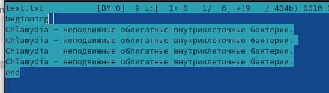
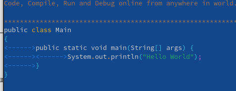

---
## Front matter
title: "Отчёт по лабораторной работе №7"
subtitle: "Командная оболчка Midnight Commander"
author: "Грузинова Елизавета Константиновна"

## Generic otions
lang: ru-RU
toc-title: "Содержание"

## Bibliography
bibliography: bib/cite.bib
csl: pandoc/csl/gost-r-7-0-5-2008-numeric.csl

## Pdf output format
toc: true # Table of contents
toc-depth: 2
lof: true # List of figures
lot: false # List of tables
fontsize: 12pt
linestretch: 1.5
papersize: a4
documentclass: scrreprt
## I18n polyglossia
polyglossia-lang:
  name: russian
  options:
	- spelling=modern
	- babelshorthands=true
polyglossia-otherlangs:
  name: english
## I18n babel
babel-lang: russian
babel-otherlangs: english
## Fonts
mainfont: PT Serif
romanfont: PT Serif
sansfont: PT Sans
monofont: PT Mono
mainfontoptions: Ligatures=TeX
romanfontoptions: Ligatures=TeX
sansfontoptions: Ligatures=TeX,Scale=MatchLowercase
monofontoptions: Scale=MatchLowercase,Scale=0.9
## Biblatex
biblatex: true
biblio-style: "gost-numeric"
biblatexoptions:
  - parentracker=true
  - backend=biber
  - hyperref=auto
  - language=auto
  - autolang=other*
  - citestyle=gost-numeric
## Pandoc-crossref LaTeX customization
figureTitle: "Рис."
tableTitle: "Таблица"
listingTitle: "Листинг"
lofTitle: "Список иллюстраций"
lotTitle: "Список таблиц"
lolTitle: "Листинги"
## Misc options
indent: true
header-includes:
  - \usepackage{indentfirst}
  - \usepackage{float} # keep figures where there are in the text
  - \floatplacement{figure}{H} # keep figures where there are in the text
---

# Цель работы

Освоение основных возможностей командной оболочки Midnight Commander и приоб-
ретение навыков практической работы по просмотру каталогов и файлов и манипуляций с ними.

# Задание по mc

1. Изучите информацию о mc, вызвав в командной строке man mc.

2. Запустите из командной строки mc, изучите его структуру и меню. 

3. Выполните несколько операций в mc, используя управляющие клавиши (операции с панелями; выделение/отмена выделения файлов, копирование/перемещение файлов, получение информации о размере и правах доступа на файлы и/или каталоги и т.п.)

4. Выполните основные команды меню левой (или правой) панели. Оцените степень подробности вывода информации о файлах.

5. Используя возможности подменю Файл , выполните:

– просмотр содержимого текстового файла;

– редактирование содержимого текстового файла (без сохранения результатов редактирования);

– создание каталога;

– копирование в файлов в созданный каталог.

6. С помощью соответствующих средств подменю Команда осуществите:

– поиск в файловой системе файла с заданными условиями (например, файла с расширением .c или .cpp, содержащего строку main);

– выбор и повторение одной из предыдущих команд;

– переход в домашний каталог;

– анализ файла меню и файла расширений.

7. Вызовите подменю Настройки . Освойте операции, определяющие структуру экрана mc (Full screen, Double Width, Show Hidden Files и т.д.)

# Задание по встроенному редактору mc

1. Создайте текстовой файл text.txt.

2. Откройте этот файл с помощью встроенного в mc редактора.

3. Вставьте в открытый файл небольшой фрагмент текста, скопированный из любого другого файла или Интернета.

4. Проделайте с текстом следующие манипуляции, используя горячие клавиши:

4.1. Удалите строку текста.

4.2. Выделите фрагмент текста и скопируйте его на новую строку

4.3. Выделите фрагмент текста и перенесите его на новую строку.

4.4. Сохраните файл.

4.5. Отмените последнее действие.

4.6. Перейдите в конец файла (нажав комбинацию клавиш) и напишите некоторый текст.

4.7. Перейдите в начало файла (нажав комбинацию клавиш) и напишите некоторый текст.

4.8. Сохраните и закройте файл.

5. Откройте файл с исходным текстом на некотором языке программирования (например C или Java)

6. Используя меню редактора, включите подсветку синтаксиса, если она не включена, или выключите, если она включена.

# Теоретическое введение
GNU Midnight Commander - это визуальный файловый менеджер, распространяемый под лицензией GPL, и поэтому он квалифицируется как Free Software. Это мощная текстовая полнофункциональная программа, которая позволяет вам копировать, перемещать и удалять файлы и директории, производить поиск файлов и запускать на выполнение команды оболочки. Также включены встроенные редактор и программа для просмотра файлов.

# Выполнение лабораторной работы

1. Изучите информацию о mc, вызвав в командной строке man mc (рис. [-@fig:001])

{ #fig:001 width=70% }

2. Запустите из командной строки mc, изучите его структуру и меню. рис. [-@fig:002])

{ #fig:002 width=70% }

3. Выполните несколько операций в mc, используя управляющие клавиши (операции с панелями; выделение/отмена выделения файлов, копирование/перемещение файлов, получение информации о размере и правах доступа на файлы и/или каталоги и т.п.) 4. Выполните основные команды меню левой (или правой) панели. Оцените степень подробности вывода информации о файлах. (рис. [-@fig:003])

{ #fig:003 width=70% }

5. Используя возможности подменю Файл , выполните:

– просмотр содержимого текстового файла;

– редактирование содержимого текстового файла (без сохранения результатов редактирования); (рис. [-@fig:004])

{ #fig:004 width=70% }

– создание каталога;

– копирование в файлов в созданный каталог.

Задание по mc

6. С помощью соответствующих средств подменю Команда осуществите:

– поиск в файловой системе файла с заданными условиями (например, файла с расширением .c или .cpp, содержащего строку main); (рис. [-@fig:005])

{ #fig:005 width=70% }

– выбор и повторение одной из предыдущих команд;

– переход в домашний каталог; (рис. [-@fig:006])

{ #fig:006 width=70% }

– анализ файла меню и файла расширений. (рис. [-@fig:007; -@fig:008])

{ #fig:007 width=70% }

{ #fig:008 width=70% }

7. Вызовите подменю Настройки . Освойте операции, определяющие структуру экрана mc (Full screen, Double Width, Show Hidden Files и т.д.) (рис. [-@fig:009])

{ #fig:009 width=70% }

Задание по встроенному редактору mc

1. Создайте текстовой файл text.txt. (рис. [-@fig:010])

{ #fig:010 width=70% }

2. Откройте этот файл с помощью встроенного в mc редактора. (рис. [-@fig:011])

{ #fig:011 width=70% }

3. Вставьте в открытый файл небольшой фрагмент текста, скопированный из любого другого файла или Интернета. (рис. [-@fig:012])

{ #fig:012 width=70% }

4. Проделайте с текстом следующие манипуляции, используя горячие клавиши:

4.1. Удалите строку текста. 4.2. Выделите фрагмент текста и скопируйте его на новую строку (рис. [-@fig:013])

{ #fig:013 width=70% }

4.3. Выделите фрагмент текста и перенесите его на новую строку. (рис. [-@fig:014])

{ #fig:014 width=70% }

4.4. Сохраните файл. (рис. [-@fig:015])

{ #fig:015 width=70% }

4.5. Отмените последнее действие.

4.6. Перейдите в конец файла (нажав комбинацию клавиш) и напишите некоторый текст.

4.7. Перейдите в начало файла (нажав комбинацию клавиш) и напишите некоторый текст.

4.8. Сохраните и закройте файл. (рис. [-@fig:016; -@fig:017])

{ #fig:016 width=70% }

{ #fig:017 width=70% }

5. Откройте файл с исходным текстом на некотором языке программирования (например C или Java) (рис. [-@fig:018; -@fig:019])

{ #fig:018 width=70% }

{ #fig:019 width=70% }

6. Используя меню редактора, включите подсветку синтаксиса, если она не включена, или выключите, если она включена. рис. [-@fig:020])

{ #fig:020 width=70% }

# Выводы

Я освоила осноные возможности командной оболочки Midnight Commander, приобрела практические навыки работы по просмотру каталогов и файлов, а так же манипуляций с ними.

# Контрольные вопросы.

1. Какие режимы работы есть в mc. Охарактеризуйте их.

MC имеет несколько режимов: командная строка, файловый редактор, файловый менеджер.

Командная строка позволяет задать команды, находясь вне текущего файлового каталога.

Файловый редактор позволяет работать с файлами и их содержимым.

Файловый менеджер позволяет менять, переписывать, удалять каталоги или файлы.

2. Какие операции с файлами можно выполнить как с помощью команд shell, так и с помощью меню (комбинаций клавиш) mc? Приведите несколько примеров.

В разделе Командная строка оболочки (Shell) перечисляются команды и комбинации клавиш, которые используются для ввода и редактирования команд в командной строке оболочки. Большая часть этих команд служит для переноса имен файлов и/или имен каталогов в командную строку (чтобы уменьшить трудоемкость ввода) или для доступа к истории команд.

3. Опишите структура меню левой (или правой) панели mc, дайте характеристику командам.

Перейти в строку меню панелей mc можно с помощью функциональной клавиши F9. В строке меню имеются пять меню: Левая панель , Файл , Команда , Настройки и Правая панель. Подпункт меню Быстрый просмотр позволяет выполнить быстрый просмотр содержимого панели. Подпункт меню Информация позволяет посмотреть информацию о файле или каталоге. В меню каждой (левой или правой) панели можно выбрать Формат списка :

– стандартный — выводит список файлов и каталогов с указанием размера и времени
правки;

– ускоренный — позволяет задать число столбцов, на которые разбивается панель при выводе списка имён файлов или каталогов без дополнительной информации;

– расширенный — помимо названия файла или каталога выводит сведения о правах доступа, владельце, группе, размере, времени правки;

– определённый пользователем — позволяет вывести те сведения о файле или каталоге, которые задаст сам пользователь.

Подпункт меню Порядок сортировки позволяет задать критерии сортировки при выводе списка файлов и каталогов: без сортировки, по имени, расширенный, время правки,время доступа, время изменения атрибута, размер, узел.

4. Опишите структура меню Файл mc, дайте характеристику командам.

В меню Файл содержит перечень команд, которые могут быть применены к одному или нескольким файлам или каталогам. 
Команды меню Файл :
– Просмотр ( F3 ) — позволяет посмотреть содержимое текущего (или выделенного) файла без возможности редактирования.

– Просмотр вывода команды ( М + ! ) — функция запроса команды с параметрами (аргумент к текущему выбранному файлу).

– Правка ( F4 ) — открывает текущий (или выделенный) файл для его редактирования.

– Копирование ( F5 ) — осуществляет копирование одного или нескольких файлов или каталогов в указанное пользователем во всплывающем окне место.

– Права доступа ( Ctrl-x c ) — позволяет указать (изменить) права доступа к одному или нескольким файлам или каталогам.

– Жёсткая ссылка ( Ctrl-x l ) — позволяет создать жёсткую ссылку к текущему (или выделенному) файлу.

– Символическая ссылка ( Ctrl-x s ) — позволяет создать символическую ссылку к текущему (или выделенному) файлу.

– Владелец/группа ( Ctrl-x o ) — позволяет задать (изменить) владельца и имя группы для одного или нескольких файлов или каталогов.

– Права (расширенные) — позволяет изменить права доступа и владения для одного или нескольких файлов или каталогов.

– Переименование ( F6 ) — позволяет переименовать (или переместить) один или несколько файлов или каталогов.

– Создание каталога ( F7 ) — позволяет создать каталог.

– Удалить ( F8 ) — позволяет удалить один или несколько файлов или каталогов.

– Выход ( F10 ) — завершает работу mc.

5. Опишите структура меню Команда mc, дайте характеристику командам.

В меню Команда содержатся более общие команды для работы с mc. Команды меню Команда :

– Дерево каталогов — отображает структуру каталогов системы.

– Поиск файла — выполняет поиск файлов по заданным параметрам

– Переставить панели — меняет местами левую и правую панели.

– Сравнить каталоги ( Ctrl-x d ) — сравнивает содержимое двух каталогов.

– Размеры каталогов — отображает размер и время изменения каталога (по умолчанию в mc размер каталога корректно не отображается).

– История командной строки — выводит на экран список ранее выполненных в оболочке команд.

– Каталоги быстрого доступа ( Ctrl-\ ) — пр вызове выполняется быстрая смена текущего каталога на один из заданного списка.

– Восстановление файлов — позволяет восстановить файлы на файловых системах ext2 и ext3.

– Редактировать файл расширений — позволяет задать с помощью определённого синтаксиса действия при запуске файлов с определённым расширением (например, какое программного обеспечение запускать для открытия или редактирования файлов с расширением doc или docx

– Редактировать файл меню — позволяет отредактировать контекстное меню пользователя, вызываемое по клавише F2.

– Редактировать файл расцветки имён — позволяет подобрать оптимальную для пользователя расцветку имён файлов в зависимости от их типа.

6. Опишите структура меню Настройки mc, дайте характеристику командам.

Меню Настройки содержит ряд дополнительных опций по внешнему виду и функциональности mc. Меню Настройки содержит:

– Конфигурация — позволяет скорректировать настройки работы с панелями.

– Внешний вид и Настройки панелей — определяет элементы (строка меню, командная строка, подсказки и прочее), отображаемые при вызове mc, а также геометрию расположения панелей и цветовыделение.

– Биты символов — задаёт формат обработки информации локальным терминалом.

– Подтверждение — позволяет установить или убрать вывод окна с запросом подтверждения действий при операциях удаления и перезаписи файлов, а также при выходе из программы.

– Распознание клавиш — диалоговое окно используется для тестирования функциональных клавиш, клавиш управления курсором и прочее.

– Виртуальные ФС –– настройки виртуальной файловой системы: тайм-аут, пароль и прочее.

7. Назовите и дайте характеристику встроенным командам mc.

F1 Вызов контекстно-зависимой подсказки

F2 Вызов пользовательского меню с возможностью создания и/или дополнения дополнительных функций

F3 Просмотр содержимого файла, на который указывает подсветка в активной панели (без возможности редактирования)

F4 Вызов встроенного в mc редактора для изменения содержания файла, на который указывает подсветка в активной панели

F5 Копирование одного или нескольких файлов, отмеченных в первой (активной) панели, в каталог, отображаемый на второй панели

F6 Перенос одного или нескольких файлов, отмеченных в первой (активной) панели, в каталог, отображаемый на второй панели

F7 Создание подкаталога в каталоге, отображаемом в активной панели

F8 Удаление одного или нескольких файлов (каталогов), отмеченных в первой (активной) панели файлов

F9 Вызов меню mc

F10 Выход из mc

8. Назовите и дайте характеристику командам встроенного редактора mc.

Ctrl-y удалить строку

Ctrl-u отмена последней операции

Ins вставка/замена

F7 поиск (можно использовать регулярные выражения)

Shift+F7 повтор последней операции поиска

F4 замена

F3 первое нажатие — начало выделения, второе — окончание выделения

F5 копировать выделенный фрагмент

F6 переместить выделенный фрагмент

F8 удалить выделенный фрагмент

F2 записать изменения в файл

F10 выйти из редактора

9. Дайте характеристику средствам mc, которые позволяют создавать меню, определяе-
мые пользователем.
User menu (F2) -  вызывает меню пользователя

Edit menu file	- редактирует файл пользовательского меню, которое вызывается нажатием клавиши F2.

Edit extension file - редактирует файл расширений, позволяя указывать программы, которые будут выполняться при попытке запуска, просмотра, редактирования и выполнения других действий над файлами с определёнными расширениями

и т.д.

Меню пользователя — это меню, вызываемое при нажатии клавиши F2 и складывающееся из команд, определённых пользователем. Меню создается через основное меню MC command/edit menu file. 

10. Дайте характеристику средствам mc, которые позволяют выполнять действия, определяемые пользователем, над текущим файлом.

Просмотр (F3) - Показывает текущий файл.

Просмотр команды (М-!) - Эта функция запрашивает команду с параметрами (аргумент к текущему выбранному файлу).

Редактирование (F4) - редактирование выбранного файла.

Копирование (F5) - Копирование файла в необходимое место с указанием данного места.

Команда Права доступа (<Ctrl>+<X>,<C>) - Позволяет изменить права доступа к выделенному или помеченным файла.

Жёсткая ссылка (<Ctrl>+<X>,1) - Создание жесткой ссылки к текущему файлу.

Символичная ссылка (<Ctrl>+<X>,<S>) - Создание символической ссылки к текущему файлу. Жесткая ссылка проявляется как реальный файл. После её создания невозможно определить, где сам файл, а где ссылка. Если удалить один из этих файлов, то другой останется целым. Символическая ссылка - это ссылка на имя файла-оригинала.

Владелец/группа (<Ctrl>+<X>,<O>) - здесь указывается владелец, имя группы и файл.

Права (расширенные) - Позволяет изменить права доступа и владения файлом.

Быстрая смена каталога (<Alt>+<C>) - Используйте эту команду, если вы знаете полный путь к каталогу, в который хотите перейти (который хотите сделать текущим)

Переименование-Перемещение - (F6) Выдаёт диалоговое окно с каталогом назначения, которым по умолчанию принимается каталог неактивной панели, и перемещает выделенный файл или группу помеченных файлов в каталог, указанный в этом окне.

Создать Каталог  - (F7) Выдаёт диалоговое окно с запросом на название каталога и создаёт каталог с указанным именем.
Удаление (F8) -  Удаляет текущий файл или группу помеченных файлов из активной панели.

Выход (F10) - Завершает работу MC. При выходе с помощью Shift-F10 текущим становится каталог, из которого был запущен MC, а не последний рабочий каталог.

# Список литературы{.unnumbered}

::: {#refs}

http://rus-linux.net/kos.php?name=/book1/gl-06/gl_06_10.html

https://interface31.ru/tech_it/2020/10/osvaivaem-effektivnuyu-rabotu-v-midnight-commander.html

:::
