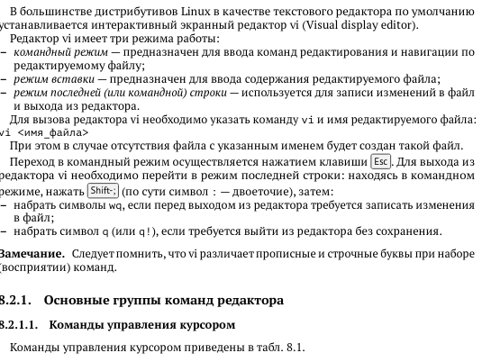
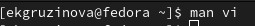
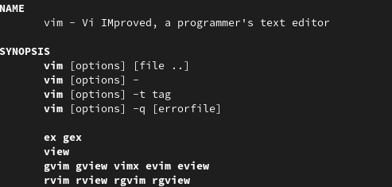
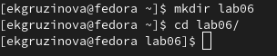
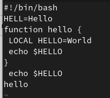
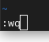
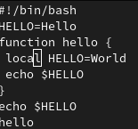
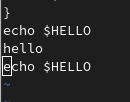
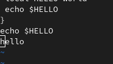
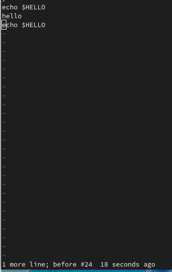

---
## Front matter
lang: ru-RU
title: "Лабораторная работа №8"
author: Грузинова Елизавета Константиновна

## Formatting
toc: false
slide_level: 2
theme: metropolis
header-includes: 
 - \metroset{progressbar=frametitle,sectionpage=progressbar,numbering=fraction}
 - '\makeatletter'
 - '\beamer@ignorenonframefalse'
 - '\makeatother'
aspectratio: 43
section-titles: true
---

# Текстовый редактор Vi

## Цель работы

Познакомиться с операционной системой Linux. Получить практические навыки работы с редактором vi, установленным по умолчанию практически во всех дистрибутивах.

## Задание

1. Ознакомиться с теоретическим материалом.
2. Ознакомиться с редактором vi.
3. Выполнить упражнения, используя команды vi.

## Упражнения

 3.1. Задание 1.
 
1. Создайте каталог с именем ~/work/os/lab06.

2. Перейдите во вновь созданный каталог.

3. Вызовите vi и создайте файл hello.sh

 (vi hello.sh)
 
 
 ## Упражнения
 
 
4. Нажмите клавишу i и вводите следующий текст.

 (#!/bin/bash
 
 HELL=Hello
 
 function hello {
 
 LOCAL HELLO=World
 
 echo $HELLO
 
 }
 
 echo $HELLO
 
 hello)
 
 
## Упражнения
 
 
5. Нажмите клавишу Esc для перехода в командный режим после завершения ввода
текста.
6. Нажмите : для перехода в режим последней строки и внизу вашего экрана появится приглашение в виде двоеточия.
7. Нажмите w (записать) и q (выйти), а затем нажмите клавишу Enter для сохранения вашего текста и завершения работы.
8. Сделайте файл исполняемым

 (chmod +x hello.sh)
 
 
## Упражнения
 
 
 3.2. Задание 2.
 
 1. Вызовите vi на редактирование файла
 
 (vi ~/work/os/lab06/hello.sh)
 
2. Установите курсор в конец слова HELL второй строки.

3. Перейдите в режим вставки и замените на HELLO. Нажмите Esc для возврата в командный режим.

4. Установите курсор на четвертую строку и сотрите слово LOCAL.

5. Перейдите в режим вставки и наберите следующий текст: local, нажмите Esc для возврата в командный режим.

## Упражнения

6. Установите курсор на последней строке файла. Вставьте после неё строку, содержащую следующий текст: echo $HELLO.

7. Нажмите Esc для перехода в командный режим.

8. Удалите последнюю строку.

9. Введите команду отмены изменений u для отмены последней команды.

10. Введите символ : для перехода в режим последней строки. Запишите произведённые изменения и выйдите из vi.
 

## Теоретическое введение

Редактор vi - универсальный полноэкранный текстовый редактор в среде UNIX. Универсальность означает, что, во-первых, этот редактор есть во всех UNIX-подобных ОС и, во-вторых, этот редактор работает с практически любым видом терминала (ANSI, VT100, VT220, VT320, DEC, и т. д.). Эта универсальность обернулась несколько непривычным (для пользователей DOS) пользовательским интерфейсом: для управления редактором используются лишь "обычные" кнопки клавиатуры (алфавитно-цифровые символы и знаки препинания).

## Выполнение лабораторной работы

1. Познакомилась с теоретическим материалом. (рис. [-@fig:001])

{ #fig:001 width=70% }

## Выполнение лабораторной работы

2. Познакомилась с редактором vi.  (рис. [-@fig:002; -@fig:003])

{ #fig:002 width=70% }

{ #fig:003 width=70% }

## Выполнение лабораторной работы

Задание 1.  Создание нового файла с использованием vi

1. Создайте каталог с именем ~/work/os/lab06. 2. Перейдите во вновь созданный каталог.(рис. [-@fig:004])

{ #fig:004 width=70% }

3. Вызовите vi и создайте файл hello.sh (рис. [-@fig:005]) 

{ #fig:005 width=70% }

## Выполнение лабораторной работы

4. Нажмите клавишу i и вводите следующий текст. (рис. [-@fig:006])

{ #fig:006 width=70% }

## Выполнение лабораторной работы

5. Нажмите клавишу Esc для перехода в командный режим после завершения ввода
текста. 6. Нажмите : для перехода в режим последней строки и внизу вашего экрана появится
приглашение в виде двоеточия. 7. Нажмите w (записать) и q (выйти), а затем нажмите клавишу Enter для сохранения
вашего текста и завершения работы (рис. [-@fig:007])

{ #fig:007 width=30% }

## Выполнение лабораторной работы

8. Сделайте файл исполняемым (рис. [-@fig:008])

{ #fig:008 width=70% }

## Выполнение лабораторной работы

Задание 2. Редактирование существующего файла

1. Вызовите vi на редактирование файла (рис. [-@fig:009])

{ #fig:009 width=70% }

## Выполнение лабораторной работы

2. Установите курсор в конец слова HELL второй строки.3. Перейдите в режим вставки и замените на HELLO. Нажмите Esc для возврата в командный режим. 4. Установите курсор на четвертую строку и сотрите слово LOCAL. 5. Перейдите в режим вставки и наберите следующий текст: local, нажмите Esc для возврата в командный режим. (рис. [-@fig:010])

{ #fig:010 width=40% }

## Выполнение лабораторной работы

6. Установите курсор на последней строке файла. Вставьте после неё строку, содержащую следующий текст: echo $HELLO  (рис. [-@fig:011])

{ #fig:011 width=70% }

## Выполнение лабораторной работы

7. Нажмите Esc для перехода в командный режим. 8. Удалите последнюю строку. (рис. [-@fig:012])

{ #fig:012 width=70% }

## Выполнение лабораторной работы

9. Введите команду отмены изменений u для отмены последней команды. (рис. [-@fig:013])

{ #fig:013 width=40% }

## Выполнение лабораторной работы

10. Введите символ : для перехода в режим последней строки. Запишите произведённые
изменения и выйдите из vi. (рис. [-@fig:014])

{ #fig:014 width=50% }

## Выводы

Я познакомилась с операционной системой Linux, получила практические навыки работы с редактором vi, установленным по умолчанию практически во всех дистрибутивах.

## {.standout}

Спасибо за внимание.
