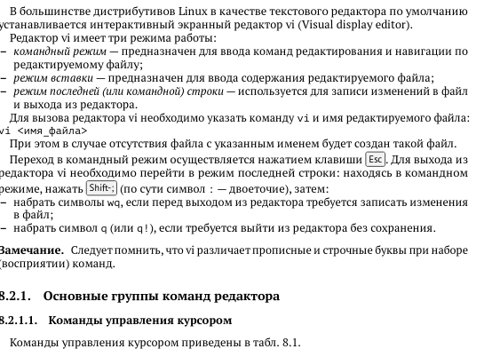
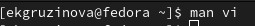
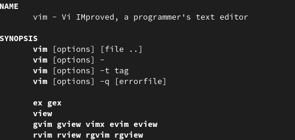
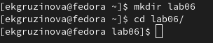
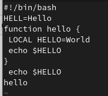
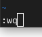
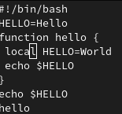
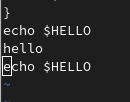
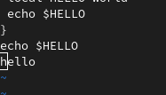
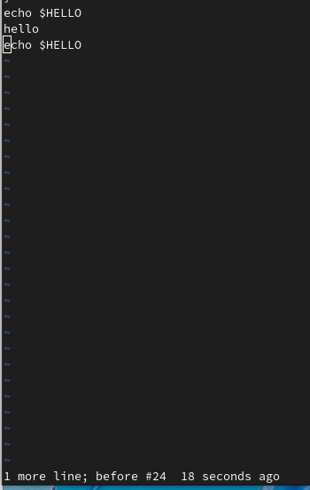

---
## Front matter
title: "Отчёт по лабораторной работе №8"
subtitle: "Текстовый редактор vi"
author: "Грузинова Елизавета Константиновна"

## Generic otions
lang: ru-RU
toc-title: "Содержание"

## Bibliography
bibliography: bib/cite.bib
csl: pandoc/csl/gost-r-7-0-5-2008-numeric.csl

## Pdf output format
toc: true # Table of contents
toc-depth: 2
lof: true # List of figures
lot: false # List of tables
fontsize: 12pt
linestretch: 1.5
papersize: a4
documentclass: scrreprt
## I18n polyglossia
polyglossia-lang:
  name: russian
  options:
	- spelling=modern
	- babelshorthands=true
polyglossia-otherlangs:
  name: english
## I18n babel
babel-lang: russian
babel-otherlangs: english
## Fonts
mainfont: PT Serif
romanfont: PT Serif
sansfont: PT Sans
monofont: PT Mono
mainfontoptions: Ligatures=TeX
romanfontoptions: Ligatures=TeX
sansfontoptions: Ligatures=TeX,Scale=MatchLowercase
monofontoptions: Scale=MatchLowercase,Scale=0.9
## Biblatex
biblatex: true
biblio-style: "gost-numeric"
biblatexoptions:
  - parentracker=true
  - backend=biber
  - hyperref=auto
  - language=auto
  - autolang=other*
  - citestyle=gost-numeric
## Pandoc-crossref LaTeX customization
figureTitle: "Рис."
tableTitle: "Таблица"
listingTitle: "Листинг"
lofTitle: "Список иллюстраций"
lotTitle: "Список таблиц"
lolTitle: "Листинги"
## Misc options
indent: true
header-includes:
  - \usepackage{indentfirst}
  - \usepackage{float} # keep figures where there are in the text
  - \floatplacement{figure}{H} # keep figures where there are in the text
---

# Цель работы

Познакомиться с операционной системой Linux. Получить практические навыки работы с редактором vi, установленным по умолчанию практически во всех дистрибутивах.

# Задание

1. Ознакомиться с теоретическим материалом.
2. Ознакомиться с редактором vi.
3. Выполнить упражнения, используя команды vi.
 3.1. Задание 1.
 1. Создайте каталог с именем ~/work/os/lab06.
2. Перейдите во вновь созданный каталог.
3. Вызовите vi и создайте файл hello.sh
 (vi hello.sh)
4. Нажмите клавишу i и вводите следующий текст.
 (#!/bin/bash
 HELL=Hello
 function hello {
 LOCAL HELLO=World
 echo $HELLO
 }
 echo $HELLO
 hello)
5. Нажмите клавишу Esc для перехода в командный режим после завершения ввода
текста.
6. Нажмите : для перехода в режим последней строки и внизу вашего экрана появится приглашение в виде двоеточия.
7. Нажмите w (записать) и q (выйти), а затем нажмите клавишу Enter для сохранения вашего текста и завершения работы.
8. Сделайте файл исполняемым
 (chmod +x hello.sh)
 
 3.2. Задание 2.
 
 1. Вызовите vi на редактирование файла
 (vi ~/work/os/lab06/hello.sh)
2. Установите курсор в конец слова HELL второй строки.
3. Перейдите в режим вставки и замените на HELLO. Нажмите Esc для возврата в командный режим.
4. Установите курсор на четвертую строку и сотрите слово LOCAL.
5. Перейдите в режим вставки и наберите следующий текст: local, нажмите Esc для возврата в командный режим.
6. Установите курсор на последней строке файла. Вставьте после неё строку, содержащую следующий текст: echo $HELLO.
7. Нажмите Esc для перехода в командный режим.
8. Удалите последнюю строку.
9. Введите команду отмены изменений u для отмены последней команды.
10. Введите символ : для перехода в режим последней строки. Запишите произведённые изменения и выйдите из vi.
 

# Теоретическое введение

Редактор vi - универсальный полноэкранный текстовый редактор в среде UNIX. Универсальность означает, что, во-первых, этот редактор есть во всех UNIX-подобных ОС и, во-вторых, этот редактор работает с практически любым видом терминала (ANSI, VT100, VT220, VT320, DEC, и т. д.). Эта универсальность обернулась несколько непривычным (для пользователей DOS) пользовательским интерфейсом: для управления редактором используются лишь "обычные" кнопки клавиатуры (алфавитно-цифровые символы и знаки препинания).

# Выполнение лабораторной работы

1. Познакомилась с теоретическим материалом. (рис. [-@fig:001])

{ #fig:001 width=70% }

2. Познакомилась с редактором vi.  (рис. [-@fig:002; -@fig:003])

{ #fig:002 width=70% }

{ #fig:003 width=70% }

3. Выполнение упражнений с использованием команды vi.

Задание 1.  Создание нового файла с использованием vi

1. Создайте каталог с именем ~/work/os/lab06. 2. Перейдите во вновь созданный каталог.(рис. [-@fig:004])

{ #fig:004 width=70% }

3. Вызовите vi и создайте файл hello.sh (рис. [-@fig:005]) 

{ #fig:005 width=70% }

4. Нажмите клавишу i и вводите следующий текст. (рис. [-@fig:006])

{ #fig:006 width=70% }

5. Нажмите клавишу Esc для перехода в командный режим после завершения ввода
текста. 6. Нажмите : для перехода в режим последней строки и внизу вашего экрана появится
приглашение в виде двоеточия. 7. Нажмите w (записать) и q (выйти), а затем нажмите клавишу Enter для сохранения
вашего текста и завершения работы (рис. [-@fig:007])

{ #fig:007 width=70% }

8. Сделайте файл исполняемым (рис. [-@fig:008])

{ #fig:008 width=70% }

Задание 2. Редактирование существующего файла

1. Вызовите vi на редактирование файла (рис. [-@fig:009])

{ #fig:009 width=70% }

2. Установите курсор в конец слова HELL второй строки.3. Перейдите в режим вставки и замените на HELLO. Нажмите Esc для возврата в командный режим. 4. Установите курсор на четвертую строку и сотрите слово LOCAL. 5. Перейдите в режим вставки и наберите следующий текст: local, нажмите Esc для возврата в командный режим. (рис. [-@fig:010])

{ #fig:010 width=70% }

6. Установите курсор на последней строке файла. Вставьте после неё строку, содержащую следующий текст: echo $HELLO  (рис. [-@fig:011])

{ #fig:011 width=70% }

7. Нажмите Esc для перехода в командный режим. 8. Удалите последнюю строку. (рис. [-@fig:012])

{ #fig:012 width=70% }

9. Введите команду отмены изменений u для отмены последней команды. (рис. [-@fig:013])

{ #fig:013 width=70% }

10. Введите символ : для перехода в режим последней строки. Запишите произведённые
изменения и выйдите из vi. (рис. [-@fig:014])

{ #fig:014 width=70% }

# Выводы

Я познакомилась с операционной системой Linux, получила практические навыки работы с редактором vi, установленным по умолчанию практически во всех дистрибутивах.

# Контрольные вопросы

1. Дайте краткую характеристику режимам работы редактора vi.

1) Режим ввода - переход осуществляется нажатием буквы "i"
2) Командный режим - переход осуществляется нажатием "esc"

Если нужно вводить, изменить, редактировать текст - переходите в режим ввожда
Если нужно сохранить, выйти с редактора или файла - переходите в командный режим

2. Как выйти из редактора, не сохраняя произведённые изменения?

Через команду :q

3. Назовите и дайте краткую характеристику командам позиционирования.

– 0 (ноль) — переход в начало строки;
– $ — переход в конец строки;
– G — переход в конец файла;
– 𝑛 G — переход на строку с номером 𝑛.

4. Что для редактора vi является словом?

Набор символов.

5. Каким образом из любого места редактируемого файла перейти в начало (конец)
файла?

Через команду G можно попасть в конец файла, а если набрать 1G, то будет переход в начало файла.

6. Назовите и дайте краткую характеристику основным группам команд редактирова-
ния.

Вставка текста

– а — вставить текст после курсора;

– А — вставить текст в конец строки;

– i — вставить текст перед курсором;

– 𝑛 i — вставить текст 𝑛 раз;

– I — вставить текст в начало строки.

Вставка строки

– о — вставить строку под курсором;

– О — вставить строку над курсором.

Удаление текста

– x — удалить один символ в буфер;

– d w — удалить одно слово в буфер;

– d $ — удалить в буфер текст от курсора до конца строки;

– d 0 — удалить в буфер текст от начала строки до позиции курсора;

– d d — удалить в буфер одну строку;

– 𝑛 d d — удалить в буфер 𝑛 строк.

Отмена и повтор произведённых изменений

– u — отменить последнее изменение;

– . — повторить последнее изменение.

Копирование текста в буфер

– Y — скопировать строку в буфер;

– 𝑛 Y — скопировать 𝑛 строк в буфер;

– y w — скопировать слово в буфер.

Вставка текста из буфера

– p — вставить текст из буфера после курсора;

– P — вставить текст из буфера перед курсором.

Замена текста

– c w — заменить слово;

– 𝑛 c w — заменить 𝑛 слов;

– c $ — заменить текст от курсора до конца строки;

– r — заменить слово;

– R — заменить текст.

Поиск текста

– / текст — произвести поиск вперёд по тексту указанной строки символов текст;

– ? текст — произвести поиск назад по тексту указанной строки символов текст

7. Необходимо заполнить строку символами $. Каковы ваши действия?

Нажать на клавишу i для перехода в редим вставки и написать строку с символами.

8. Как отменить некорректное действие, связанное с процессом редактирования?

Через клавишу u.

9. Назовите и дайте характеристику основным группам команд режима последней стро-
ки.

Копирование и перемещение текста

– : 𝑛,𝑚 d — удалить строки с 𝑛 по 𝑚;

– : 𝑖,𝑗 m 𝑘 — переместить строки с 𝑖 по 𝑗, начиная со строки 𝑘;

– : 𝑖,𝑗 t 𝑘 — копировать строки с 𝑖 по 𝑗 в строку 𝑘;

– : 𝑖,𝑗 w имя-файла — записать строки с 𝑖 по 𝑗 в файл с именем имя-файла.

Запись в файл и выход из редактора

– : w — записать изменённый текст в файл, не выходя из vi;

– : w имя-файла — записать изменённый текст в новый файл с именем имя-файла;

– : w ! имя-файла — записать изменённый текст в файл с именем имя-файла;

– : w q — записать изменения в файл и выйти из vi;

– : q — выйти из редактора vi;

– : q ! — выйти из редактора без записи;

10. Как определить, не перемещая курсора, позицию, в которой заканчивается строка?

Перейти в конец строки командой $.

11. Выполните анализ опций редактора vi (сколько их, как узнать их назначение и т.д.).

Запуск и завершение VI

Запуск VI

vi filename	Открыть файл filename для редактирования

view filename	Открыть файл filename для просмотра

vi -r filename	Открыть последнюю сохраненную версию filename после аварийного выхода

vi + n filename	Открыть filename и поместить курсор на строку n

vi + filename	Открыть filename и поместить курсор на последнюю строку

vi +/string filename	Открыть filename и поместить курсор на первое вхождение string

vi filename file2 ...	Открыть filename, затем file2 ... Переход к следующему файлу - :n

Завершение VI

ZZ или :wq или :х	Сохранить изменения и завершить VI

:w	Сохранить изменения в текущем файле

:w!	Безусловно сохранить текущий файл

:w file	Сохранить текущий файл под именем file

:w! file	Безусловно сохранить файл под именем file

:n,mw file	Сохранить строки с n до m в file

:n,mw >>file	Сохранить строки с n до m в конец file

:q	Завершить VI, предупредив при необходимости сохранения

:q!	Завершить VI без сохранения

:e!	Начать редактирование снова (отменив несохраненные изменения)

:we!	Сохранить и продолжить редактирование

Статус
:.=	Номер текущей строки

:=	Количество строк в файле

CTRL-G	Имя файла, номер строки, общее число строк и положение в файле (%)

l	Спецсимволы в текущей строке: tab (^l), backslash (\), backspace (^H), newline ($), bell (^G), formfeed (^L^)

Подробнее на https://remoteshaman.com/unix/common/polnaya-reference-at-vi-redaktoru

12. Как определить режим работы редактора vi?

Если команда позволяет вводить символы в текст и внизу указано "INSERT", то редактор находится в режиме вставки. Если после нажатия : внизу появляется само :, то это значит, что сейчас включен режим командной строки.

13. Постройте граф взаимосвязи режимов работы редактора vi. (рис. [-@fig:015])

{ #fig:015 width=70% }

# Список литературы{.unnumbered}

::: {#refs}
:::
